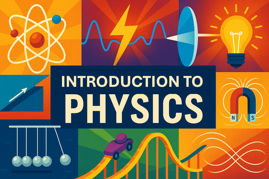

# Introduction To Physics

{ width="600"}

Welcome to the Introduction to Physics website.

Status:

1. Course description: Done (quality score: 86)
2. Learning Graph: Done see [graph quality metrics](./learning-graph/quality-metrics.md)
3. Book Chapter Structure: Done - 200 concepts in the knowledge graph were partitioned into 12 chapters.  No concept is introduced before it's dependant concepts have been explained.
4. Chapter Content Generation: 12 chapters of text generated with detailed specifications of diagrams, charts and MicroSims ready for generation
5. Glossary of Terms: done - precise, concise and distinct ISO defintions were created with examples of how the term is used in the textbook. see [Glossary of Terms](./glossary.md)
6. FAQ: Done - 80 questions with answers
7. Quiz: Done! - There are now 10 quiz questions with each chapter
8. References: Done - 20 [reference](./references.md) created with descriptions and relevancy
9. Diagrams Reports: Done - Analysis of all diagrams to be generated [Diagram Table](learning-graph/diagram-table.md) and [Diagram Details](learning-graph/diagram-details.md)
10. Book Quality Metrics: TODO

[Graph Viewer](./sims/graph-viewer/index.md)

Please contact me on [LinkedIn](https://www.linkedin.com/in/danmccreary/)

Thanks! - Dan
