# Physics MicroSims

This section contains interactive MicroSims covering topics in high school physics including kinematics, dynamics, energy, momentum, rotational motion, oscillations, waves, and electricity. Each simulation allows students to explore physics concepts through hands-on experimentation and visualization.

- **[2D Collision Vector Diagram](./2d-collision-vectors/index.md)**

    
    Interactive visualization showing momentum vector conservation in two dimensions before and after collision.

- **[Action-Reaction Pairs](./action-reaction/index.md)**

    
    Interactive demonstration of Newton's Third Law through six real-world scenarios showing action-reaction force pairs.  We have an example of a book on a table, a hammer and
    a nail, a rocket in space, a swimmer and tires on a car.

- **[Angled Projectile Explorer](./angled-projectile/index.md)**

    
    Interactive simulation exploring how launch angle and speed affect projectile trajectory, range, and maximum height.

- **[Angled Tension Components](./angled-tension/index.md)**
    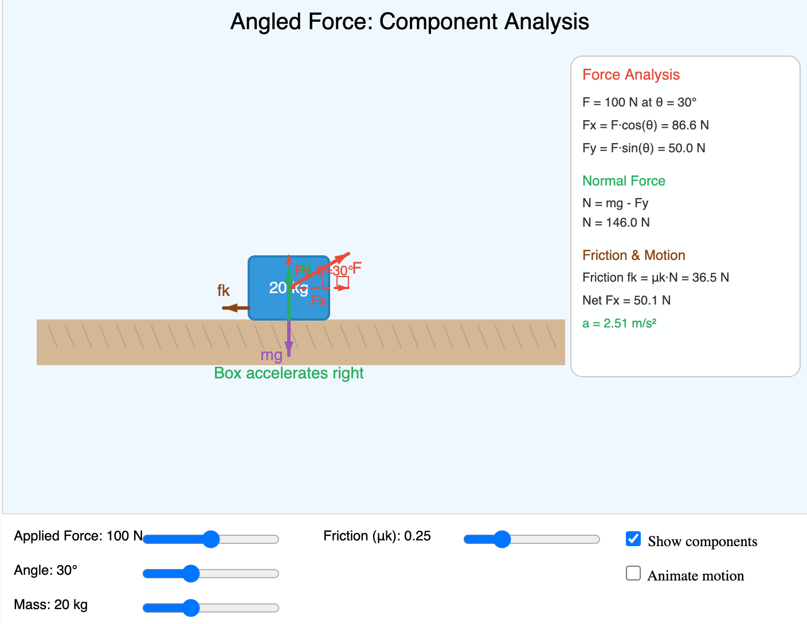
    Interactive visualization showing how the angle of an applied force affects its horizontal and vertical components.

- **[Angular Displacement Visualization](./angular-displacement/index.md)**

    
    An interactive MicroSim demonstrating angular displacement with a rotating disk showing how different points at various radii travel different arc lengths.

- **[Angular Momentum Vector Visualization](./angular-momentum-vector/index.md)**

    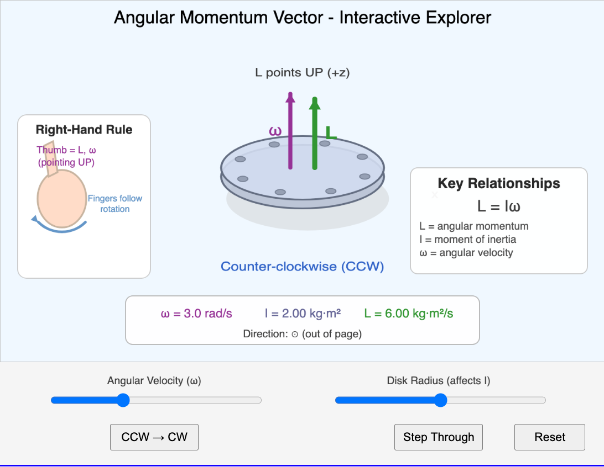
    Visualize angular momentum as a vector quantity showing the right-hand rule for determining direction.

- **[Comparative Angular Velocities Chart](./angular-velocities-chart/index.md)**

    
    An interactive horizontal bar chart comparing angular velocities of common rotating objects on a logarithmic scale.

- **[Atwood Machine Free-Body Diagram](./atwood-fbd/index.md)**

    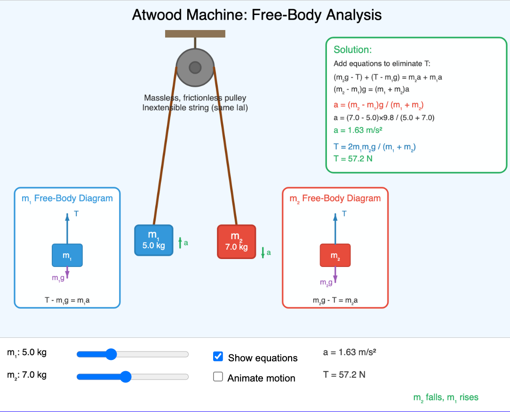
    Interactive visualization of free-body diagrams for the Atwood machine showing how to set up and solve the equations.

- **[Atwood Machine](./atwood-machine/index.md)**

    
    Interactive simulation of the classic Atwood machine with adjustable masses.

- **[Banked Curve Force Analysis](./banked-curve-forces/index.md)**

    
    Interactive force analysis diagram for a vehicle on a banked curve showing how the normal force provides centripetal force.

- **[Banked Curve Speed Analysis](./banked-curve-speed/index.md)**

    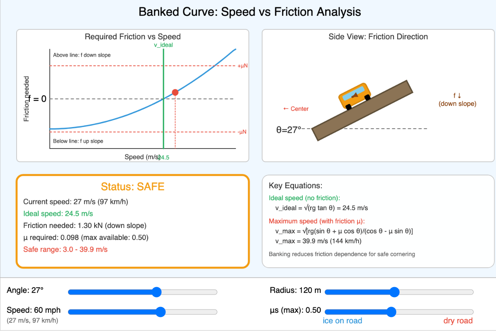
    Interactive exploration of how vehicle speed relative to ideal speed determines friction requirements on banked curves.

- **[Branches of Physics](./branches-of-physics/index.md)**

    Overview of 11 major branches of physics and their subbranches as an interactive dependency graph visualization.

- **[Capacitor Charging and Discharging](./capacitor-charging-discharging/index.md)**

    
    Interactive simulation showing how capacitors store and release energy in RC circuits with exponential charging/discharging behavior.

- **[Car on Curve](./car-on-curve/index.md)**

    Interactive simulation showing centripetal force requirements for a car navigating a curve.

- **[Centripetal Force Visualization](./centripetal-force-viz/index.md)**

    Interactive visualization showing the relationship between velocity, centripetal acceleration, and centripetal force in circular motion.

- **[Charging by Induction](./charging-induction/index.md)**

    
    An interactive step-by-step simulation demonstrating how objects can be charged through electrostatic induction without direct contact.

- **[Collision Types Comparison](./collision-types/index.md)**

    
    Interactive simulation comparing elastic, inelastic, and perfectly inelastic collisions demonstrating conservation of momentum and kinetic energy.

- **[Elastic Collisions](./collisions/index.md)**

    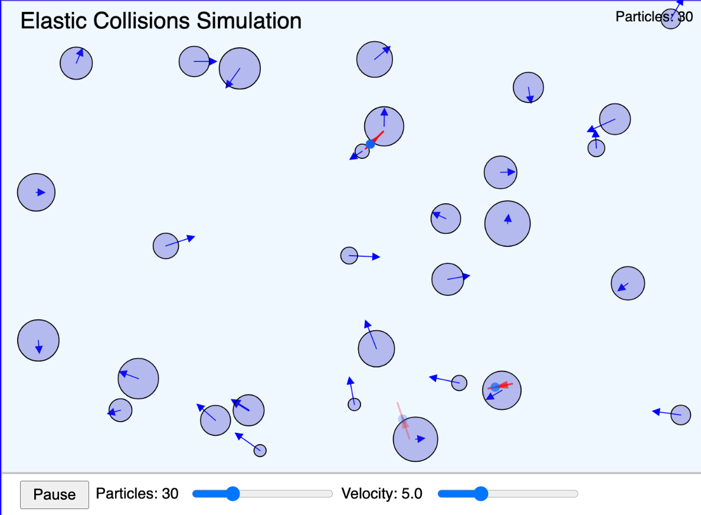
    Interactive simulation demonstrating elastic collisions between particles of varying masses, showing momentum and energy conservation.

- **[Coulomb's Law Force Calculator](./coulombs-law/index.md)**

    Interactive simulation demonstrating Coulomb's Law, which describes the electrostatic force between two point charges.

- **[Current Animation Test](./current-animation/index.md)**

    A MicroSim demonstrating the animation of current in wires with animated electron flow representation.

- **[Types of Damping Comparison](./damping-types/index.md)**

    
    Interactive simulation showing a mass-spring system with real-time displacement graph for underdamped, critically damped, and overdamped oscillators.

- **[DC Motor Operation](./dc-motor/index.md)**

    An interactive visualization demonstrating how DC motors convert electrical energy to mechanical rotation through electromagnetic forces.

- **[Distance vs Displacement](./distance-displacement/index.md)**

    An interactive MicroSim that helps students understand the difference between distance (total path length) and displacement (straight-line change in position).

- **[Doppler Effect Simulation](./doppler-effect/index.md)**

    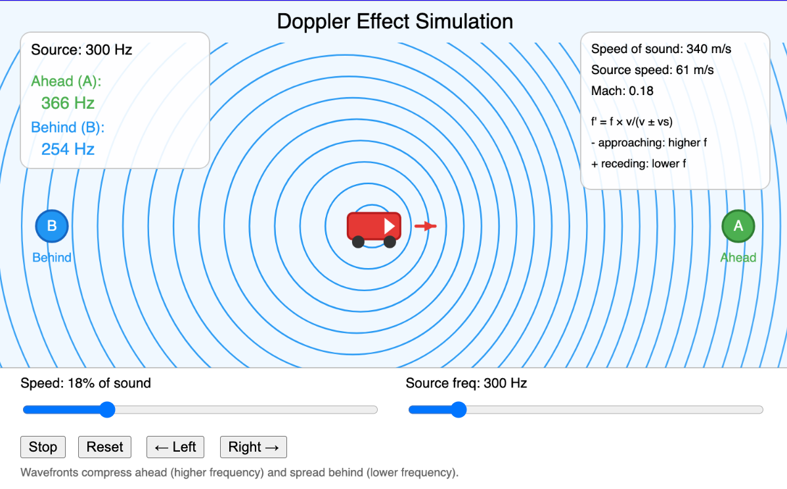
    An interactive MicroSim demonstrating how source motion affects observed frequency through wavefront compression and expansion.

- **[Driven Oscillator](./driven-oscillator/index.md)**

    Interactive simulation showing how a driven oscillator responds to different driving frequencies, demonstrating resonance.

- **[Elasticity](./elasticity/index.md)**

    A MicroSim demonstrating how elasticity affects energy loss when a ball bounces off surfaces.

- **[Electric Field Lines Visualization](./electric-field-lines/index.md)**

    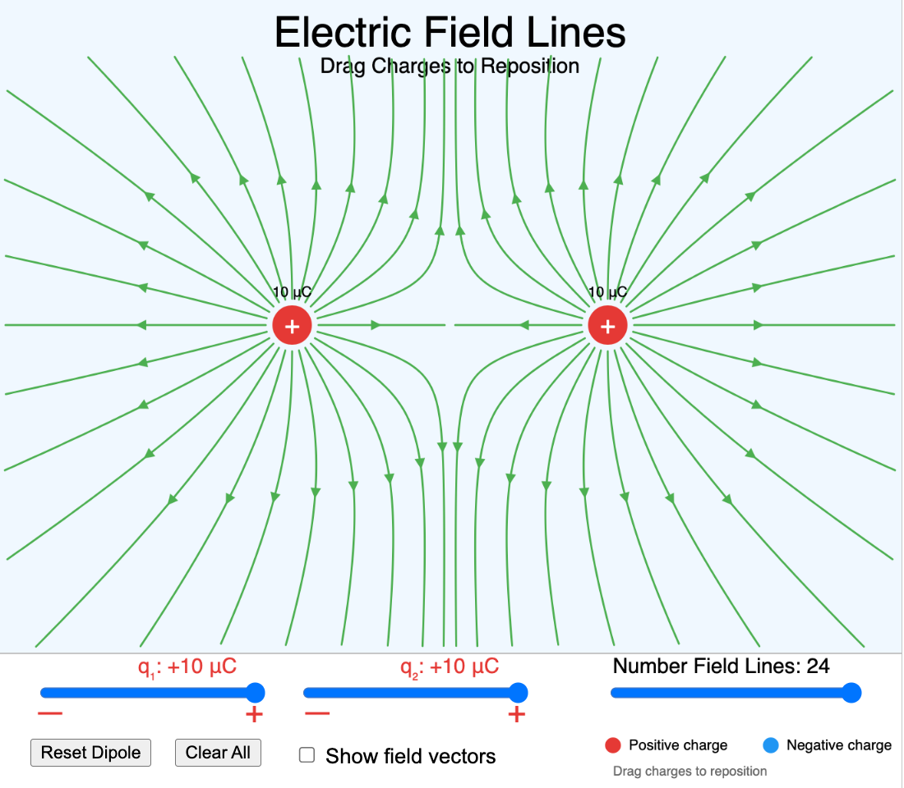
    Interactive simulation visualizing electric field patterns around point charges demonstrating electrostatic field direction and strength.

- **[Energy Diagram Explorer](./energy-diagram-explorer/index.md)**

    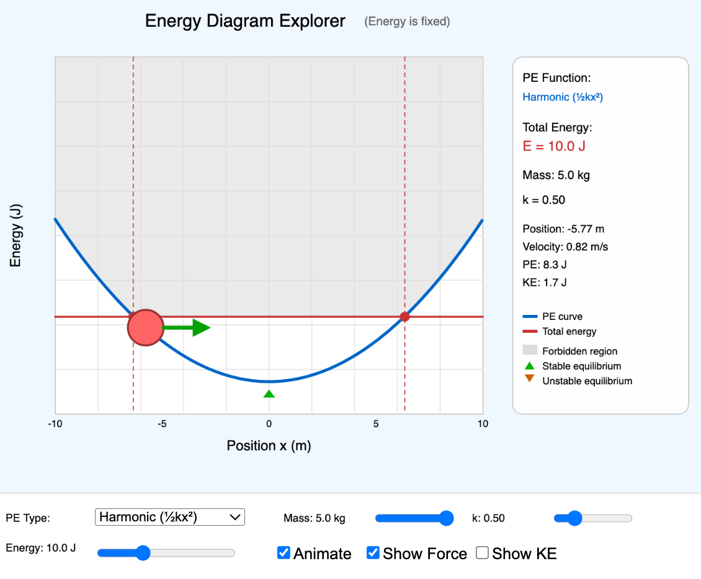
    Interactive tool to explore potential energy curves, turning points, and equilibrium positions for four different energy
    diagrams: Harmonic Oscillator, Gravity Valley, Double Well and Gaussian Barrier.

- **[Energy Efficiency Comparison](./energy-efficiency/index.md)**

    Interactive infographic comparing energy efficiency across common devices and processes.

- **[Equilibrium Classification Workflow](./equilibrium-workflow/index.md)**

    Interactive decision tree to classify objects as in static equilibrium, dynamic equilibrium, or not in equilibrium.

- **[Exoplanet Transit Detection](./exoplanet/index.md)**

    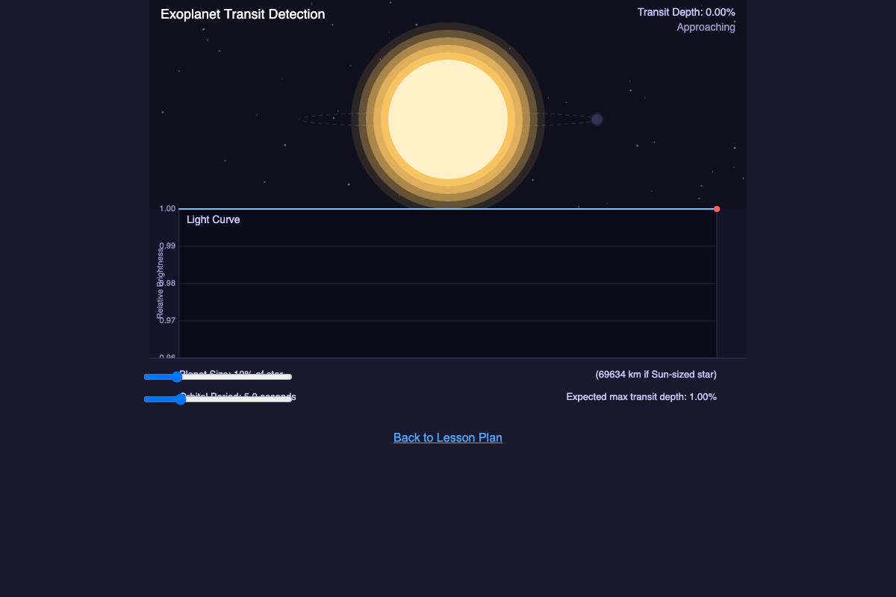
    Interactive simulation demonstrating how astronomers detect exoplanets using the transit method showing brightness dips as a planet passes.

- **[Figure Skater Angular Momentum](./figure-skater-spin/index.md)**

    Interactive simulation showing how a figure skater's spin speed changes when pulling arms in or extending them out.

- **[Fluid Dynamics](./fluid-dynamics/index.md)**

    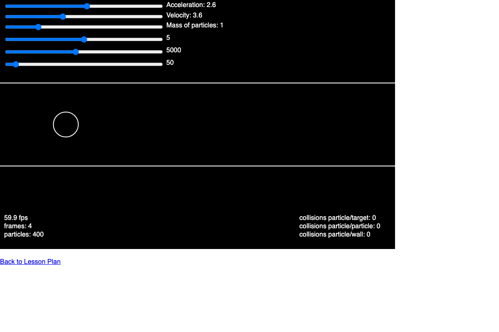
    Interactive simulation demonstrating fluid flow around an obstacle with particle collisions and adjustable flow parameters.

- **[Force vs Time Impact Comparison](./force-time-impulse/index.md)**

    Chart comparing how extending impact time reduces peak force while maintaining the same impulse.

- **[Free-Body Diagram Tutorial](./free-body-diagram/index.md)**

    An interactive tutorial teaching students how to draw and interpret free-body diagrams through progressively complex scenarios.

- **[Free Fall Motion](./free-fall/index.md)**

    Interactive simulation of objects falling under gravity with adjustable initial conditions.

- **[Friction Coefficient Chart](./friction-coefficient-chart/index.md)**

    Interactive chart comparing static and kinetic friction coefficients for common material pairs.

- **[Interactive Graph Analysis](./graph-analysis/index.md)**

    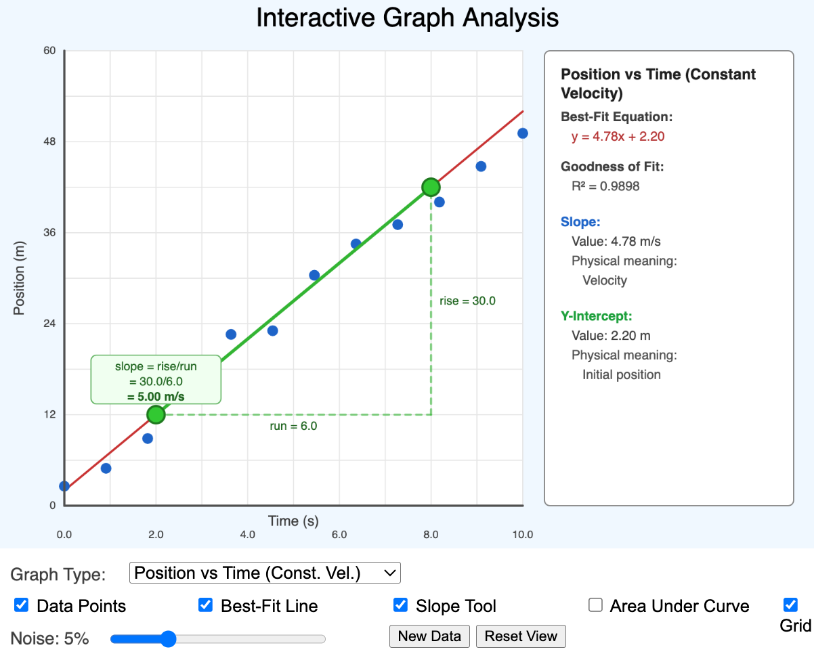
    An interactive tool for analyzing physics graphs, extracting slope, intercepts, and area under curve with physical interpretations.

- **[Learning Graph Viewer](./graph-viewer/index.md)**

    Viewer that reads a learning graph and provides search functionality and taxonomy legend controls.

- **[Gravitational Attractor](./gravitational-attractor/index.md)**

    Interactive simulation demonstrating gravitational attraction between particles and a central attractor showing orbital motion.

- **[Hooke's Law Interactive](./hookes-law-demo/index.md)**

    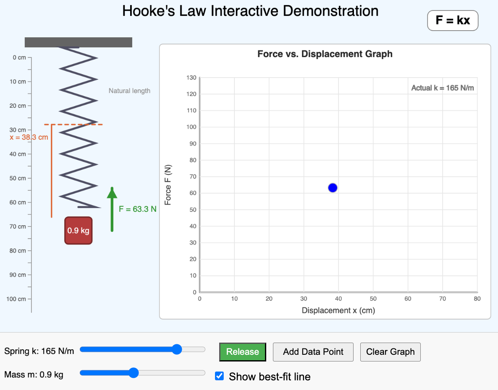
    Explore the relationship between force, displacement, and spring constant according to Hooke's Law with an interactive spring system.

- **[Horizontal Projection](./horizontal-projection/index.md)**

    Interactive simulation demonstrating that objects with different horizontal velocities but same initial height hit the ground simultaneously.

- **[Inclined Plane Force Decomposition](./inclined-plane-forces/index.md)**

    Interactive diagram showing how to decompose weight into components parallel and perpendicular to an inclined plane.

- **[Inclined Plane Motion](./inclined-plane-motion/index.md)**

    Interactive simulation of a block on an inclined plane with adjustable angle and friction.

- **[Inertia Demonstration](./inertia-demo/index.md)**

    An interactive MicroSim demonstrating how mass affects inertia by comparing how different objects respond to identical forces.

- **[Kinematic Equation Selector](./kinematic-selector/index.md)**

    Interactive decision tool to help students select the appropriate kinematic equation based on known and unknown variables.

- **[Law of Reflection](./law-of-reflection/index.md)**

    An interactive MicroSim demonstrating that the angle of incidence equals the angle of reflection.

- **[Longitudinal Wave Animation](./longitudinal-wave/index.md)**

    An interactive MicroSim demonstrating how particles in a longitudinal wave move parallel to the wave propagation direction.

- **[Metric Scale Zoom](./metric-scale-zoom/index.md)**

    An interactive MicroSim that helps students visualize the relative scale of metric prefixes and practice conversions.

- **[Microscopic Surface Contact](./microscopic-surface-contact/index.md)**

    Interactive visualization showing how microscopic surface irregularities create friction between two surfaces.

- **[Momentum Comparison](./momentum-comparison/index.md)**

    Interactive visualization showing how mass and velocity combine to determine momentum as a vector quantity.

- **[Multistage Rocket Efficiency](./multistage-rocket/index.md)**

    Interactive chart comparing delta-v achieved by single-stage vs multi-stage rockets using the Tsiolkovsky rocket equation.

- **[Newton's Second Law](./newtons-second-law/index.md)**

    Interactive visualization of the relationship between force, mass, and acceleration (F = ma).

- **[Normal Force on Inclined Planes](./normal-force-incline/index.md)**

    Interactive visualization showing how normal force changes with incline angle and how weight decomposes into components.

- **[Ohm's Law Interactive Calculator](./ohms-law/index.md)**

    An interactive visualization exploring the relationship between voltage, current, and resistance with animated circuit and V-I curves.

- **[Applications of Oscillations](./oscillation-applications/index.md)**

    Interactive radial infographic showing how oscillation principles apply across medicine, architecture, music, transportation, electronics, and sports.

- **[Simple vs Physical Pendulum](./pendulum-comparison/index.md)**

    Side-by-side animated comparison showing the differences between simple and physical pendulums.

- **[Period, Frequency, and Angular Frequency](./period-frequency-relationship/index.md)**

    Interactive infographic showing the mathematical relationships between period, frequency, and angular frequency with live calculations.

- **[Position-Time Graph Analyzer](./position-time-analyzer/index.md)**

    Interactive tool for learning to interpret position-time graphs with animated objects and tangent line analysis.

- **[Potential Energy Comparison Chart](./potential-energy-chart/index.md)**

    Grouped bar chart comparing gravitational and elastic potential energy across different scenarios.

- **[Precision vs Accuracy](./precision-accuracy/index.md)**

    
    An interactive visualization demonstrating the difference between precision (repeatability) and accuracy (correctness) in measurements.

- **[Projectile Motion](./projectile-motion/index.md)**

    A MicroSim demonstrating parabolic trajectories of projectiles with controls for launch angle and power.

- **[Projectile Motion with Gravity](./projectile-motion-gravity/index.md)**

    
    A MicroSim demonstrating the effect of gravity on projectile motion with adjustable gravity control and trajectory visualization.

- **[Pulley Mechanical Advantage](./pulley-mechanical-advantage/index.md)**

    Interactive comparison of three pulley configurations showing how mechanical advantage increases with system complexity.

- **[Relative Velocity Solver](./relative-velocity/index.md)**

    Interactive tool for visualizing and solving relative velocity problems with two moving objects in 2D.

- **[Resonance Amplitude vs Frequency](./resonance-graph/index.md)**

    Interactive graph showing how oscillation amplitude depends on driving frequency and damping level.

- **[River Crossing Relative Velocity](./river-crossing/index.md)**

    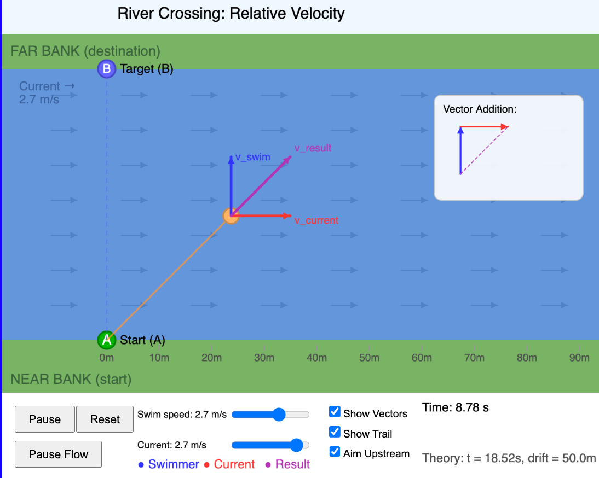
    Interactive simulation demonstrating relative velocity through a river crossing scenario with current and swimmer velocities.

- **[Rocket Propulsion Diagram](./rocket-propulsion/index.md)**

    Interactive visualization showing momentum conservation in rocket propulsion with exhaust gases.

- **[Roller Coaster Energy Conservation](./roller-coaster-energy/index.md)**

    Interactive simulation showing energy transformation between kinetic and potential energy on a roller coaster.

- **[Energy Distribution in Rolling Objects](./rolling-energy-distribution/index.md)**

    Stacked bar chart showing how kinetic energy is split between translational and rotational components for different rolling objects.

- **[Rolling Motion Velocity Vectors](./rolling-velocity-vectors/index.md)**

    Visualize how velocity vectors at different points on a rolling wheel combine translational and rotational motion.

- **[Real-World Rotational Applications](./rotational-applications/index.md)**

    Interactive infographic showing 12 real-world applications of rotational motion across engineering, sports, and natural phenomena.

- **[Rotational Inertia Race](./rotational-inertia-race/index.md)**

    Race different shaped objects down a ramp to see how rotational inertia affects acceleration.

- **[Rotational Kinematics Solver](./rotational-kinematics-solver/index.md)**

    Interactive tool for solving rotational kinematics problems with animated visualization and real-time graphs.

- **[Scientific Method Workflow](./scientific-method/index.md)**

    Overview of the scientific method as an interactive flowchart showing all steps and decision points.

- **[Series vs Parallel Circuit Comparison](./series-parallel/index.md)**

    An interactive side-by-side comparison of series and parallel circuits showing current flow, voltage distribution, and failure behavior.

- **[Energy Transformation in SHM](./shm-energy/index.md)**

    Animated bar chart showing how kinetic and potential energy transform during oscillation while total energy remains constant.

- **[Position, Velocity, and Acceleration in SHM](./shm-motion-graphs/index.md)**

    Visualize how position, velocity, and acceleration change during simple harmonic motion and understand their phase relationships.

- **[Simple Pendulum Period Investigation](./simple-pendulum/index.md)**

    
    Investigate how pendulum length affects period and verify the T = 2π√(L/g) relationship through hands-on measurement.

- **[Snell's Law Refraction](./snells-law/index.md)**

    An interactive MicroSim demonstrating refraction at a boundary between two media using Snell's Law.

- **[Solar System](./solar-system/index.md)**

    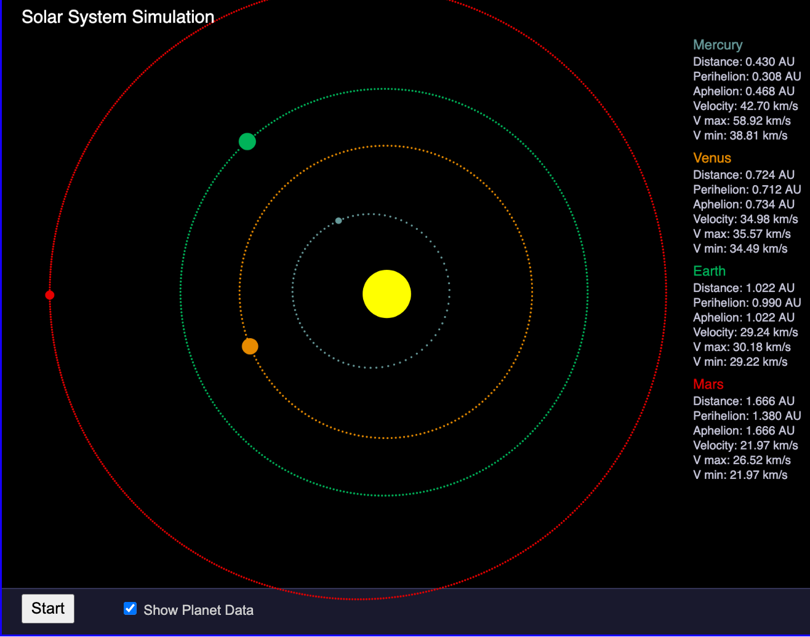
    Interactive simulation of the inner solar system demonstrating Newtonian gravity, orbital mechanics, and Kepler's laws.

- **[Standing Waves on a String](./standing-waves/index.md)**

    An interactive MicroSim visualizing standing wave patterns, nodes, antinodes, and harmonics on a vibrating string.

- **[Static Friction](./static-friction/index.md)**

    Interactive demonstration of static friction responding to applied force and transitioning to kinetic friction.

- **[Tacoma Narrows Bridge Timeline](./tacoma-narrows-timeline/index.md)**

    Interactive timeline showing the sequence of events on November 7, 1940 when resonance destroyed the Tacoma Narrows Bridge.

- **[Tension Force Diagram](./tension-force-diagram/index.md)**

    Interactive visualization demonstrating how tension forces act within a rope and on connected objects.

- **[Three-Graph Motion Analyzer](./three-graph-analyzer/index.md)**

    Shows synchronized position, velocity, and acceleration graphs demonstrating their mathematical relationships.

- **[Interactive Torque Diagram](./torque-diagram/index.md)**

    Explore how torque depends on force magnitude, position, and angle with this interactive lever simulation.

- **[Transverse Wave Animation](./transverse-wave/index.md)**

    An interactive MicroSim demonstrating how particles in a transverse wave move perpendicular to the wave propagation direction.

- **[Uniform vs Accelerated Motion](./uniform-accelerated-motion/index.md)**

    Side-by-side comparison of position, velocity, and acceleration graphs for uniform and uniformly accelerated motion.

- **[Variable Force Work Calculation](./variable-force-work/index.md)**

    
    Interactive visualization showing work as the area under a force-position curve.

- **[Vector Addition](./vector-addition/index.md)**

    An interactive visualization demonstrating both graphical (tip-to-tail) and component methods of vector addition.

- **[Vector Basics](./vector-basics/index.md)**

    An interactive visualization teaching how vectors are represented graphically with magnitude, direction, and component decomposition.

- **[Vector Components](./vector-components/index.md)**

    Interactive diagram showing how 2D vectors decompose into horizontal and vertical components using trigonometry.

- **[Velocity vs Speed Comparison](./velocity-speed-comparison/index.md)**

    An interactive comparison showing scenarios where speed and velocity differ, helping students distinguish between these concepts.

- **[Velocity-Time Graph Area Calculator](./velocity-time-area/index.md)**

    Interactive tool demonstrating that the area under a velocity-time curve equals displacement.

- **[Two-Source Wave Interference](./wave-interference/index.md)**

    An interactive MicroSim demonstrating constructive and destructive interference patterns from two coherent wave sources.

- **[Weight in Different Gravitational Fields](./weight-gravity/index.md)**

    Interactive comparison of how weight changes while mass stays constant across different celestial bodies.

- **[Work-Energy Theorem](./work-energy-theorem/index.md)**

    Interactive demonstration showing how net work equals change in kinetic energy.

- **[Work Scenarios](./work-scenarios/index.md)**

    Interactive diagram showing how the angle between force and displacement affects work done.

