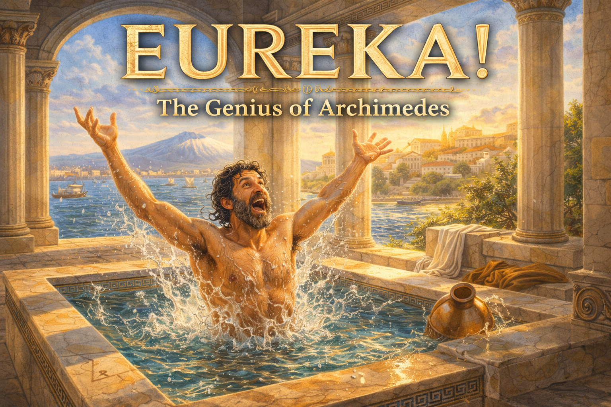
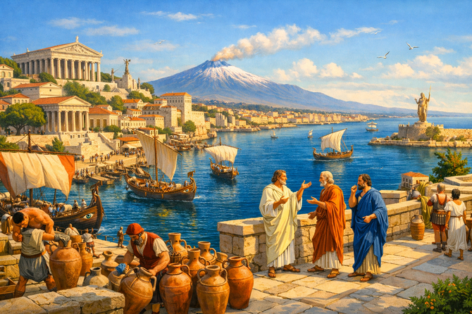
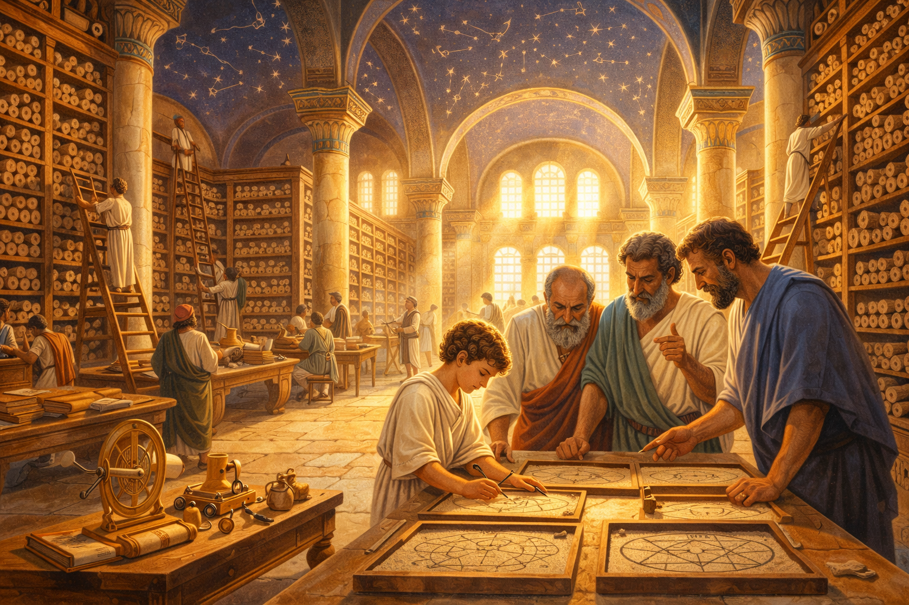
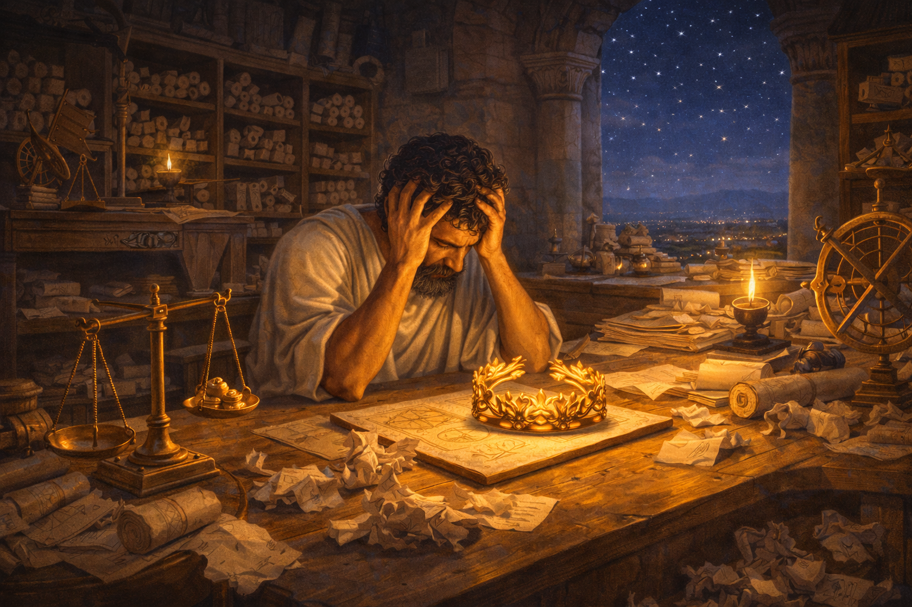
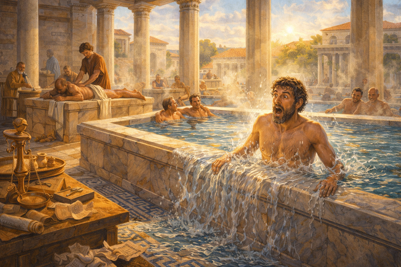
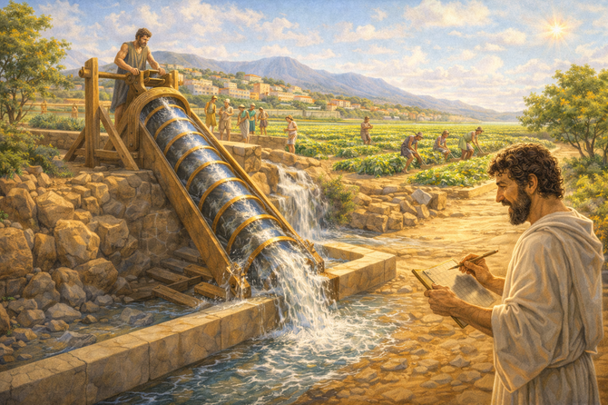
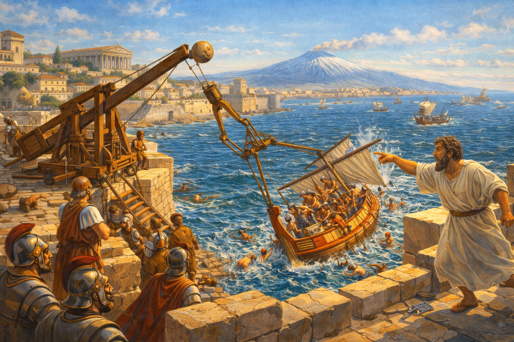
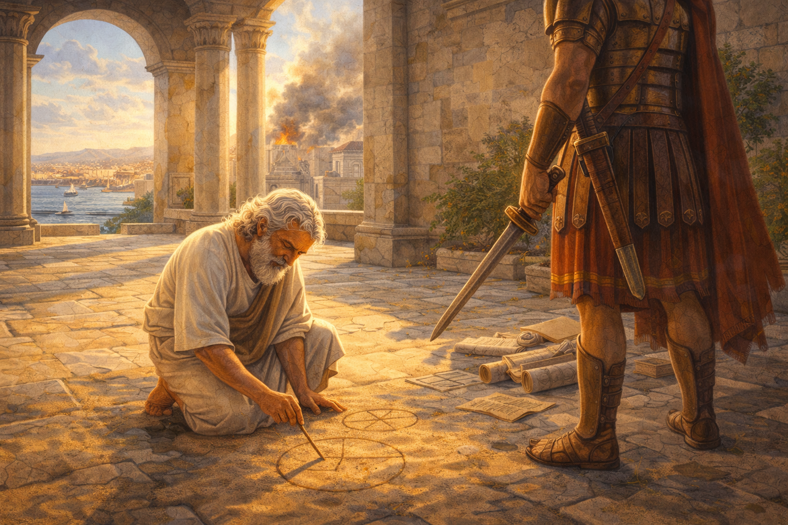

# Eureka! The Genius of Archimedes

    
Cover Image Prompt

Version 1:
Please generate a new wide-landscape cover illustration in 16:9 format.

A vibrant, colorful wide-landscape illustration in a classical Mediterranean style capturing the legendary "Eureka" moment. Archimedes, a bearded Greek man in his fifties with wild, wet hair, bursts upward from an ornate marble bath, water exploding dramatically around him in a spectacular splash. His arms are raised triumphantly toward the sky, mouth open in a jubilant shout, eyes wide with the unmistakable fire of sudden understanding. Droplets of water catch the warm Mediterranean sunlight like scattered diamonds.  **Only the top half of his body is visible.**

The bathhouse setting features beautiful classical Greek architecture: fluted marble columns, decorative friezes depicting geometric patterns and ocean waves, terracotta roof tiles, and a mosaic floor visible through the crystal-clear bath water. An overturned bronze vessel floats in the disturbed water—the visual trigger for his revelation about displacement. His discarded robes lie draped over a marble bench nearby.

Through an arched opening behind him, the sun-drenched city of ancient Syracuse is visible: white marble temples on hillsides, the blue Mediterranean harbor filled with trading ships, and the distant peak of Mount Etna with a wisp of smoke. Olive trees and cypress frame the view. The lighting is warm and golden, characteristic of the ancient Mediterranean world—late afternoon sun streaming in from the left, casting long shadows and making the water droplets glow.

At the top of the image, prominently display the title "EUREKA!" in large, bold letters styled to look like ancient Greek inscriptions carved in marble—perhaps with subtle gold leaf accents catching the light. Below it, in elegant but smaller complementary text: "The Genius of Archimedes". The typography should evoke classical antiquity while remaining highly readable, perhaps incorporating subtle Greek key pattern borders or laurel leaf decorations around the letters.

In the foreground corners, include subtle references to his other achievements: a small lever and fulcrum diagram scratched into the stone floor on one side, and the spiral of an Archimedes screw carved into a column base on the other—easter eggs for attentive viewers.

The overall mood should be one of pure intellectual joy and triumph—the exact instant when confusion transforms into understanding, when a problem that seemed impossible suddenly becomes obvious. This is the moment that gave us the word "eureka" and changed science forever.

!!! Note:
    I had to add the following to get around the image censorship problem: Only the top half of his body is visible.

Version 2:
Please generate a new wide-landscape cover illustration in 16:9 format.

A vibrant, colorful wide-landscape illustration in a classical Mediterranean style showing Archimedes in his workshop, surrounded by his greatest inventions. Archimedes, a bearded Greek man in his fifties wearing a white toga with a blue border, stands at a large wooden worktable covered with scrolls, geometric instruments, and bronze mechanisms. His arms are spread wide in a gesture of triumph, his face lit with intellectual joy as he shouts his famous word to the heavens.

The workshop is filled with visual references to his legendary achievements: a working model of the Archimedes screw for lifting water stands in one corner, water spiraling upward through its helical chamber. A large lever and fulcrum demonstration sits nearby, with a small weight lifting a massive stone block—illustrating his famous boast about moving the Earth. Geometric diagrams of circles, spheres, and parabolas cover scrolls pinned to the walls. A golden crown sits prominently on the table—the crown that started the famous density puzzle.

On the table before him, a bronze vessel sits in a basin of water, water spilling over the edges—the displacement experiment that solved King Hiero's mystery. Archimedes points at it triumphantly, the "eureka" moment captured forever.

Through large arched windows behind him, the sun-drenched city of ancient Syracuse is visible: white marble temples on hillsides, the blue Mediterranean harbor filled with trading ships, and the distant peak of Mount Etna with a wisp of smoke. Roman warships are visible in the far harbor—a hint of the siege to come. The lighting is warm and golden, characteristic of the ancient Mediterranean world, with dramatic rays of sunlight streaming through the windows and illuminating dust motes in the air.

At the top of the image, prominently display the title "EUREKA!" in large, bold letters styled to look like ancient Greek inscriptions carved in marble—perhaps with subtle gold leaf accents catching the light. Below it, in elegant but smaller complementary text: "The Genius of Archimedes". The typography should evoke classical antiquity while remaining highly readable, perhaps incorporating subtle Greek key pattern borders or laurel leaf decorations around the letters.

The overall mood should be one of pure intellectual joy and triumph—a genius surrounded by the fruits of his brilliant mind, in the moment of his greatest discovery. This is the man who said "Give me a place to stand and I shall move the Earth"—and meant it.

    
Narrative Prompt

Please generate a detailed narrative for a new graphic novel about Archimedes
and his contributions to physics, particularly the discovery of buoyancy and density.
The target audience is high school students studying introductory physics.

The story begins in ancient Syracuse, Sicily, around 250 BCE. Describe the vibrant
Greek colony and its position as a center of Mediterranean trade and learning.

Describe Archimedes' background—son of an astronomer, educated in Alexandria,
and returning to serve King Hiero II as the royal problem-solver.

The central story follows the famous crown mystery: King Hiero suspects his
goldsmith substituted cheaper silver for some of the gold in his new crown.
He challenges Archimedes to determine if the crown is pure gold without
damaging it.

Show Archimedes struggling with the problem for days, then experiencing his
legendary "Eureka" moment while stepping into a public bath—realizing that
the water displaced by an object equals its volume, allowing him to compare
the crown's density to pure gold.

Expand the story to include his other contributions: the principle of the lever
("Give me a place to stand and I shall move the Earth"), the Archimedes screw
for lifting water, and his war machines that defended Syracuse against Rome.

End with his tragic death during the Roman siege and his enduring legacy
as the father of experimental physics.

When appropriate, suggest wide-landscape drawings that could be inserted into
the narrative to make the story a graphic novel. Describe each image in detail
and be consistent across all images for style.

When you describe an image, make sure to mention that it should be a colorful,
bright wide-landscape illustration in a classical Mediterranean style with
warm sunlit tones and architectural details of ancient Greece.

### Prologue – The Shores of Syracuse

In the third century BCE, the island of Sicily sparkled like a jewel in the Mediterranean Sea. The Greek colony of **Syracuse** was one of the ancient world's great cities—a bustling port where merchant ships from Egypt, Carthage, and Rome crowded the harbor, and where philosophers debated in marble courtyards beneath swaying olive trees. Here, mathematics was not merely academic; it was the key to building temples, designing ships, and winning wars.

In this golden age lived a man whose name would echo through millennia: **Archimedes**.

Image Prompt

Image 1:
Please generate a new wide-landscape illustration.
A colorful, bright wide-landscape illustration in a classical Mediterranean style showing the ancient harbor of Syracuse around 250 BCE. Warm sunlight bathes white marble temples and columned buildings rising above a crescent bay filled with Greek trading ships. In the foreground, merchants unload amphorae of wine and olive oil while philosophers in flowing robes gesture animatedly on a stone terrace. The deep blue Mediterranean stretches to the horizon, with Mount Etna smoking gently in the distance. The scene conveys prosperity, learning, and the vibrant energy of ancient Greek civilization.

## Chapter 1 – Son of the Stars

Archimedes was born around 287 BCE to Phidias, a royal astronomer who charted the movements of planets and predicted eclipses for King Hiero II. From childhood, young Archimedes learned to see patterns in nature—the curve of a seashell, the spiral of a whirlpool, the arc of a thrown stone.

"Father," the boy once asked, pointing at the full moon rising over the sea, "how far away is it?"

Phidias smiled. "That, my son, is a question mathematics can answer—if you learn to ask it properly."

Image Prompt

Image 2:
Please generate a new wide-landscape illustration.
A colorful, bright wide-landscape illustration in a classical Mediterranean style showing young Archimedes, perhaps twelve years old, standing on a rooftop terrace with his father Phidias at dusk. The father points toward the rising moon while the boy traces geometric shapes on a wax tablet. Bronze astronomical instruments gleam on a nearby table. The warm orange sunset transitions to deep purple where stars are beginning to appear. Their white robes catch the last golden light, and Syracuse's temples are silhouetted below. The scene conveys wonder, mentorship, and the birth of scientific curiosity.

## Chapter 2 – The Library of Alexandria

As a young man, Archimedes journeyed to Alexandria, Egypt—home to the greatest library the world had ever known. Within its towering halls, scrolls containing the wisdom of Euclid, Aristotle, and countless others lined shelves reaching toward painted ceilings. Here, Archimedes studied geometry with the finest mathematicians of the age.

He spent years measuring, calculating, and debating. He learned to prove ideas with logical rigor, never accepting "it seems true" when he could demonstrate "it *must* be true." When he finally returned to Syracuse, his mind burned with new questions.

Image Prompt

Image 3:
Please generate a new wide-landscape illustration.
A colorful, bright wide-landscape illustration in a classical Mediterranean style depicting the interior of the Great Library of Alexandria. Massive columns support a vaulted ceiling painted with constellations. Honeycomb-like shelves hold thousands of papyrus scrolls, with scholars on rolling ladders retrieving them. In the center, young Archimedes studies with a group of mathematicians around a large table covered in geometric diagrams drawn in sand trays. Shafts of golden light stream through high windows, illuminating floating dust motes. The architecture is grand Egyptian-Greek fusion, conveying the magnificence of ancient learning.

## Chapter 3 – The King's Problem

King Hiero II trusted Archimedes above all others to solve impossible puzzles. One day, the king summoned his mathematician with a delicate problem.

"I commissioned a golden crown to honor the gods," Hiero explained, holding up a magnificent wreath of golden leaves. "I gave the goldsmith a precise weight of pure gold. He returned this crown, which weighs exactly what I provided. But I have heard whispers..." The king's eyes narrowed. "Whispers that he kept some gold for himself and mixed in cheaper silver."

"You wish me to determine if the crown is pure gold, Your Majesty?"

"Without melting it or cutting it apart. The crown must remain perfect for the temple."

Archimedes bowed. "I shall find a way."

Image Prompt

Image 4:
Please generate a new wide-landscape illustration.
A colorful, bright wide-landscape illustration in a classical Mediterranean style showing King Hiero II's throne room. The king, wearing purple robes and a simple gold circlet, sits on an elevated marble throne and holds out an ornate golden crown shaped like a laurel wreath. Archimedes stands before him in a philosopher's white chiton, stroking his beard thoughtfully. Columns frame the scene, with guards in bronze armor standing at attention. Sunlight streams through the openings, making the golden crown gleam brilliantly. A suspicious-looking goldsmith lurks nervously in the background shadows. The scene conveys royal authority and an intellectual challenge.

## Chapter 4 – Days of Frustration

Archimedes retreated to his workshop, a cluttered room filled with pulleys, levers, and half-finished inventions. He set the crown on his worktable and stared at it for hours. He weighed it against pure gold—identical. He measured its dimensions, but the intricate leaves and curves made precise measurement impossible.

"If I could melt it into a simple cube, I could calculate its volume easily," he muttered. "But the king forbids that. How can I measure the volume of something so irregular?"

Day after day, Archimedes paced, sketched, and discarded ideas. His servants brought food he barely touched. His friends worried he had gone mad.

Image Prompt

Image 5:
Please generate a new wide-landscape illustration.
A colorful, bright wide-landscape illustration in a classical Mediterranean style showing Archimedes' cluttered workshop at night. Oil lamps cast flickering shadows across tables covered with scrolls, geometric models, and bronze instruments. Archimedes sits hunched over, head in hands, staring at the golden crown before him. Crumpled papyrus litters the floor—discarded calculations. A balance scale with gold weights sits nearby. Through a window, stars are visible in the night sky. The scene conveys intellectual struggle, frustration, and obsessive focus on an unsolved problem.

## Chapter 5 – The Public Bath

After many sleepless nights, Archimedes' friends insisted he take a break. They dragged him to the public baths—great marble pools where citizens relaxed, gossiped, and scraped oil from their skin with curved bronze tools called strigils.

Archimedes lowered himself into an already-full bath, still thinking about the crown. As he sat down, water sloshed over the marble rim and splashed onto the floor. He watched it flow across the tiles...

And froze.

*The water that overflowed... equals the space my body occupies in the tub.*

His eyes went wide.

Image Prompt

Image 6:
Please generate a new wide-landscape illustration.
A colorful, bright wide-landscape illustration in a classical Mediterranean style showing the public baths of Syracuse. A rectangular marble pool surrounded by columns is filled with steaming water. Several citizens relax in the pool while others receive massages nearby. Archimedes has just stepped into the full bath, causing water to cascade over the edge. His face shows the exact moment of revelation—eyes widening, mouth opening in astonishment. Water flows in rivulets across the geometric tile floor. Steam rises in the warm sunlight streaming through the columned arcade. The scene captures the split-second before his famous cry.

## Chapter 6 – Eureka!

In that instant, everything clicked. The volume of water displaced by an object equals the object's volume—no matter how complex its shape! And if he knew the volume and the weight, he could calculate **density**. Gold is denser than silver; if the crown contained hidden silver, it would displace *more* water than pure gold of the same weight.

**"EUREKA!"** Archimedes shouted—Greek for "I have found it!"

He leaped from the bath and ran through the streets of Syracuse, completely naked, water streaming from his body, shouting his discovery to the bewildered citizens. Servants chased after him with his robes, but Archimedes was already calculating in his head.

The goldsmith was doomed.

Image Prompt

Image 7:
Please generate a new wide-landscape illustration.
A colorful, bright wide-landscape illustration in a classical Mediterranean style showing Archimedes running through the sunlit streets of ancient Syracuse, arms raised in triumph, mouth open shouting "EUREKA!" Citizens in togas stare in shock—a woman covers her child's eyes, merchants drop their goods, a philosopher raises an eyebrow in amusement. A servant runs behind carrying Archimedes' robes. White marble buildings and columns line the street, with laundry hanging from balconies. The warm Mediterranean sun casts sharp shadows. Despite the comedy, Archimedes' face shows pure intellectual joy. The scene balances humor with the genuine excitement of scientific discovery.

## Chapter 7 – The Crown Revealed

Back in his workshop, Archimedes prepared his demonstration for the king. He filled a vessel to the brim with water and carefully lowered the crown into it, collecting every drop that overflowed. Then he repeated the process with a lump of pure gold weighing exactly the same as the crown.

The crown displaced more water than the pure gold.

Before the court, Archimedes announced his verdict: "The crown contains silver, Your Majesty. Its density is lower than pure gold. Your goldsmith is a thief."

The goldsmith confessed on the spot. King Hiero had him executed—and rewarded Archimedes handsomely. But for Archimedes, the real prize was the principle he had discovered: what we now call **Archimedes' Principle** of buoyancy.

Image Prompt

Image 8:
Please generate a new wide-landscape illustration.
A colorful, bright wide-landscape illustration in a classical Mediterranean style showing Archimedes demonstrating his discovery in the royal court. Two identical bronze vessels sit on a marble table, each overflowing with water into collection basins. One contains the crown, the other a lump of pure gold. Archimedes gestures triumphantly at the basins, showing the crown's basin has more water. King Hiero leans forward with satisfaction while courtiers murmur. The goldsmith, held by guards, has gone pale. Sunlight streams through high windows, illuminating the water and making the gold gleam. The scene conveys justice through science.

## Chapter 8 – The Law of the Lever

Archimedes' fame spread throughout the Mediterranean world. His discoveries kept coming—none more practical than his perfection of the **lever**.

"Give me a place to stand," he once boasted to King Hiero, "and I shall move the Earth itself!"

To prove his point, he rigged a system of pulleys and levers that allowed a single man to drag a fully loaded warship across the beach and into the sea. The king watched in disbelief as Archimedes, seated comfortably in a chair, pulled a single rope and moved what a hundred men could not.

The secret was **mechanical advantage**: a small force applied over a long distance could move a great weight over a short distance.

Image Prompt

Image 9:
Please generate a new wide-landscape illustration.
A colorful, bright wide-landscape illustration in a classical Mediterranean style showing Archimedes' famous ship-moving demonstration on the Syracuse beach. A massive wooden warship, complete with ram and oars, slides across wooden rollers toward the sparkling blue sea. A complex system of pulleys and levers connects to a single rope that Archimedes pulls while seated in a wooden chair. King Hiero and a crowd of citizens watch in amazement. Workers who expected to haul the ship stand idle, mouths agape. The warm sun illuminates the scene, with seabirds wheeling overhead. The scene conveys the power of physics to multiply human capability.

## Chapter 9 – The Archimedes Screw

Among his many inventions, Archimedes created a device to lift water from rivers to irrigate fields—the **Archimedes screw**. A helical blade wrapped inside a cylinder could raise water when turned, fighting gravity with geometry.

Egyptian farmers used it to irrigate the Nile delta. Greek ships used it to pump out bilge water. Today, variants of his screw still move grain in silos and wastewater in treatment plants—twenty-three centuries after Archimedes first sketched it in the sand.

Image Prompt

Image 10:
Please generate a new wide-landscape illustration.
A colorful, bright wide-landscape illustration in a classical Mediterranean style showing an Archimedes screw in operation along a Sicilian riverbank. A large wooden cylinder containing a bronze helical blade angles from the river up to an irrigation channel. A worker turns a crank at the top while water magically climbs upward, defying gravity, and pours into the channel. Farmers in the background tend green crops in terraced fields. Archimedes observes, making notes on a tablet. The warm Mediterranean sun glints off the water. The scene conveys practical engineering improving everyday life, connecting ancient innovation to modern applications.

## Chapter 10 – The Siege of Syracuse

In 214 BCE, Rome sent a massive fleet to conquer Syracuse. General Marcus Claudius Marcellus expected an easy victory against the small Greek colony. He did not expect Archimedes.

The old mathematician turned his genius to war. He designed **catapults** that hurled boulders with terrifying accuracy. He created the **Claw of Archimedes**—a giant crane that could lift Roman ships from the water and flip them over. Some ancient sources even claim he used **giant mirrors** to focus sunlight and set ships ablaze, though historians debate this.

For two years, Roman soldiers lived in terror of the old man's inventions. "We are fighting a geometrical monster," Marcellus reportedly said, "who uses our ships like toys."

Image Prompt

Image 11:
Please generate a new wide-landscape illustration.
A colorful, bright wide-landscape illustration in a classical Mediterranean style depicting the defense of Syracuse against the Roman fleet. The scene is dramatic but not gory. Massive catapults on the city walls launch boulders toward approaching Roman warships. The famous Claw—a crane-like mechanism—grips a Roman galley and tips it sideways, sailors tumbling into the waves. In the background, other ships flee in disarray. On the walls, Archimedes directs the defenses, pointing and shouting orders to soldiers operating his machines. The blue Mediterranean churns with action while Syracuse's white walls stand defiant. The scene conveys how one brilliant mind could hold off an empire.

## Chapter 11 – "Do Not Disturb My Circles"

Syracuse finally fell through treachery, not assault. During a festival when the city's guard was relaxed, Roman soldiers scaled the walls. General Marcellus gave strict orders: "Capture Archimedes alive. Bring him to me unharmed."

But in the chaos of the sack, a Roman soldier burst into a courtyard where an old man knelt in the sand, drawing geometric circles with a stick. The soldier demanded he come immediately.

"Do not disturb my circles," Archimedes said without looking up, still lost in his mathematics.

The soldier, enraged at being ignored, drew his sword and killed the greatest scientist of the ancient world. Marcellus, they say, wept when he heard the news.

Image Prompt

Image 12:
Please generate a new wide-landscape illustration.
A colorful, bright wide-landscape illustration in a classical Mediterranean style showing Archimedes' final moment—solemn rather than violent. An elderly Archimedes kneels peacefully in a sunlit courtyard, drawing perfect geometric circles in sand with a wooden stick. His white hair and beard flow; his expression is serene, absorbed in thought. A Roman soldier in bronze armor and red cloak stands over him, sword drawn but not yet struck—the moment frozen before tragedy. In the background, smoke rises from the city, but this courtyard remains an island of calm. Scattered nearby are Archimedes' scrolls and instruments. The scene conveys the timelessness of pure thought confronting the brutality of war—intellect that transcends mortality.

## Chapter 12 – The Immortal Legacy

Archimedes asked that his tomb be marked with a sphere inscribed within a cylinder—his proof that the sphere's volume is exactly two-thirds the cylinder's was, he felt, his greatest achievement. A century later, the Roman orator Cicero found the neglected tomb, overgrown with thorns, and restored it.

But Archimedes' true monument is not stone. Every time you:

- Float in a pool (buoyancy)
- Use a lever or pulley (mechanical advantage)
- Calculate the density of a material (mass ÷ volume)
- Wonder at how ships stay afloat despite being made of steel

...you stand on foundations Archimedes laid twenty-three centuries ago. He showed that nature follows mathematical laws—and that a single curious mind, asking the right questions, can illuminate the universe.

Image Prompt

Image 13:
Please generate a new wide-landscape illustration.
A colorful, bright wide-landscape illustration in a classical Mediterranean style blended with modern elements. The left side shows Archimedes' tomb—a weathered stone cylinder with a sphere carved in relief, surrounded by Mediterranean cypress trees and golden light. The right side transitions into the modern world: a steel cargo ship floats on the sea (buoyancy), a construction crane lifts a beam (levers), a laboratory scientist measures liquid in a graduated cylinder (density), and a swimming child floats happily in a pool. Connecting both sides, translucent geometric shapes and mathematical formulas (F = ρVg) float in the air like ghosts of thought. The scene conveys how ancient wisdom lives on in modern science and everyday life.

### Epilogue – Becoming the Next Archimedes

Archimedes' legacy is more than formulas; it is a way of seeing the world as a puzzle waiting to be solved:

| Skill | Why It Mattered to Archimedes | How You Can Cultivate It |
|-------|-------------------------------|--------------------------|
| **Observation** | Noticed water overflowing in an ordinary bath | Pay attention to everyday phenomena; ask "why?" |
| **Persistence** | Spent sleepless nights on the crown problem | Don't give up when problems seem impossible |
| **Mathematical Rigor** | Proved principles with geometry, not just intuition | Learn to express ideas in precise equations |
| **Practical Application** | Turned theory into war machines and irrigation | Build things; test your ideas in the real world |
| **Fearless Curiosity** | Asked questions others thought answered | Challenge assumptions, even from authorities |

Final Image Prompt

Image 14:
Please generate a new wide-landscape illustration.
A colorful, bright wide-landscape illustration blending classical Mediterranean style with modern optimism. A diverse group of modern high school students works in a physics lab. One measures water displacement of irregular objects in a beaker. Another uses a lever system to lift weights. A third sketches geometric proofs on a tablet. Behind them, translucent and ghost-like, Archimedes looks over their shoulders with an approving smile, his robes flowing into mathematical symbols. On the classroom wall, posters show buoyancy, levers, and density formulas. Through the windows, both ancient Syracuse and a modern city skyline are visible, merging past and future. The scene conveys that Archimedes' spirit of inquiry lives on in every student who asks "why" and seeks to understand.

### Call to Action

Two thousand years before smartphones or satellites, a man in a bathtub solved a royal mystery by noticing displaced water. Archimedes showed us that **physics is everywhere**—in floating ships, in seesaws on playgrounds, in the density of a gold ring versus a silver one.

You don't need a royal court or a library of scrolls. You need:

- **Curiosity** to notice what others overlook
- **Persistence** to keep trying when stuck
- **Mathematics** to express your discoveries precisely
- **Courage** to shout "Eureka!" when you find the answer

The universe is full of circles waiting to be drawn, principles waiting to be discovered, and problems waiting for *your* insight. What will *you* find?

---

*"Give me a place to stand, and I shall move the Earth."*
—Archimedes of Syracuse

---

## References

1. [Archimedes | Facts & Biography](https://www.britannica.com/biography/Archimedes) - Updated 2024 - Britannica - Comprehensive article covering Archimedes' life, mathematical discoveries, inventions, and the legendary stories surrounding him including the "Eureka" moment and his war machines.

2. [The History of Archimedes](https://archimedespalimpsest.org/about/history/archimedes.php) - Ongoing - The Archimedes Palimpsest Project - Learn about the remarkable discovery of a hidden medieval manuscript containing Archimedes' lost mathematical writings, erased and overwritten by monks.

3. [Archimedes' Principle | Description & Facts](https://www.britannica.com/science/Archimedes-principle) - Updated 2024 - Britannica - Detailed explanation of the principle of buoyancy with diagrams and real-world applications from ships to hot air balloons.

4. [Eureka! Or Buoyancy and Archimedes' Principle](https://www.teachengineering.org/activities/view/wsu_eureka_activity) - 2024 - TeachEngineering - Hands-on activity where you can recreate Archimedes' density experiments using household objects and water displacement.

5. [Archimedes - Windows to the Universe](https://www.windows2universe.org/people/ancient_epoch/archimedes.html) - 2024 - UCAR/Windows to the Universe - Student-friendly overview connecting Archimedes' discoveries to modern physics, including his war machines and the legend of the burning mirrors.

6. [ChatGPT Session Log](https://chatgpt.com/share/69569388-6698-8001-b4f0-ec3e81c3e10a) - December 31, 2025 - A full recap of the prompts and resulting images from the OpenAI system.  I thought it was interesting about how the bathtub images triggered the censor classification.