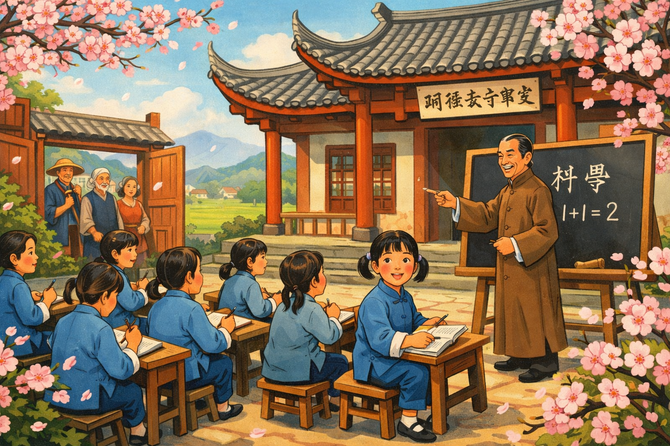
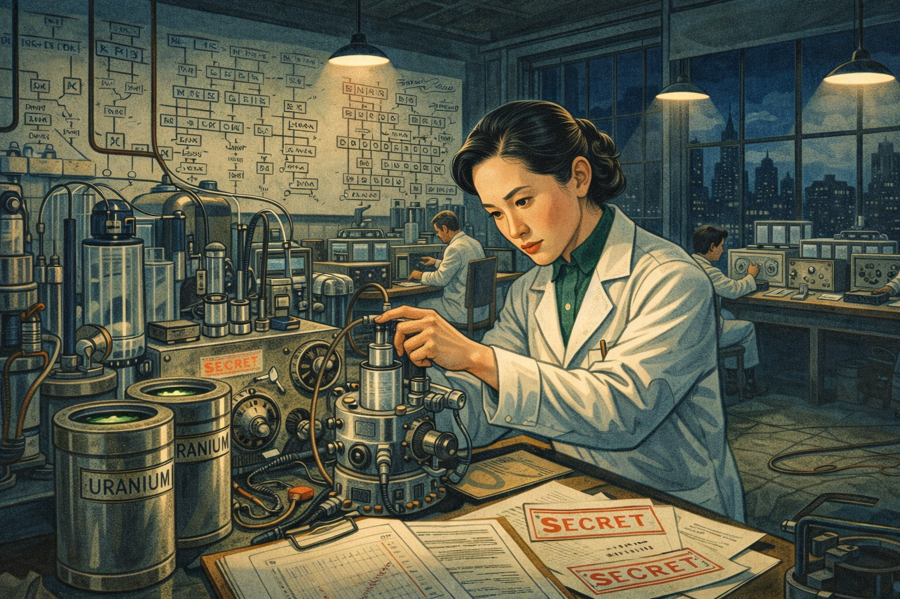
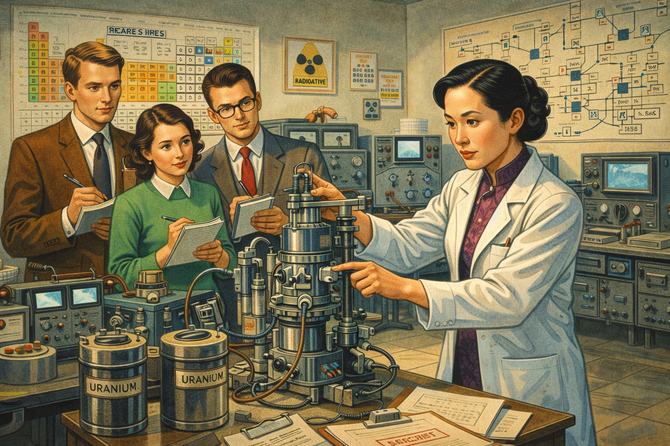
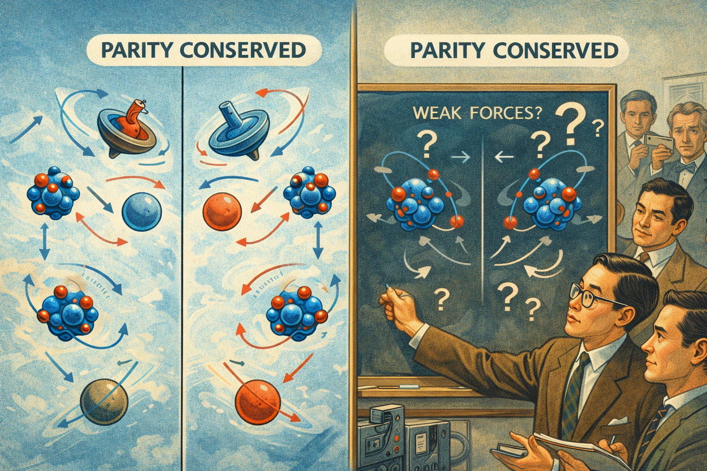
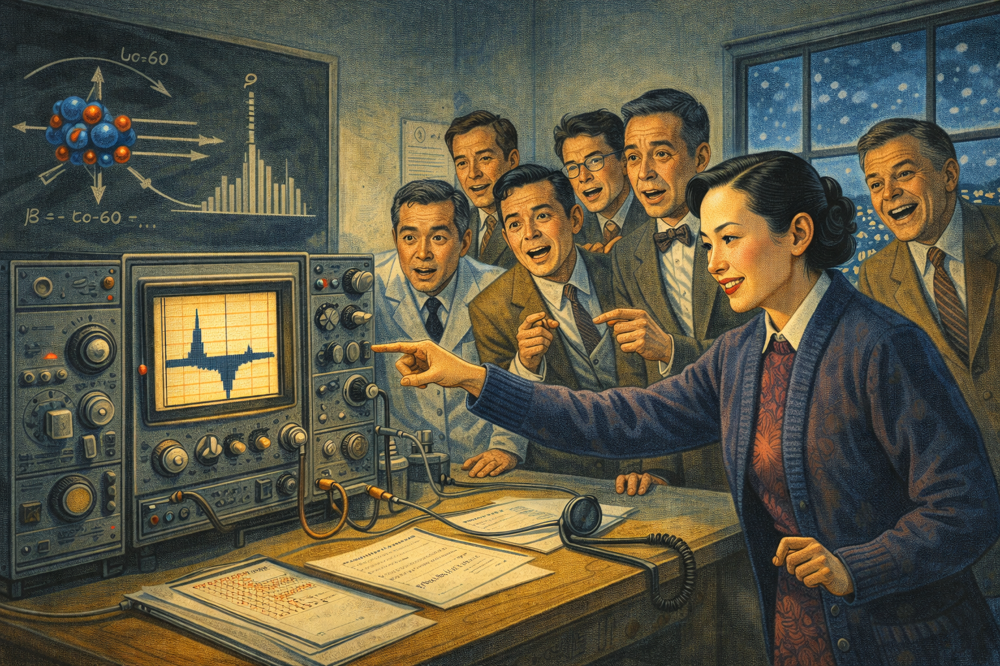
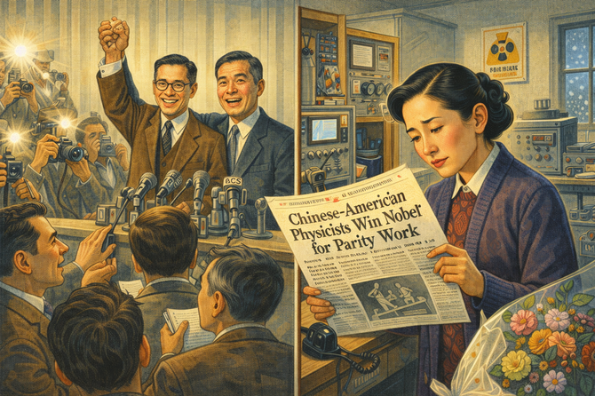
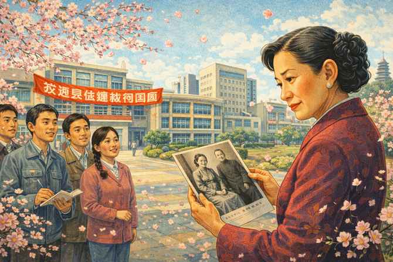
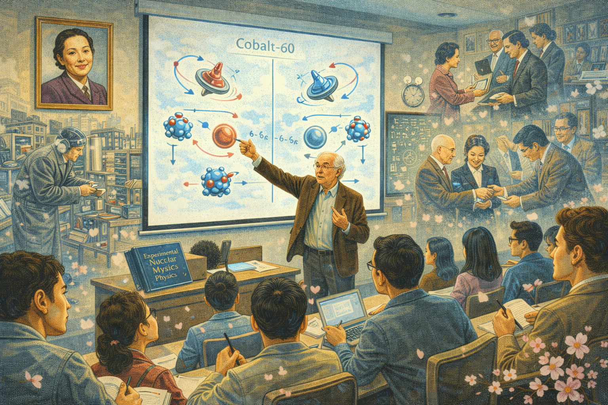
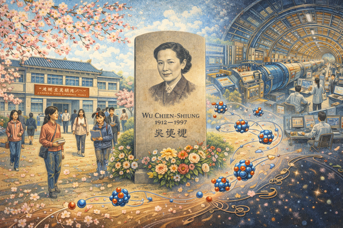

# Breaking Parity: Chien-Shiung Wu and the Fall of a Law

    
Narrative Prompt

Please generate a detailed narrative for a new graphic novel about Chien-Shiung Wu
and her groundbreaking parity violation experiment. The target audience is high
school students studying introductory physics.

The story begins in 1912 in a small town near Shanghai, where Wu's father—a
progressive educator—founded a school for girls at a time when most Chinese
families didn't educate daughters. Show how his belief in women's education
shaped young Chien-Shiung's life.

Describe her journey to America in 1936 to study physics at Berkeley, her
intention to return home, and how World War II and the Chinese Communist
Revolution made that impossible. Show her work on the Manhattan Project
(uranium enrichment).

The central story follows the 1956-1957 parity violation experiment. Theoretical
physicists Tsung-Dao Lee and Chen-Ning Yang proposed that parity (mirror
symmetry) might be violated in certain nuclear reactions—a revolutionary idea.
Everyone thought they were wrong. Wu designed and executed the elegant
cobalt-60 experiment that proved them right.

Include the dramatic moment in January 1957 when her results were confirmed,
the scientific community's shock, and the bitter injustice when Lee and Yang
received the Nobel Prize while Wu—who did the actual experiment—was excluded.

End with her legacy as the "First Lady of Physics" and the question of why
experimental genius is so often overlooked in favor of theoretical work.

When you describe an image, make sure to mention that it should be a colorful,
bright wide-landscape illustration in a mid-20th century scientific style with
elements bridging Chinese and American visual traditions.

### Prologue – A Father's Revolutionary Gift

In 1912, the year the last Chinese emperor abdicated, a baby girl was born in a small town near Shanghai. Her father, **Wu Zhongyi**, did something almost unheard of: he celebrated.

While most Chinese families mourned the birth of daughters, Wu Zhongyi founded a school *for girls*. He believed that China's future depended on educating its women. He named his daughter **Chien-Shiung**—"Strong Hero."

"Remember," he told her, "you can achieve anything a man can achieve. The laws of nature do not discriminate."

She would spend her life proving him right—and discovering that the laws of society were another matter entirely.

Image Prompt

Image 1:
Please generate a new wide-landscape illustration.
A colorful, bright wide-landscape illustration blending traditional Chinese and early modern styles showing Wu Zhongyi's school for girls in Liuhe, China around 1920. The traditional Chinese building with upturned eaves serves as a schoolhouse, its courtyard filled with young girls in simple blue cotton clothing learning to read and write. Wu Zhongyi, in a scholar's long gown, teaches at a blackboard. Young Chien-Shiung, about 8 years old, sits in the front row, her face alight with curiosity. Cherry blossoms frame the scene. Through an open gate, peasant farmers pause to watch this revolutionary sight: girls being educated. The scene conveys progressive vision in a traditional setting.

## Chapter 1 – The Journey East

Chien-Shiung excelled at everything—mathematics, physics, literature. She graduated at the top of her class from National Central University in Nanjing, China's most prestigious school. But China had no advanced physics programs for graduate study.

In 1936, at age 24, she boarded a ship for America. Her plan was simple: earn a PhD in physics, then return home to build China's scientific future.

Her parents waved from the dock. She promised to come back soon.

She never saw them again.

Image Prompt

Image 2:
Please generate a new wide-landscape illustration.
A colorful, bright wide-landscape illustration in a 1930s ocean liner style showing Chien-Shiung Wu's departure from Shanghai in 1936. A massive steam ship prepares to leave the harbor. On deck, young Wu—elegant in a qipao dress, a small suitcase at her feet—waves to her parents on the crowded dock below. Her mother wipes tears; her father waves encouragingly. The Shanghai skyline, a mix of traditional Chinese and art deco buildings, rises behind the dock. Red paper lanterns flutter in the wind. The vast Pacific Ocean stretches toward an unseen America. Wu's expression shows determination mixed with the sorrow of leaving home. The scene captures the courage of crossing oceans for knowledge.

## Chapter 2 – Berkeley and the Bomb

Wu arrived at the University of California, Berkeley, intending to stay two years. She stayed for life. World War II erupted. Then the Communist Revolution transformed China. Return became impossible.

At Berkeley, her brilliance was immediately recognized. When the Manhattan Project needed someone to solve a critical problem with uranium enrichment, they recruited Wu. Her expertise in beta decay—the radioactive process at the heart of nuclear reactions—was essential.

She helped build the atomic bomb, though she was not permitted at Los Alamos because of her Chinese nationality. Like many women in wartime science, her contribution was vital and largely invisible.

Image Prompt

Image 3:
Please generate a new wide-landscape illustration.
A colorful, bright wide-landscape illustration in a 1940s American wartime scientific style showing Chien-Shiung Wu working on uranium enrichment research around 1944. She stands in a Columbia University laboratory filled with vacuum tubes, radiation counters, and uranium samples in lead containers. Charts of radioactive decay chains cover the walls. Other scientists work at distant benches, but Wu works alone on a critical apparatus. Her expression is intensely focused. Security classification stamps marked "SECRET" are visible on documents. Through a window, wartime New York is visible—no lights due to blackout restrictions. The scene conveys essential secret work done by someone officially excluded from the inner circle.

## Chapter 3 – The First Lady of Physics

After the war, Wu joined the faculty at Columbia University. Her experiments on beta decay were so precise, so elegant, that she became the world's leading expert. Other physicists called her "the First Lady of Physics" and "the Chinese Madame Curie."

But being the best experimentalist in the world didn't protect her from discrimination. She was paid less than male colleagues. She was passed over for promotions. When prestigious physics conferences were held, she was sometimes not invited—then asked to explain the results afterward.

Wu kept working. The data, she believed, would speak for itself.

Image Prompt

Image 4:
Please generate a new wide-landscape illustration.
A colorful, bright wide-landscape illustration in a 1950s American academic style showing Chien-Shiung Wu in her Columbia University laboratory around 1955. Now in her 40s, she wears a white lab coat over a elegant dress—always impeccably dressed despite the lab environment. She adjusts a sophisticated beta decay apparatus while graduate students watch and take notes. The laboratory is filled with state-of-the-art equipment: Geiger counters, oscilloscopes, and radioactive source holders. On the wall, a periodic table and nuclear decay diagrams. Her expression is commanding and precise. The scene conveys world-class science being conducted by a woman who has had to be twice as good to receive half the credit.

## Chapter 4 – The Parity Problem

In physics, **parity** was considered a sacred law. It stated that nature treats left and right identically—that the mirror image of any physical process would work exactly the same way. Drop a ball, and its reflection drops too. Spin a top clockwise, and its reflection spins counterclockwise—but both obey the same physics.

In 1956, two young Chinese-American theorists—**Tsung-Dao Lee** and **Chen-Ning Yang**—proposed something shocking: in certain nuclear reactions, parity might be *violated*. Nature might actually distinguish left from right.

Most physicists thought they were crazy. Why would nature have a preference?

Lee and Yang needed an experimentalist brilliant enough to test their wild idea. They went to Chien-Shiung Wu.

Image Prompt

Image 5:
Please generate a new wide-landscape illustration.
A colorful, bright wide-landscape illustration in a 1950s physics concept style explaining parity conservation. The scene shows a split image: on the left, a normal scene with a spinning top, falling objects, and moving particles; on the right, the mirror image. Arrows show that everything in the mirror obeys the same physical laws—parity is conserved. Lee and Yang appear at a chalkboard, adding question marks and proposing that for weak nuclear forces, the mirror might NOT behave identically. Other physicists look skeptical in the background. The visual style uses clean lines and clear comparisons to make the abstract concept concrete. The scene conveys a fundamental assumption about nature being questioned.

## Chapter 5 – The Cobalt Experiment

Wu designed an experiment of breathtaking elegance. She would cool **cobalt-60** atoms to nearly absolute zero, align their nuclear spins with a powerful magnet, and watch which direction the emitted electrons flew.

If parity held, electrons should fly equally in both directions—toward the north pole and the south pole of the nuclei. If parity was violated, more electrons would fly in one direction than the other.

The experiment was extraordinarily difficult. It required temperatures just fractions of a degree above absolute zero—colder than outer space. No one had ever measured beta decay at such temperatures.

Wu worked through Christmas and New Year's, sleeping in the laboratory while others celebrated.

Image Prompt

Image 6:
Please generate a new wide-landscape illustration.
A colorful, bright wide-landscape illustration in a 1950s cryogenic laboratory style showing Chien-Shiung Wu's parity experiment setup at the National Bureau of Standards in late 1956. A massive cryogenic apparatus dominates the scene—vacuum chambers, coiled tubing, and tanks of liquid helium gleaming silver and copper. Wu supervises the assembly while technicians check connections. Diagrams on a nearby blackboard show cobalt-60 atoms with aligned spins and arrows indicating electron emission directions. The temperature gauge shows readings approaching absolute zero. The room is cold; Wu wears a wool sweater over her blouse. Snow is visible through the window—it's Christmas week, but science doesn't stop. The scene conveys the technical complexity required to test a fundamental law of nature.

## Chapter 6 – The Night Physics Changed

On January 9, 1957, Wu's data was clear. More electrons were flying toward one pole than the other. The asymmetry was unmistakable.

**Parity was violated.**

A law that physicists had believed for decades—a symmetry thought to be woven into the fabric of the universe—was wrong. Nature *did* distinguish left from right, at least in certain nuclear reactions.

Wu immediately called Lee and Yang with the results. Lee called other physicists. Word spread through the physics community like wildfire. By morning, the world of physics had changed forever.

"I was shocked," said physicist I.I. Rabi. "It was as if we had learned that a house we had lived in for years had suddenly dissolved."

Image Prompt

Image 7:
Please generate a new wide-landscape illustration.
A colorful, bright wide-landscape illustration in a dramatic late 1950s scientific discovery style showing the moment parity violation was confirmed, January 9, 1957. Wu stands before an oscilloscope displaying the asymmetric electron counts—more emissions toward one direction than the other. Her face shows controlled triumph: she knew what it meant. Assistants and collaborators crowd around, their expressions ranging from disbelief to elation. On a chalkboard behind them, the once-symmetric diagram of electron emission now shows arrows predominantly in one direction. A telephone receiver lies off the hook—she has just called Lee and Yang. Through the window, pre-dawn darkness. The scene captures the electric moment when a fundamental law of physics fell.

## Chapter 7 – The Nobel Snub

On October 31, 1957—less than ten months after Wu's experiment—the Nobel Prize in Physics was announced. The winners: **Tsung-Dao Lee** and **Chen-Ning Yang**, "for their penetrating investigation of the so-called parity laws."

Chien-Shiung Wu was not mentioned.

The theorists had proposed the idea. Wu had *proven* it. Without her experiment, their proposal would have remained speculation. Yet the Nobel Committee honored only the idea, not the evidence.

Lee and Yang were gracious. They publicly acknowledged Wu's essential contribution. But the Nobel Prize—the highest honor in science—excluded her.

Image Prompt

Image 8:
Please generate a new wide-landscape illustration.
A colorful, bright wide-landscape illustration in a late 1950s news media style showing the 1957 Nobel Prize announcement. The scene is split: on one side, Lee and Yang celebrate at a press conference, flashbulbs popping, reporters crowding with notebooks. On the other side, Wu reads the newspaper announcement alone in her Columbia laboratory. Her expression is complex—pride in the discovery, pain at the exclusion. The headline reads "Chinese-American Physicists Win Nobel for Parity Work." Wu's name is not in the article visible to us. Lab equipment surrounds her. A bouquet of congratulatory flowers sits unopened. The scene conveys injustice wrapped in celebration.

## Chapter 8 – "I'm Not Bitter"

When asked about the Nobel snub, Wu was characteristically dignified. "I'm not bitter," she said. "The important thing is the physics."

But others were bitter on her behalf. The exclusion of experimentalists—especially women experimentalists—became a recurring pattern in Nobel history. Colleagues pointed out that discoveries require *proof*, not just ideas.

Wu continued her work, making more fundamental contributions to physics. She received virtually every other major prize: the National Medal of Science, the Wolf Prize, the Comstock Prize. Everything but the Nobel.

"Maybe I'm a black box," she once said with a wry smile. "The Nobel Committee can't see inside."

Image Prompt

Image 9:
Please generate a new wide-landscape illustration.
A colorful, bright wide-landscape illustration in a late 1950s portrait style showing Chien-Shiung Wu in a formal interview setting around 1958. She sits elegantly in her Columbia office, surrounded by awards and certificates—the National Medal of Science prominent among them, but no Nobel medal. A journalist takes notes while she speaks with composure. Her desk holds her famous experimental apparatus in miniature, plus a photo of Lee and Yang at their Nobel ceremony. Through the window, the Columbia campus is visible. Wu's expression is serene and proud. The scene conveys dignity in the face of injustice—a woman who refused to let unfairness diminish her achievements.

## Chapter 9 – Why Does It Matter?

Why does parity violation matter beyond abstract physics?

The asymmetry Wu discovered helps explain one of the deepest mysteries in cosmology: **why is there something rather than nothing?**

In the Big Bang, matter and antimatter should have been created in equal amounts—and then annihilated each other completely. But parity violation (and related asymmetries) created a tiny imbalance. For every billion antimatter particles, there were a billion *and one* matter particles.

That one extra particle in a billion is everything we see: galaxies, stars, planets, people. Without parity violation, the universe would be empty.

Wu's experiment helped explain why we exist.

Image Prompt

Image 10:
Please generate a new wide-landscape illustration.
A colorful, bright wide-landscape illustration in a modern cosmological visualization style showing the implications of parity violation for the existence of matter. The scene shows the Big Bang at left, with matter and antimatter particles (shown as colored and anti-colored spheres) annihilating in brilliant flashes. A tiny asymmetry—just one extra matter particle per billion—survives. These survivors flow rightward, coalescing into galaxies, stars, planets, and eventually a human figure looking up at the stars. Parity-violating decay diagrams (cobalt-60, electrons flying asymmetrically) are woven into the cosmic flow. At the bottom, a caption: "That one in a billion is everything." The scene conveys how Wu's laboratory discovery connects to the largest questions of existence.

## Chapter 10 – Return to China

In 1973, decades after she left, Wu finally returned to China. The Cultural Revolution had ended, and diplomatic relations with America were thawing. She visited universities, met with scientists, and was celebrated as a national hero.

But her parents were gone. The world she had left no longer existed. She walked through her father's school—now transformed beyond recognition—and wept.

She returned to America knowing she belonged to both countries and fully to neither. Her exile had been the price of her science.

Image Prompt

Image 11:
Please generate a new wide-landscape illustration.
A colorful, bright wide-landscape illustration blending 1970s Chinese and American elements showing Chien-Shiung Wu's return to China in 1973. Wu, now in her 60s with gray-streaked hair, stands before the transformed site of her father's school. Modern buildings have replaced the traditional architecture. She holds an old photograph of her parents, comparing it to the changed landscape. Young Chinese physics students surround her admiringly, but her expression is bittersweet—homecoming mixed with loss. A banner welcomes her as a national hero. Cherry blossoms fall, connecting past and present. The scene conveys the complicated emotions of returning to a homeland that has become foreign.

## Chapter 11 – The Quiet Revolution

Though Wu never received the Nobel Prize, her impact reshaped physics. Her experimental methods became textbooks. Her students became leaders. Her insistence on precision and elegance set standards that endure today.

More importantly, she proved—again and again—that experimental physics is not secondary to theory. Ideas mean nothing without evidence. Someone must design the experiment, build the apparatus, and wrestle truth from nature.

That someone was Chien-Shiung Wu.

Image Prompt

Image 12:
Please generate a new wide-landscape illustration.
A colorful, bright wide-landscape illustration in a late 20th century academic style showing Wu's lasting influence on physics. The scene shows a modern university physics lecture hall where a professor (one of Wu's former students, now elderly) teaches parity violation to a new generation. On the screen: Wu's original cobalt-60 experiment diagrams. On the wall: a portrait of Wu. In the audience, diverse students take notes. Floating around the scene, transparent images show key moments from Wu's career: the experiment, receiving awards, mentoring students. A textbook titled "Experimental Nuclear Physics" by Wu sits on the professor's desk. The scene conveys knowledge flowing across generations.

## Chapter 12 – First Lady of Physics

Chien-Shiung Wu died on February 16, 1997, at age 84. Her ashes were buried in the courtyard of her father's school in China—finally home, in a way, after a lifetime of exile.

The school has been renamed in her honor. The **Wu Chien-Shiung Education Foundation** promotes science education for girls throughout China. Element 117, named **Tennessine**, was discovered using techniques she pioneered.

But her greatest memorial is the physics itself. Every textbook chapter on parity violation, every particle physics experiment that exploits CP violation, every cosmologist who wonders why matter survived the Big Bang—all stand on foundations she built.

The "First Lady of Physics" proved that nature distinguishes left from right. History should learn to distinguish experiment from theory.

Image Prompt

Image 13:
Please generate a new wide-landscape illustration.
A colorful, bright wide-landscape illustration blending Chinese and modern scientific imagery showing Wu's legacy. The left side shows her father's school, now renamed the Wu Chien-Shiung Memorial Hall, with Chinese students—many of them girls—walking through cherry blossoms in the courtyard. The center shows her grave marker, simple and elegant, with flowers left by admirers. The right side shows a modern particle physics laboratory (like CERN or Fermilab) where the asymmetries she discovered are probed at ever-higher energies. Connecting all scenes, asymmetric particle decay diagrams flow like calligraphy—East meeting West, past meeting future. The scene conveys a life that bridged cultures and changed physics forever.

### Epilogue – The Weight of Evidence

Chien-Shiung Wu's life teaches us that proving an idea is as important as having it:

| Challenge | How Wu Responded | Lesson for Today |
|-----------|------------------|------------------|
| **Born when girls weren't educated** | Her father built a school; she became its best student | Progress begins at home |
| **Crossed an ocean for knowledge** | Never returned but never forgot her origins | Sacrifice for learning transforms lives |
| **Excluded from inner circles** | Did essential wartime work anyway | Contribution matters more than credit |
| **Asked to prove an "impossible" theory** | Designed the most elegant experiment in nuclear physics | Rise to the challenge |
| **Denied the Nobel Prize** | Continued working; received every other major honor | Let history judge; keep working |
| **Separated from homeland** | Built bridges between Chinese and American science | Science transcends borders |

Final Image Prompt

Image 14:
Please generate a new wide-landscape illustration.
A colorful, bright wide-landscape illustration bridging Chinese and Western scientific traditions with an inspiring, forward-looking tone. A diverse group of young physics students works in a modern particle physics laboratory. Asian and American flags hang together. One student examines a model of cobalt-60 decay; another adjusts cryogenic equipment; a third—a young Chinese-American woman—presents data showing particle asymmetries. On the wall, portraits of great experimentalists include Wu prominently. Through the window, both a Chinese pagoda and an American university spire are visible—perhaps unrealistically, but symbolically. Wu's ghostly image appears in a beam of light, smiling at the next generation. A blackboard shows the parity violation equations. The scene conveys that Wu's legacy lives on in every experimentalist who proves theory right—or wrong.

### Call to Action

Chien-Shiung Wu was asked to prove the impossible—and did. She showed that nature itself is asymmetric, that the universe distinguishes left from right, and that one extra particle in a billion is the reason anything exists at all.

She was denied the Nobel Prize. But she proved something more important: **without experimentalists, theories are just stories.**

Ideas are cheap. Evidence is hard. Someone must cool atoms to near absolute zero, align nuclear spins, count electrons one by one, and report what nature actually does—not what we expect.

That someone could be you.

The next fundamental law waiting to fall, the next symmetry waiting to break, the next experiment waiting to change everything—it needs someone with steady hands, precise thinking, and the courage to trust data over authority.

Physics doesn't care about prizes. Physics cares about truth.

What will *you* prove?

---

*"There is only one thing worse than coming home after a day in the lab to find that dinner is not ready—and that is not to have a lab to go to at all."*
—Chien-Shiung Wu

---

## References

1. [Chien-Shiung Wu | Biography, Accomplishments, Importance, & Facts](https://www.britannica.com/biography/Chien-Shiung-Wu) - Updated 2024 - Britannica - Complete biography of the "First Lady of Physics" who designed the experiment that proved parity violation and changed our understanding of the universe.

2. [Chien-Shiung Wu](https://ahf.nuclearmuseum.org/ahf/profile/chien-shiung-wu/) - 2024 - Atomic Heritage Foundation/Nuclear Museum - Detailed account of Wu's work on the Manhattan Project and her groundbreaking parity experiment at near absolute zero temperatures.

3. [Biography: Dr. Chien-Shiung Wu](https://www.womenshistory.org/education-resources/biographies/chien-shiung-wu) - 2024 - National Women's History Museum - Educational biography highlighting Wu's journey from China to becoming the first female president of the American Physical Society.

4. [Chien-Shiung Wu | The First Lady of Physics](https://www.thematildaproject.com/scientists/chien-shiung-wu) - 2024 - The Matilda Project - Illustrated story about Wu's life and the Nobel Prize controversy, part of a project highlighting women overlooked for scientific recognition.

5. [Chien-Shiung Wu](https://oumnh.ox.ac.uk/learn-chien-shiung-wu) - 2024 - Oxford University Museum of Natural History - Learn about Wu's meticulous experimental techniques that made her one of the most respected physicists of her generation.

