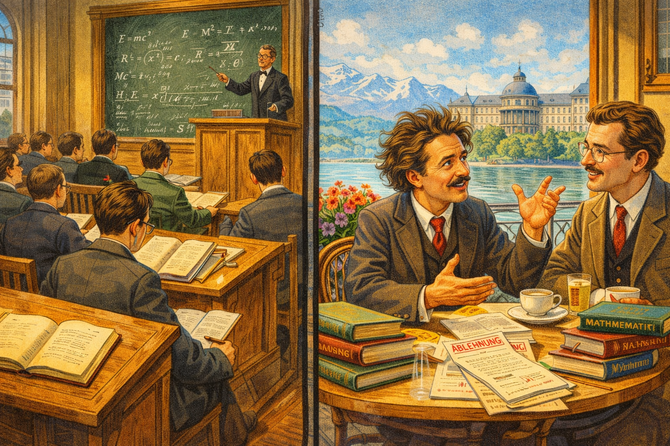
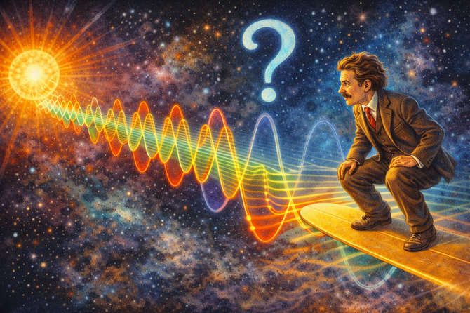
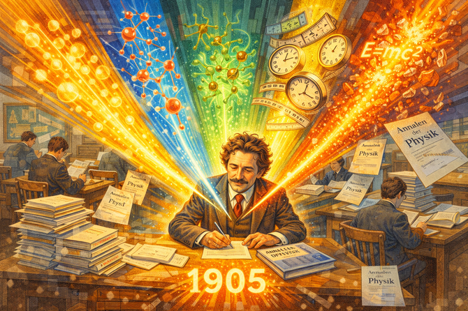
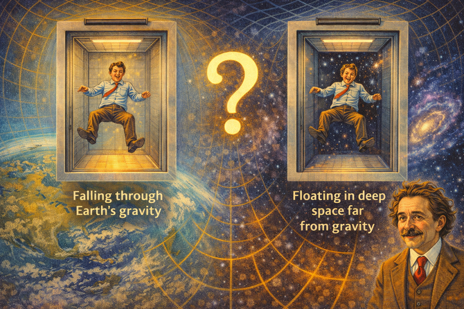
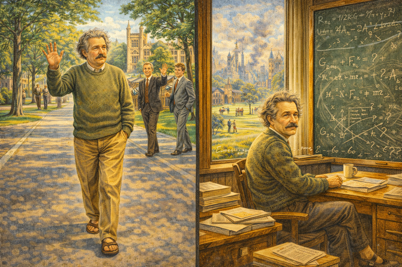
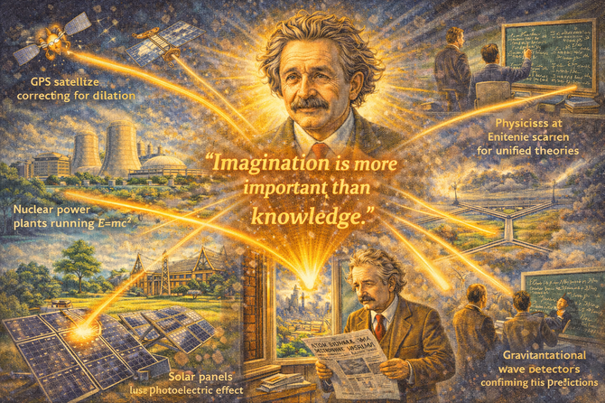

# The Patent Clerk's Daydream: Einstein's Miracle Year

    
Narrative Prompt

Please generate a detailed narrative for a new graphic novel about Albert Einstein
that is engaging and inspiring for teenagers. The target audience is high school
students studying introductory physics.

Einstein's story challenges the myth of the overnight genius. He struggled to get
academic positions, was considered a mediocre student by some professors, and only
revolutionized physics because he had free time at a patent office to think.

Key elements:
- Born 1879 in Ulm, Germany; moved around as a child
- Legend of being "bad at school" is false—he was brilliant but rebellious
- Failed to get academic positions after graduating from ETH Zurich
- Worked at the Swiss Patent Office in Bern, evaluating inventions
- 1905 "Miracle Year" (Annus Mirabilis): published four revolutionary papers:
  1. Photoelectric effect (won Nobel Prize)
  2. Brownian motion (proved atoms exist)
  3. Special relativity (E=mc²)
  4. Mass-energy equivalence
- Famous thought experiments: chasing a beam of light, falling elevator
- General relativity (1915): gravity as curved spacetime
- 1919 eclipse confirmed his predictions—became world famous overnight
- Fled Nazi Germany in 1933, settled at Princeton
- Wrote letter to Roosevelt warning about atomic bomb; later regretted it
- Pop culture icon: wild hair, quotable wisdom, image of genius itself

When you describe an image, make sure to mention that it should be a colorful,
bright wide-landscape illustration in an early 20th century European modernist
style with elements of Swiss precision and playful imagination.

---
Image preamble

This session is to generate wide-landscape 16:9 ratio images for my
new graphic novel about Albert Einstein
that is engaging and inspiring for teenagers. The target audience is high school
students studying introductory physics.

All images MUST have a wide-landscape 16:9 width:height ratio.

The style of each image should be a colorful, bright illustrations in an early 20th century 
European modernist style with elements of Swiss precision and playful imagination.
Make the images fun when appropriate.  This should not be a serious a story.  It
is about how Einstein's ability to visualize thought experiments gave him a unique superpower.

### Prologue – The Kid Who Questioned Everything

In 1879, a baby was born in Ulm, Germany who wouldn't speak until age three. His parents worried something was wrong. Teachers would later call him slow and unfocused.

They were all wrong.

**Albert Einstein** wasn't slow—he was thinking. While other children memorized facts, Albert asked uncomfortable questions. Why did magnets work? What would it look like to ride a beam of light? Why did everyone just accept things without really understanding them?

His questions would eventually overturn everything we thought we knew about space, time, and reality itself.

But first, he had to fail spectacularly.

Image Prompt

Image 1:
Please generate a new wide-landscape illustration.
A colorful, bright wide-landscape illustration in a late 19th century German domestic style showing young Albert Einstein, about 5 years old, in Munich around 1884. His father Hermann shows him a compass, and the boy stares at it with intense fascination—the needle always pointing north, moved by an invisible force. His expression shows not just curiosity but the beginning of obsession: why? How? Around them, a comfortable middle-class home with physics and mathematics books (his father was an engineer). The compass glows slightly, hinting at the electromagnetic mysteries the boy will later unravel. The scene captures the origin of a questioning mind.

## Chapter 1 – The Rebellious Student

Einstein was not a bad student—he was a *rebellious* one. He got excellent grades in math and physics but openly challenged teachers who demanded rote memorization. One professor called him "a lazy dog."

At ETH Zurich, Einstein spent more time reading physics books on his own than attending lectures. He relied on his classmate Marcel Grossmann's notes to pass exams. Professors wrote dismissive recommendation letters.

After graduating in 1900, Einstein applied for academic positions across Europe. Every single one rejected him. The young genius couldn't even get a job as a teaching assistant.

Image Prompt

Image 2:
Please generate a new wide-landscape illustration.
A colorful, bright wide-landscape illustration in a turn-of-the-century Swiss academic style showing Einstein as a student at ETH Zurich around 1899. The scene is split: on one side, a formal lecture hall where the professor drones and students take dutiful notes—Einstein's seat is empty. On the other side, Einstein sits in a sunny café, physics books piled around him, discussing ideas animatedly with his friend Marcel Grossmann. Rejection letters are visible on a nearby table. Einstein's expression shows frustration mixed with confidence—he knows he's brilliant, even if the establishment doesn't. The scene contrasts institutional disapproval with self-directed learning.

## Chapter 2 – The Patent Office

In 1902, desperate for income, Einstein took a job as a "Technical Expert Third Class" at the Swiss Patent Office in Bern. His job: evaluate patent applications, determining whether inventions were practical and truly new.

It sounds like a dead end. It was actually perfect.

The work was easy enough that Einstein finished his daily tasks quickly. That left hours of free time to think. While other academics taught classes, attended meetings, and played politics, Einstein sat at his desk and pondered the nature of the universe.

The patent office became his private physics laboratory—no equipment needed, just thought.

Image Prompt

Image 3:
Please generate a new wide-landscape illustration.
A colorful, bright wide-landscape illustration in an early 20th century Swiss bureaucratic style showing the Patent Office in Bern around 1904. Rows of clerks work at heavy wooden desks piled with patent applications. Einstein sits among them, but his desk is different: patent documents are stacked neatly to one side (already finished), while he stares into space, a physics journal hidden among his papers, equations doodled in the margins of official forms. A thought bubble shows the ideas percolating: light beams, moving trains, clocks. His colleagues work diligently; Einstein dreams. The scene captures hidden genius in mundane circumstances.

## Chapter 3 – What If You Chased a Beam of Light?

Since age 16, Einstein had pondered a strange question: what would you see if you could travel alongside a beam of light?

According to physics, light was a wave. If you caught up to it, you should see a stationary wave—frozen in space, neither moving nor vibrating.

But that was nonsense. Light couldn't just stop being light.

Einstein turned the question around: what if the speed of light was the same for *everyone*, no matter how fast they were moving? What would that mean for space and time?

The answer would shatter centuries of assumptions.

Image Prompt

Image 4:
Please generate a new wide-landscape illustration.
A colorful, bright wide-landscape illustration in an early 20th century surrealist-scientific style showing Einstein's famous light beam thought experiment. Einstein imagines himself riding alongside a beam of light, watching its waves. The image visualizes this fantasy: Einstein on some kind of cosmic surfboard, riding next to oscillating electromagnetic waves shown in brilliant colors. But something's wrong—if he matches the light's speed, what does he see? Frozen waves? Nothing? A question mark floats in space. The scene blends playful imagination with deep physics, showing how "silly" questions lead to revolutionary answers.

## Chapter 4 – The Miracle Year

In 1905, something extraordinary happened. In a single year, Einstein published four papers that would each have been enough to make him famous:

1. **The photoelectric effect**: Light comes in packets (photons). This would win the Nobel Prize.
2. **Brownian motion**: Random motion of particles proves atoms exist.
3. **Special relativity**: Space and time are relative; the speed of light is absolute.
4. **Mass-energy equivalence**: E = mc². Matter is frozen energy.

Einstein was 26 years old. He still worked at the patent office.

No laboratory. No research team. No academic position. Just a clerk with ideas.

Image Prompt

Image 5:
Please generate a new wide-landscape illustration.
A colorful, bright wide-landscape illustration in an early 20th century modernist collage style showing Einstein's Miracle Year of 1905. Einstein sits at his patent office desk, but four brilliant light beams emanate from him, each representing one paper: photoelectric effect (light as particles), Brownian motion (dancing atoms), special relativity (warped clocks and rulers), and E=mc² (mass converting to pure energy). Scientific journal covers float around him: "Annalen der Physik." The year 1905 glows prominently. His colleagues continue their mundane work, unaware. The scene captures the explosive creativity of a single remarkable year.

## Chapter 5 – Time Is Personal

Special relativity's central insight was mind-bending: **time passes differently depending on how fast you're moving.**

If you travel near the speed of light, your clock ticks slower relative to someone standing still. This isn't an illusion—you actually age more slowly. Lengths contract. Mass increases. The universe is stranger than Newton imagined.

Einstein showed that space and time aren't separate—they're woven together into **spacetime**. And nothing can travel faster than light.

At the end of his paper, he added a short note: a moving object's mass is related to its energy by a simple formula.

E = mc².

Image Prompt

Image 6:
Please generate a new wide-landscape illustration.
A colorful, bright wide-landscape illustration in an early 20th century scientific visualization style showing special relativity concepts. A train moves at near light speed across the image. Inside, a passenger's clock ticks slowly; outside, clocks on the platform tick faster—time dilation made visible. The train is compressed in its direction of motion—length contraction. A beam of light races ahead, always staying the same speed faster than the train. Einstein stands to the side, explaining the relationships with a small chalkboard showing E=mc². The scene makes abstract physics visual and approachable.

## Chapter 6 – E = mc²

That little equation became the most famous in history. It says that mass and energy are the same thing, just in different forms. The "c²" (speed of light squared) is enormous, so even a tiny amount of matter contains vast energy.

How much? If you could convert one kilogram of matter entirely into energy, you would release the same energy as a 20-megaton nuclear bomb.

Einstein didn't set out to create weapons. He was just following the logic of his equations. But the implications would eventually change world history.

Image Prompt

Image 7:
Please generate a new wide-landscape illustration.
A colorful, bright wide-landscape illustration in a mid-20th century atomic age style showing the meaning of E=mc². The famous equation floats at the center, glowing with power. On one side, a tiny pellet of matter (mass); on the other, an enormous explosion of energy. The speed of light squared bridges them, showing why tiny mass equals huge energy. Both positive applications (nuclear power plants, medical isotopes) and negative ones (mushroom clouds) are subtly suggested in the background. Einstein looks on with a complex expression—wonder at the math, concern about implications. The scene captures the most famous equation in history.

## Chapter 7 – The Elevator Insight

Special relativity covered constant motion. But what about acceleration? What about gravity?

Einstein's breakthrough came in 1907 when he imagined a person in a falling elevator. While falling, the person would feel weightless—indistinguishable from floating in empty space. Gravity and acceleration felt identical.

This "happiest thought of my life" became the **equivalence principle**—the foundation of general relativity. Einstein realized that gravity wasn't a force pulling objects together. It was the curvature of spacetime itself.

Mass bends space. And objects follow the curves.

Image Prompt

Image 8:
Please generate a new wide-landscape illustration.
A colorful, bright wide-landscape illustration in an early 20th century thought experiment style showing the falling elevator insight. Two side-by-side images: Left, a person floats in an elevator falling through Earth's gravity—they feel weightless. Right, the same person floats in an elevator in deep space, far from any gravity—also weightless. The question mark between them: how would you tell the difference? Einstein grins in the corner, having realized they're identical. Curved grid lines hint at the coming geometric interpretation of gravity. The scene makes Einstein's "happiest thought" visually accessible.

## Chapter 8 – Gravity Bends Light

In 1915, after eight grueling years of mathematical struggle (with help from mathematician Marcel Grossmann), Einstein completed his **general theory of relativity**.

The theory made an audacious prediction: since gravity curves spacetime, and light travels through spacetime, massive objects should bend light. Starlight passing near the Sun should appear slightly shifted.

This could be tested during a solar eclipse. In 1919, British astronomer Arthur Eddington led expeditions to observe an eclipse from Africa and Brazil. His measurements confirmed Einstein's predictions.

Headlines exploded worldwide: **NEWTON OVERTHROWN**

Einstein, the patent clerk, was suddenly the most famous scientist on Earth.

Image Prompt

Image 9:
Please generate a new wide-landscape illustration.
A colorful, bright wide-landscape illustration in a 1919 documentary/newspaper style showing the eclipse that made Einstein famous. The scene splits between the eclipse expedition (astronomers with telescopes in an African field, the Sun's corona blazing around the dark Moon) and the results (photographs showing star positions slightly shifted, proving light bends around the Sun). Headlines from around the world flash: "REVOLUTION IN SCIENCE," "LIGHTS ALL ASKEW IN THE HEAVENS," "EINSTEIN THEORY TRIUMPHS." Einstein himself, now with his iconic wild hair emerging, looks slightly bewildered by sudden fame. The scene captures science becoming global news.

## Chapter 9 – Celebrity Scientist

After 1919, Einstein became more than a scientist—he became a symbol. His wild hair, rumpled sweaters, and quotable wisdom made him an icon. He traveled the world, met royalty, and was mobbed like a movie star.

He used his fame for causes he believed in: pacifism, civil rights, Jewish causes, and later, warnings about nuclear weapons. He helped establish the Hebrew University in Jerusalem and advocated for refugees.

But fame had costs. Privacy vanished. Cranks and critics multiplied. And the Nazis were rising in Germany, singling out "Jewish physics" for attack.

Image Prompt

Image 10:
Please generate a new wide-landscape illustration.
A colorful, bright wide-landscape illustration in a 1920s international celebrity style showing Einstein's fame. A montage: Einstein meets the Emperor of Japan, delivers lectures to packed halls, is surrounded by reporters with flashbulbs popping, relaxes on a ship deck during world tours, appears on magazine covers. His face is everywhere—already the iconic image of "genius." He plays violin at charity concerts, speaks about peace to crowds. But shadows creep at the edges: Nazi posters denouncing "Jewish physics," the gathering storm in Europe. The scene captures the heights of fame before the fall.

## Chapter 10 – Exile

In 1933, while Einstein was visiting California, Hitler came to power. Einstein never returned to Germany. His Berlin apartment was raided, his bank accounts frozen, his books burned.

He settled at the Institute for Advanced Study in Princeton, New Jersey—a refuge for European intellectuals fleeing fascism. He became an American citizen in 1940.

But Einstein spent his later years frustrated. He never accepted quantum mechanics fully, fighting a losing battle against the theory's randomness. He sought a unified field theory that would merge all physics—and never found it.

"I have become a lonely old man," he wrote, "who is displayed as a curiosity."

Image Prompt

Image 11:
Please generate a new wide-landscape illustration.
A colorful, bright wide-landscape illustration in a 1940s American academic style showing Einstein's Princeton years. Einstein walks down a tree-lined Princeton street in his famous disheveled sweater, sockless feet in sandals. Students and professors wave; he waves back distractedly, lost in thought. His office at the Institute for Advanced Study is visible: blackboards covered with failed unified field attempts, equations crossed out, a sense of questing that doesn't quite succeed. Through the window, both the peaceful Princeton campus and ghostly images of the Europe he left behind. The scene conveys the last chapter: famous, safe, but searching.

## Chapter 11 – The Letter He Regretted

In 1939, physicists Leo Szilard and Eugene Wigner visited Einstein with disturbing news: Nazi Germany might be developing an atomic bomb. They convinced him to sign a letter to President Roosevelt urging American research.

The Manhattan Project followed. Einstein had no role in building the bomb—his pacifism and German origins made him a security risk. But his famous equation, E=mc², described exactly where the bomb's energy came from.

When Hiroshima was destroyed, Einstein reportedly said: "Woe is me."

He spent his remaining years advocating for nuclear disarmament and world government—trying to contain the forces his physics had helped unleash.

Image Prompt

Image 12:
Please generate a new wide-landscape illustration.
A colorful, bright wide-landscape illustration in a late 1940s atomic age style showing Einstein's conflicted legacy. The scene is split dramatically: on one side, Einstein signs the letter to Roosevelt in 1939, Szilard and Wigner looking on urgently. On the other side, the mushroom cloud over Hiroshima. Einstein reads the newspaper headline about the bombing, his expression devastated. His famous equation E=mc² floats between the two scenes, connecting them. In his hand, a draft letter calling for nuclear disarmament. The scene captures the burden of knowledge and responsibility.

## Chapter 12 – What Genius Really Means

Albert Einstein died on April 18, 1955, in Princeton. His last written words were incomplete equations—still searching for unity.

But his legacy is everywhere:
- GPS satellites correct for **relativistic time dilation** every day
- **E=mc²** powers nuclear reactors and explains how the Sun shines
- **Photons** from his photoelectric effect run solar panels
- His thought experiments taught us that **imagination is as important as knowledge**

Einstein wasn't a genius because he was born special. He was a genius because he kept asking questions everyone else ignored, followed them stubbornly for years, and never stopped wondering.

A patent clerk who daydreamed about light beams—and rewrote the laws of the universe.

Image Prompt

Image 13:
Please generate a new wide-landscape illustration.
A colorful, bright wide-landscape illustration blending early 20th century and modern elements showing Einstein's legacy. From his Princeton office, beams of light connect to: GPS satellites correcting for time dilation, nuclear power plants running on E=mc², solar panels using the photoelectric effect, gravitational wave detectors confirming his predictions, and physicists at blackboards continuing his search for unified theories. Above it all, Einstein's iconic face looks down with a gentle smile. His most famous quote floats: "Imagination is more important than knowledge." The scene conveys how one curious person reshaped modern life.

### Epilogue – The Daydreamer's Guide to Changing Everything

Einstein didn't fit the mold—and that was his greatest advantage:

| Einstein's Trait | How It Helped Him | Lesson for Today |
|------------------|-------------------|------------------|
| **Questioned authority** | Didn't accept Newton blindly; found limits others missed | Ask "why?" even when experts say "just accept it" |
| **Failed to get academic jobs** | Had time to think at the patent office | Setbacks can become opportunities |
| **Used thought experiments** | Could explore physics without expensive equipment | Imagination is a legitimate tool |
| **Worked in isolation** | No pressure to follow trends; developed ideas fully | Sometimes being outside the mainstream helps |
| **Stayed curious** | Kept asking questions into old age | Wonder doesn't have an expiration date |
| **Admitted mistakes** | Eventually accepted quantum mechanics was correct | Being wrong is part of being right eventually |

Final Image Prompt

Image 14:
Please generate a new wide-landscape illustration.
A colorful, bright wide-landscape illustration blending early 20th century and modern styles. A diverse group of students sits in a classroom, but they're clearly daydreaming—thought bubbles show them riding light beams, falling in elevators, bending spacetime. A poster of Einstein on the wall has his quote: "Imagination is more important than knowledge." A teacher smiles approvingly at their wandering minds. Through the window, both the old patent office in Bern and modern physics facilities (LIGO, CERN) are visible. One student has wild hair like Einstein's; another sketches impossible physics in a notebook. The scene conveys that genius begins with daydreaming—and asking "what if?"

### Call to Action

Albert Einstein was rejected for academic jobs. He worked as a patent clerk. He had no laboratory, no research team, and no institutional support.

He changed physics forever by asking questions like:
- "What would it look like to chase a beam of light?"
- "What if space and time were connected?"
- "What if mass and energy were the same thing?"

He didn't need fancy equipment. He needed curiosity, persistence, and the courage to follow strange ideas wherever they led.

**His method:**

1. **Ask weird questions** — The "dumb" questions are often the deepest
2. **Use thought experiments** — Imagine impossible scenarios to find truth
3. **Trust your reasoning** — Even when everyone says you're wrong
4. **Keep going** — General relativity took 8 years of struggle
5. **Stay humble** — "The more I learn, the more I realize how much I don't know"

Einstein's greatest lesson isn't E=mc² or curved spacetime. It's that **a curious mind with persistent questions can understand the universe**—even from a desk in a patent office.

What's your weird question?

---

*"Imagination is more important than knowledge. Knowledge is limited. Imagination encircles the world."*
—Albert Einstein

*"I have no special talents. I am only passionately curious."*
—Also Einstein (probably being modest)

---

## References

1. [Albert Einstein | Biography, Education, Discoveries, & Facts](https://www.britannica.com/biography/Albert-Einstein) - Updated 2024 - Britannica - Comprehensive biography from his struggles in school to becoming the world's most famous scientist, including his work on relativity and the photoelectric effect.

2. [Case Files: Albert Einstein](https://fi.edu/en/news/case-files-albert-einstein) - 2024 - The Franklin Institute - Explore Einstein's notebooks, letters, and the story of how a patent clerk revolutionized our understanding of space, time, and energy.

3. [10 Facts About Albert Einstein](https://www.natgeokids.com/uk/discover/science/general-science/albert-einstein-facts/) - 2024 - National Geographic Kids - Fun, student-friendly facts about Einstein's life, including his love of music, his quirky habits, and his most famous equation.

4. [Albert Einstein - From Graduation to the Miracle Year](https://www.britannica.com/biography/Albert-Einstein/From-graduation-to-the-miracle-year-of-scientific-theories) - Updated 2024 - Britannica - Detailed look at 1905, when Einstein published four papers that transformed physics while working as a patent clerk.

5. [Albert Einstein: Biography](https://www.biography.com/scientists/albert-einstein) - Updated 2024 - Biography.com - Accessible overview of Einstein's life, from his escape from Nazi Germany to his later years at Princeton and his complicated legacy with nuclear weapons.

