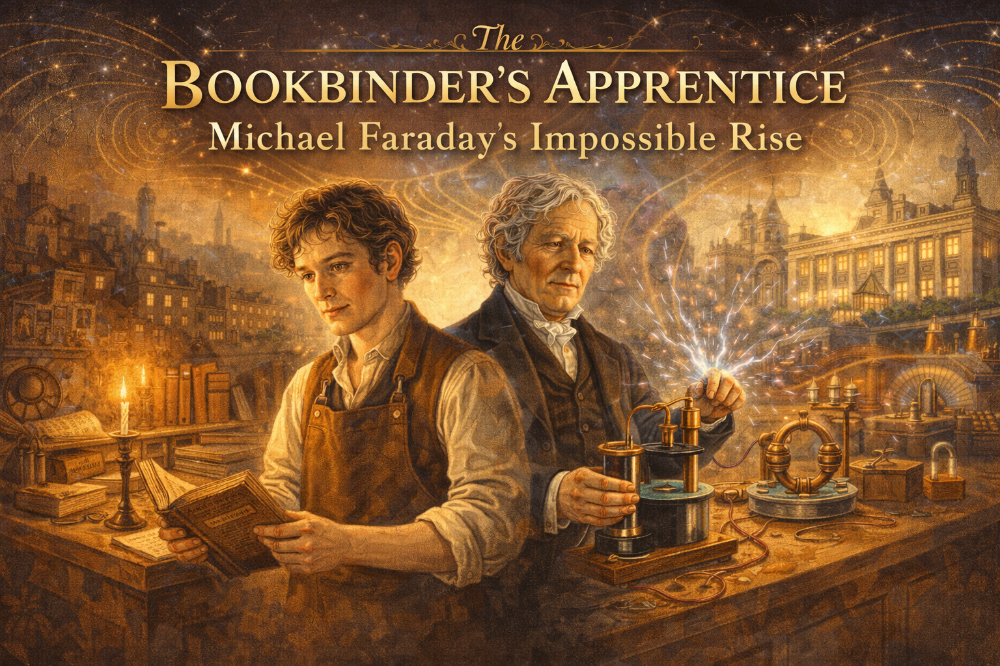
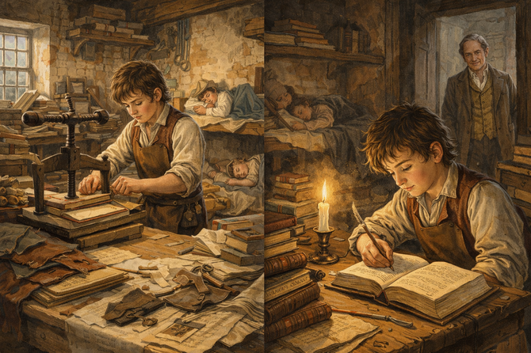
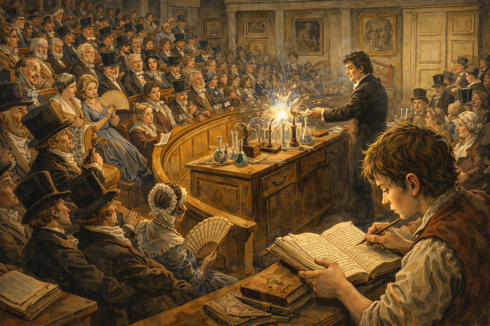
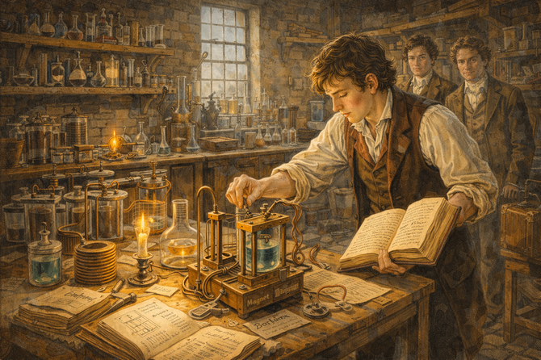
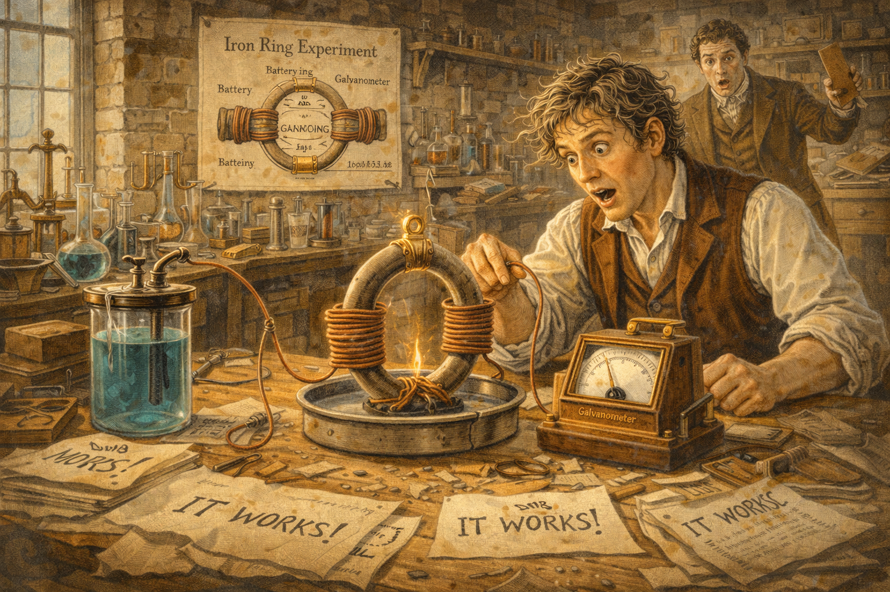
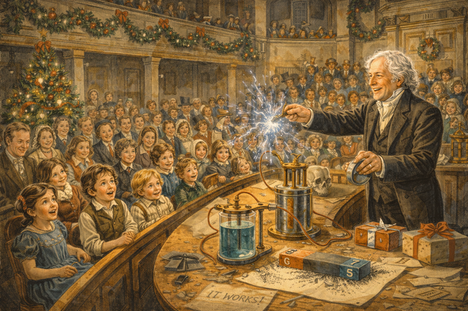
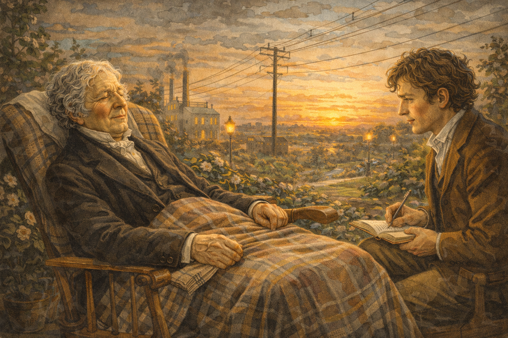
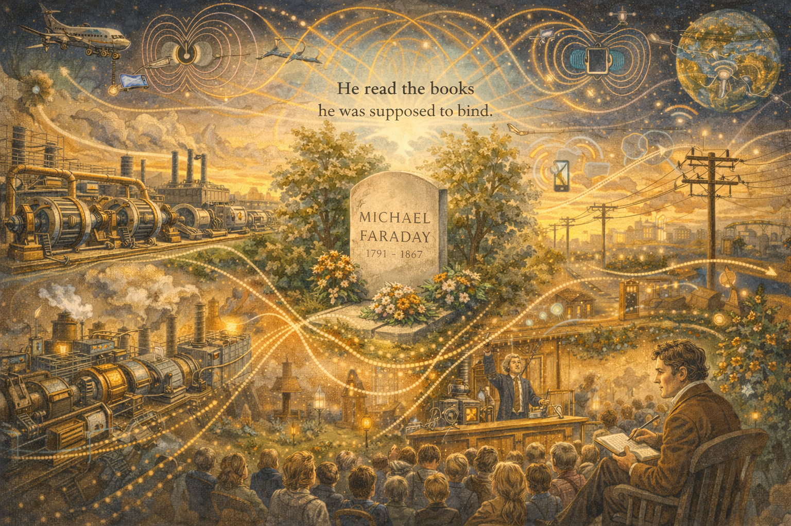
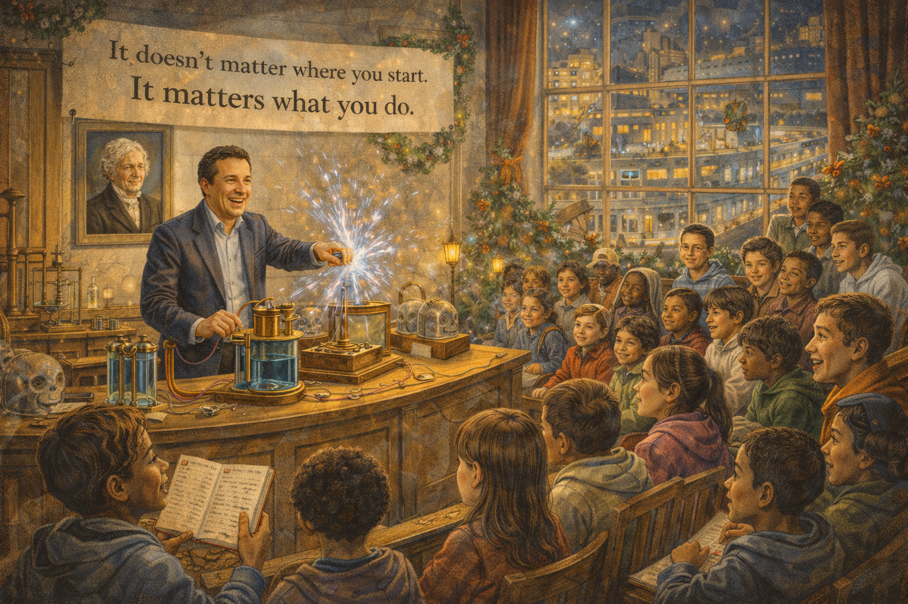

# The Bookbinder's Apprentice: Michael Faraday's Impossible Rise

Cover Image Prompt

  Create a colorful, bright wide-landscape 16:9 cover illustration in an early 19th century English Regency/Victorian style with warm lighting and period-accurate details.

  Title Text: Place the title "The Bookbinder's Apprentice: Michael Faraday's Impossible Rise" prominently at the top of the image in elegant Victorian-era serif typography, perhaps with subtle gold leaf embellishment, against a darker vignette area to ensure readability.

  Central Figure: Michael Faraday stands at the center, depicted at two ages blended together—the young apprentice in a leather apron holding bookbinding tools transitions into the mature scientist in a tailored coat holding electromagnetic apparatus. His expression shows determined curiosity.

  Visual Journey: The composition flows from left to right showing his transformation:
  - Left side: A humble bookbinder's workshop with leather, paper, books (including "Conversations on Chemistry"), candlelight, and the young Faraday reading secretly at night
  - Center: The transition point—his famous hand-bound 300-page notebook of Davy's lectures, the key that opened the door to science
  - Right side: The Royal Institution laboratory with gleaming copper coils, his rotating wire motor, iron filings revealing magnetic field lines, and electrical sparks

  Background Elements: The London skyline transitions from the cramped slums of his birth (left) to the elegant spires of the Royal Institution (right). Subtle magnetic field lines arc across the entire scene like a visual motif, connecting past to future.

  Lighting: Warm candlelight on the left gradually blends into the bright electrical glow on the right—literally illuminating his journey from darkness to enlightenment.

  Color Palette: Rich browns and burgundies of leather and wood, warm golds of candlelight, copper and brass of scientific instruments, and electric blue-white sparks. The overall tone is warm, inviting, and inspiring.

  Mood: Triumphant and inspirational—capturing the impossible journey from poverty to greatness through curiosity, persistence, and self-education.

    
Narrative Prompt

Please generate a detailed narrative for a new graphic novel about Michael Faraday
that is engaging and inspiring for teenagers. The target audience is high school
students studying introductory physics.

Faraday's story is one of the greatest rags-to-riches tales in science:
- Born into extreme poverty in 1791 London
- No formal education beyond basic reading and writing
- Apprenticed to a bookbinder at age 14—and read the books he bound
- Attended public lectures by famous chemist Humphry Davy
- Sent Davy a 300-page book of notes from his lectures, asking for a job
- Became Davy's assistant, endured snobbery from Davy's wife
- Discovered electromagnetic induction—moving magnets create electricity
- Invented the electric motor, the generator, and the transformer
- Introduced the concept of "fields"—one of the most important ideas in physics
- Couldn't do higher mathematics, but had unparalleled intuition
- Remained humble despite becoming the most famous scientist in England
- Refused a knighthood and turned down the presidency of the Royal Society

The story should emphasize that formal education isn't the only path to greatness,
and that curiosity plus hard work can overcome any obstacle. Faraday is the
anti-Newton: humble, kind, generous with credit, and beloved by everyone.

When you describe an image, make sure to mention that it should be a colorful,
bright wide-landscape illustration in an early 19th century English Regency/
Victorian style with warm lighting and period-accurate details.

---
Image preamble

In this session our goal is to create images for a graphic novel about Michael Faraday
that is engaging and inspiring for teenagers.  The target audience is high school
students studying introductory physics.

Image Format: Each image must be rendered in a wide-landscape format with a width:height ration of 16:9.

Image style: Each image should be a colorful,
bright wide-landscape illustration in an early 19th century English 
Regency/Victorian style with warm lighting and period-accurate details.

### Prologue – The Boy from the Slums

In 1791, in a cramped room above a stable in one of London's poorest neighborhoods, a blacksmith's son was born. His family could barely afford bread. There was no money for school, no connections to powerful people, no path to a better life.

His name was **Michael Faraday**. And against all odds, this child of poverty would grow up to invent the electric age.

He had no formal education. He couldn't do advanced mathematics. He never attended university. But he had something more powerful: an unquenchable curiosity about how the world worked.

This is the story of how a bookbinder's apprentice became the greatest experimental physicist who ever lived.

Image Prompt

Image 1:
Please generate a new wide-landscape illustration.
A colorful, bright wide-landscape illustration in an early 19th century London street style showing the poverty of Faraday's childhood around 1795. A cramped courtyard in a London slum: laundry hangs between buildings, children play in muddy streets, workers carry heavy loads. Young Michael, about 4 years old, sits on a doorstep watching everything with curious eyes. His father, a tired blacksmith, works at a small forge in the background. The family is poor but dignified. Through gaps between buildings, the distant spires of wealthy London are visible—a world completely out of reach. The scene conveys the unlikely starting point of a scientific revolution.

## Chapter 1 – Reading Other People's Books

At 14, Michael was apprenticed to a bookbinder named George Riebau. It was supposed to be a trade that would feed him for life—cutting, folding, and binding books for wealthy customers.

But Michael did something his master didn't expect: he *read* the books.

Late at night, after his work was done, Michael devoured everything: chemistry, electricity, philosophy. One book changed his life: *Conversations on Chemistry* by Jane Marcet, which explained science in simple terms anyone could understand.

"I can learn this," Michael realized. "I can understand how the world works."

He started keeping notebooks, conducting small experiments in the back of the shop, and dreaming of something more.

Image Prompt

Image 2:
Please generate a new wide-landscape illustration.
A colorful, bright wide-landscape illustration in an early 19th century English workshop style showing young Michael Faraday as a bookbinder's apprentice around 1805. The bookbinding shop is cluttered with leather, tools, paper, and half-bound books. Michael, about 14, works at a binding press by day. But the scene also shows him at night: reading by candlelight in a corner, a book propped open while he takes notes. The book "Conversations on Chemistry" is visible. Other apprentices sleep, but Michael studies. The master bookbinder, George Riebau, watches with quiet approval from the doorway. The scene conveys education as rebellion against fate.

## Chapter 2 – The Lectures That Changed Everything

In 1812, a customer gave Michael tickets to attend public lectures by **Humphry Davy**, the most famous scientist in England. Davy was a celebrity—brilliant, charismatic, and known for discovering new elements using electricity.

Michael sat in the back of the Royal Institution lecture hall, mesmerized. He took detailed notes, went home, and expanded them into a beautiful 300-page book with illustrations and leather binding—using all the skills he'd learned as an apprentice.

Then he did something audacious: he sent the book to Davy with a letter asking for a job.

"I want to work in science," he wrote. "I will do anything. Please give me a chance."

Image Prompt

Image 3:
Please generate a new wide-landscape illustration.
A colorful, bright wide-landscape illustration in an early 19th century English lecture hall style showing Humphry Davy's lecture at the Royal Institution in 1812. The elegant hall is filled with well-dressed audience members—gentlemen in top hats, ladies with fans. At the front, Davy performs a dramatic chemistry demonstration, sparks flying from electrical apparatus. In the back row, young Michael Faraday—poorly dressed compared to others—leans forward, scribbling furious notes, eyes wide with wonder. His handmade notebook is already thick with observations. The scene captures the moment science captured Faraday's soul.

## Chapter 3 – The Big Break

Most people would have ignored a letter from a poor bookbinder. Humphry Davy did not.

In early 1813, Davy injured his eyes in a laboratory explosion. He remembered the young man with the beautiful notebook and hired Michael as his temporary assistant. When a permanent position opened up, Davy gave it to Michael.

There was a catch: Michael would also serve as Davy's personal valet during a European tour. Davy's wife, Lady Jane, treated Michael like a servant—making him eat with the coachmen, mocking his poverty, reminding him constantly that he didn't belong.

Michael endured it all. He knew this was his only chance.

Image Prompt

Image 4:
Please generate a new wide-landscape illustration.
A colorful, bright wide-landscape illustration in an early 19th century English scientific style showing Faraday's early days as Davy's assistant around 1813. The scene is split: on one side, the glorious Royal Institution laboratory where Faraday assists Davy with chemical experiments, handling apparatus with careful attention. On the other side, a carriage scene where Lady Davy sneers at Faraday, pointing him toward the servants' quarters. Davy looks uncomfortable but says nothing. Faraday's expression shows quiet determination—enduring humiliation for the sake of opportunity. The contrast between scientific wonder and social cruelty is stark.

## Chapter 4 – Learning by Doing

Back in London, Faraday threw himself into laboratory work. He had no formal training, so he learned by doing—repeating every experiment he read about, building his own equipment, keeping meticulous records.

Davy recognized his talent. "The best thing I ever discovered," he supposedly said, "was Michael Faraday."

But Davy was also jealous. As Faraday's skills grew, Davy sometimes blocked his progress, refusing to support his election to the Royal Society. The student was becoming the master.

Faraday didn't complain. He just kept working.

Image Prompt

Image 5:
Please generate a new wide-landscape illustration.
A colorful, bright wide-landscape illustration in an early 19th century English laboratory style showing Faraday at work in the Royal Institution basement laboratory around 1820. The room is filled with handmade apparatus: batteries, coils of wire, glass vessels, magnets. Faraday, now in his late 20s, adjusts an experiment while consulting his detailed notebook. Every piece of equipment is labeled, every observation recorded. In the background, other assistants watch him with respect. The lighting is warm, coming from both windows and chemical reactions. The scene conveys the patient, methodical work that would lead to revolution.

## Chapter 5 – The Dancing Wire

In 1821, Faraday made his first great discovery. Scientists knew that electric current created magnetic fields (Hans Christian Ørsted had shown this the year before). Faraday asked: could magnetism create motion?

He built a simple device: a wire hanging next to a magnet, both dipped in mercury to conduct electricity. When he turned on the current, the wire began to *rotate* around the magnet—continuous circular motion from electricity and magnetism.

He had invented the **electric motor**.

It was primitive, but it proved the principle. Electricity could create motion. The industrial world would never be the same.

Image Prompt

Image 6:
Please generate a new wide-landscape illustration.
A colorful, bright wide-landscape illustration in an early 19th century English experimental style showing Faraday's first electric motor in 1821. The simple apparatus sits on a laboratory bench: a wire suspended over a dish of mercury, with a magnet standing upright. Faraday connects a battery, and the wire begins to spin around the magnet. His face shows the joy of discovery. Other scientists gather around, amazed at the continuous rotation. Diagrams on the wall show the principle: electric current + magnetic field = motion. The scene captures the birth of a technology that would power civilization.

## Chapter 6 – Ten Years of Failure

Faraday's next question was the reverse: if electricity creates magnetism and motion, can magnetism create electricity?

He tried for *ten years*. Experiment after experiment failed. He wrapped wires around magnets, built elaborate apparatus, tested every configuration he could imagine. Nothing worked.

Other scientists gave up on the idea. Faraday didn't.

"I have never failed," he told a friend. "I have just found ten thousand ways that don't work."

He kept meticulous notes of every attempt, believing that even failures taught something. And he kept trying.

Image Prompt

Image 7:
Please generate a new wide-landscape illustration.
A colorful, bright wide-landscape illustration in an early 19th century English experimental style showing Faraday's years of struggle from 1821-1831. The scene shows multiple failed experiments scattered across his laboratory: tangled coils, burned-out wires, apparatus marked "NO RESULT" in his notebooks. Faraday, now in his 30s with graying hair, sits surrounded by these failures, studying his notes. But his expression is thoughtful, not defeated. On one page, he writes: "What am I missing?" The walls are covered with diagrams of magnetic fields. The scene conveys persistence through a decade of disappointment.

## Chapter 7 – The Magic Moment

On August 29, 1831, Faraday finally found what he'd been seeking. He wrapped two coils of wire around an iron ring. One coil was connected to a battery; the other to a meter that detected current.

When he *connected* the battery, the meter jumped. When he *disconnected* it, the meter jumped again. But while the current flowed steadily, nothing happened.

The key wasn't steady magnetism—it was *changing* magnetism. Moving a magnet through a coil, or changing the current in one coil, induced current in another.

He had discovered **electromagnetic induction**—the principle behind every electrical generator, transformer, and power plant in the world.

Image Prompt

Image 8:
Please generate a new wide-landscape illustration.
A colorful, bright wide-landscape illustration in an early 19th century English breakthrough moment style showing August 29, 1831. Faraday's laboratory is arranged with his famous ring experiment: an iron ring wrapped with two separate coils of wire, one connected to a battery, one to a galvanometer (current detector). Faraday touches the wire to the battery—and the galvanometer needle jumps! His eyes go wide. An assistant drops what he's holding in shock. The breakthrough is electric (literally): after ten years, motion creates electricity. Notes marked "IT WORKS" are visible. The scene captures the moment the modern electrical age was born.

## Chapter 8 – Seeing the Invisible

Faraday couldn't do the advanced mathematics that scientists like Newton used. But he had something else: incredible intuition and the ability to *visualize* what was happening.

He imagined invisible "lines of force" spreading out from magnets and electric charges—curved lines filling space, pushing and pulling on each other. He sprinkled iron filings around magnets and *saw* these lines made visible.

This was the concept of the **field**—one of the most important ideas in all of physics. Later, James Clerk Maxwell would translate Faraday's visual intuition into mathematical equations. But the insight was Faraday's.

He saw what he couldn't calculate.

Image Prompt

Image 9:
Please generate a new wide-landscape illustration.
A colorful, bright wide-landscape illustration in an early 19th century English scientific visualization style showing Faraday's concept of field lines. Faraday sprinkles iron filings on paper above a bar magnet—and the filings arrange themselves into beautiful curved lines revealing the invisible magnetic field. His expression shows wonder at making the invisible visible. Floating around the scene are Faraday's own drawings of field lines from his notebooks: around magnets, around current-carrying wires, interacting and influencing each other across empty space. The scene conveys how intuition can see what mathematics cannot (yet) describe.

## Chapter 9 – The Christmas Lectures

Faraday became the most famous scientist in England, but he never forgot where he came from. Every year, he gave public lectures at the Royal Institution—especially the famous **Christmas Lectures** for young people.

He was a spellbinding speaker. He demonstrated electricity and magnetism with dramatic experiments, spoke clearly enough for children to understand, and inspired thousands of young people to pursue science.

"A scientist should be a person of no class," he believed. Science wasn't just for the wealthy. It was for everyone.

Image Prompt

Image 10:
Please generate a new wide-landscape illustration.
A colorful, bright wide-landscape illustration in a Victorian public lecture style showing Faraday's Christmas Lectures at the Royal Institution around 1855. The elegant lecture hall is packed with children and families from all social classes. Faraday, now elderly with white hair, performs a dramatic demonstration—perhaps making electrical sparks fly or lifting objects with electromagnets. Children in the front row lean forward with wide eyes. Parents smile in the back. The room is decorated for Christmas. Faraday's expression shows pure joy in sharing knowledge. The scene captures science as entertainment and inspiration for everyone.

## Chapter 10 – The Humble Giant

As Faraday's fame grew, honors poured in. Queen Victoria offered him a knighthood. He refused. The Royal Society twice offered him their presidency. He refused that too.

"I must remain plain Michael Faraday to the end," he said.

He continued living in simple apartments at the Royal Institution. He gave away most of his money. He stayed close to his Sandemanian church, which preached humility and service.

When scientists asked how he achieved so much without mathematical training, he said: "I kept working. I kept questioning. I kept believing that nature would reveal her secrets if I was patient enough."

Image Prompt

Image 11:
Please generate a new wide-landscape illustration.
A colorful, bright wide-landscape illustration in a Victorian intimate portrait style showing Faraday in his later years around 1860. He sits in his modest rooms at the Royal Institution—comfortable but simple, filled with books and scientific instruments but no luxuries. On a table, various medals and honors sit in an unassuming box, including a declined offer of knighthood. He reads a letter from a young scientist asking for advice, pen in hand to reply. Through the window, the bustling wealthy streets of London are visible—a world he could have joined but chose not to. His expression is peaceful, content. The scene conveys greatness without ego.

## Chapter 11 – The Price of Genius

Faraday's final years were difficult. His memory began to fail—possibly from decades of exposure to chemical fumes in the laboratory. He had to give up research, though he continued attending lectures when he could.

He wrote: "My memory wearies me greatly in working; for I cannot remember from day to day the conclusions I come to, and all has to be thought out many times over."

But even as his mind dimmed, his legacy blazed brighter. Electrical power stations were rising across Europe and America, all based on his discovery of induction. The electric age he'd started was transforming civilization.

Image Prompt

Image 12:
Please generate a new wide-landscape illustration.
A colorful, bright wide-landscape illustration in a late Victorian transitional style showing Faraday's final years around 1865. An elderly Faraday sits in a garden chair, a blanket on his lap, watching a beautiful sunset. His mind is failing, but his expression is peaceful. In the background, subtly visible, are the fruits of his work: electrical wires crossing the sky, a factory powered by generators, streetlights glowing. A young scientist (perhaps representing the future) sits with him, taking notes on everything the master can still remember. The scene is bittersweet—decline meeting legacy—but ultimately warm and gentle.

## Chapter 12 – The Eternal Apprentice

Michael Faraday died on August 25, 1867, at age 75. He had refused burial in Westminster Abbey, asking for a simple grave with a simple headstone.

But his true monument is everywhere:

- Every **electric motor** uses his principle of electromagnetic rotation
- Every **power plant** uses electromagnetic induction
- Every **transformer** that adjusts voltage in your devices comes from his work
- The concept of **fields** underlies all modern physics
- His Christmas Lectures continue to this day, inspiring new generations

From a blacksmith's son who couldn't afford school to the inventor of the electrical age—all because he read the books he was supposed to bind, asked questions nobody thought he had the right to ask, and never stopped believing that understanding was for everyone.

Image Prompt

Image 13:
Please generate a new wide-landscape illustration.
A colorful, bright wide-landscape illustration blending Victorian and modern elements showing Faraday's legacy. The center shows Faraday's simple grave at Highgate Cemetery with fresh flowers. Branching from this: electric motors spinning in factories, generators in power plants, transformers on power lines, the Royal Institution Christmas Lectures continuing with a modern presenter. Above it all, Faraday's field lines—now understood as electromagnetic waves—carry radio signals, phone calls, and internet data around the world. Text floats: "He read the books he was supposed to bind." The scene conveys how one curious apprentice electrified civilization.

### Epilogue – What Made Faraday Different?

Faraday succeeded where many with more advantages failed. Here's what we can learn:

| Challenge | How Faraday Responded | Lesson for Today |
|-----------|----------------------|------------------|
| **No formal education** | Read everything he could find; taught himself | Education happens everywhere, not just school |
| **No mathematical training** | Developed visual intuition; saw what others calculated | Different minds solve problems differently |
| **Born into poverty** | Used his trade skills to get noticed (the bound notebook) | Your current skills can open doors to new ones |
| **Treated as inferior** | Endured it; focused on the work | Don't let others' snobbery define your worth |
| **Failed for ten years** | Kept detailed notes; kept trying | Persistence beats talent over time |
| **Became famous** | Stayed humble; taught everyone; refused honors | Success doesn't require ego |

Final Image Prompt

Image 14:
Please generate a new wide-landscape illustration.
A colorful, bright wide-landscape illustration blending Victorian and modern styles with an inspiring tone. A diverse group of modern students attends a Christmas Lecture at the Royal Institution—the tradition Faraday started. A charismatic presenter demonstrates electromagnetic induction just as Faraday did. In the audience, children of all backgrounds lean forward excitedly. One holds a handmade notebook—like young Faraday's. On the wall, a portrait of Faraday watches approvingly. Through the windows, the electrified modern world is visible: trains, lights, devices, all powered by his discoveries. A banner reads: "It doesn't matter where you start. It matters what you do." The scene conveys that Faraday's real gift was proving that anyone can contribute to science.

### Call to Action

Michael Faraday's formal education ended at 13. He never learned calculus. He was treated as a servant by people who thought poverty meant stupidity.

He invented the electric motor, discovered electromagnetic induction, introduced the concept of fields, and inspired generations through his public lectures.

How?

- He **read everything** he could get his hands on
- He **asked for opportunities** even when he had no right to expect them
- He **failed for a decade** and kept trying
- He **stayed humble** when he could have become arrogant
- He **shared what he learned** with everyone, especially young people

You don't need a prestigious degree. You don't need wealthy parents. You don't even need to be good at math.

You need curiosity. You need persistence. You need the courage to ask "how does this work?" and keep asking until you find out.

Faraday started as a bookbinder's apprentice. He ended as the father of the electric age.

What's your starting point? And where will curiosity take you?

---

*"Nothing is too wonderful to be true, if it be consistent with the laws of nature."*
—Michael Faraday

*"The lecturer should give the audience full reason to believe that all his powers have been exerted for their pleasure and instruction."*
—Faraday on teaching

---

## References

1. [Michael Faraday | Biography, Inventions, & Facts](https://www.britannica.com/biography/Michael-Faraday) - Updated 2024 - Britannica - Complete biography of Faraday's rise from bookbinder's apprentice to one of history's greatest experimental scientists.

2. [Michael Faraday](https://nationalmaglab.org/magnet-academy/history-of-electricity-magnetism/pioneers/michael-faraday/) - 2024 - National MagLab/Magnet Academy - Detailed explanation of Faraday's electromagnetic discoveries with interactive diagrams showing how motors and generators work.

3. [Faraday (1791)](https://www.eia.gov/kids/history-of-energy/famous-people/faraday.php) - 2024 - U.S. Energy Information Administration - Student-friendly overview of how Faraday's discoveries power our modern world, from electric cars to smartphones.

4. [The Genius of Michael Faraday](https://www.aaas.org/taxonomy/term/10/genius-michael-faraday) - 2024 - American Association for the Advancement of Science - Explores why Faraday, despite having no formal education, is considered one of the greatest experimentalists in history.

5. [Michael Faraday: Scientist and Nonconformist](http://silas.psfc.mit.edu/Faraday/) - Ongoing - MIT Plasma Science and Fusion Center - Academic resource exploring Faraday's scientific method and his religious beliefs that shaped his view of nature's unity.

