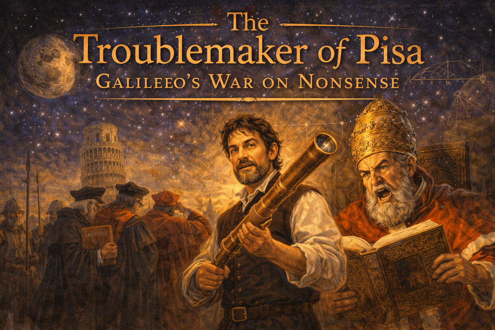
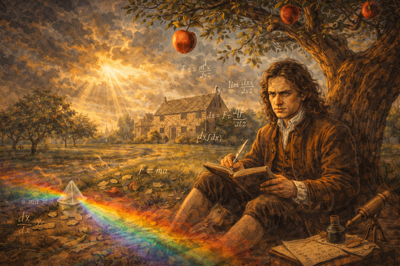
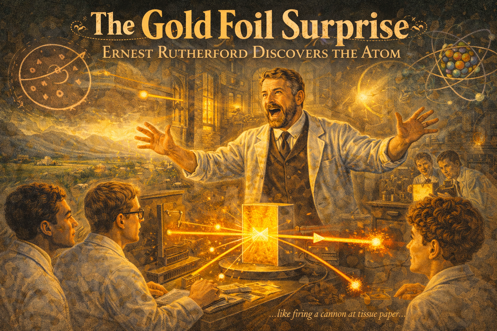
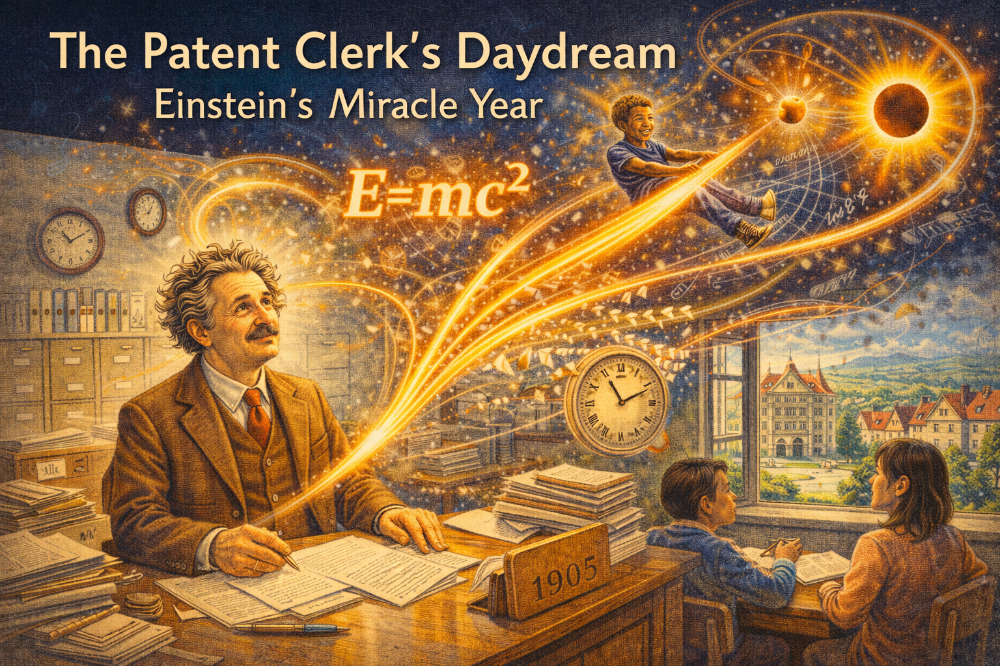

# Physics History Graphic Novels

Think physics is just equations and formulas? Think again. These are the stories of real people who broke rules, challenged authority, and changed everything we know about the universe. They got rejected, ridiculed, and sometimes arrested—but they were right, and that's what mattered.

- **[Eureka! The Story of Archimedes](archimedes/index.md)**

    
    A king suspects his crown is fake gold. A mathematician takes a bath. What happens next changes science forever. Discover how one "Eureka!" moment in ancient Syracuse gave us the laws of buoyancy—and how Archimedes used giant mirrors and war machines to fight off an invading Roman army.

- **[The Troublemaker of Pisa](galileo/index.md)**

    
    What happens when you prove your professors wrong? You get fired. Galileo dropped balls off towers, built telescopes, discovered moons around Jupiter—and made the Church so angry they put him on trial. He was forced to say he was wrong. Spoiler: he wasn't.

- **[The Plague Year](newton/index.md)**

    
    Cambridge University closed due to plague. A 23-year-old student went home with nothing to do. In 18 months, he invented calculus, discovered the laws of motion, figured out gravity, and cracked the code of light and color. Not bad for a lockdown. Oh, and he was also incredibly petty and held grudges forever.

- **[The Bookbinder's Apprentice](faraday/index.md)**

    
    No money. No education. No connections. Michael Faraday had every reason to fail. But he taught himself science from the books he was binding, talked his way into a lab assistant job, and ended up discovering how to turn magnetism into electricity. Every motor and generator on Earth exists because of him.

- **[Glowing in the Dark](marie-curie/index.md)**

    
    She couldn't go to university in her home country because she was a woman. So she moved to Paris, nearly starved, and worked in a leaky shed for four years. She discovered two new elements, won two Nobel Prizes, and invented mobile X-ray units that saved thousands of soldiers' lives. The radiation that made her famous also killed her.

- **[The Gold Foil Surprise](rutherford/index.md)**

    
    Everyone "knew" atoms were like plum pudding—positive goo with electrons scattered throughout. Then Ernest Rutherford shot particles at gold foil and some bounced straight back. "It was as if you fired a cannon shell at tissue paper and it came back and hit you." That's when he realized: atoms are mostly empty space.

- **[The Patent Clerk's Daydream](einstein/index.md)**

    
    He failed his college entrance exam. He couldn't get an academic job. So Albert Einstein worked at a patent office—and in his spare time, he reimagined space, time, and energy. His equation E=mc² became the most famous in history. But even Einstein got things wrong sometimes, and he spent decades chasing ideas that went nowhere.

- **[The Fission Escape](lise-meitner/index.md)**

    
    She did the work. She made the discovery. Her partner got the Nobel Prize. Lise Meitner was the first to explain nuclear fission—the science behind nuclear power and atomic bombs—while literally fleeing Nazi Germany. She was nominated for the Nobel Prize 49 times and never won. Sometimes history isn't fair.

- **[Breaking Parity](chien-shiung-wu/index.md)**

    
    Physicists believed the universe followed the same rules whether you looked at it in a mirror or not. Chien-Shiung Wu designed an experiment at near absolute zero temperatures that proved them wrong. The two male physicists who suggested the idea got the Nobel Prize. She didn't. She kept doing groundbreaking physics anyway.

- **[The Missing Universe](vera-rubin/index.md)**

    
    Galaxies are spinning too fast. According to the math, they should fly apart. But they don't. Vera Rubin measured galaxy after galaxy and proved that most of the universe is made of something we can't see—dark matter. We still don't know what it is. She opened a mystery we haven't solved yet.

## Why These Stories Matter

Physics isn't just about memorizing formulas. It's about people asking questions nobody else thought to ask—and being stubborn enough to find the answers even when everyone told them they were wrong.

These physicists:

- **Challenged authority** when the evidence said the experts were wrong
- **Kept working** after rejection, ridicule, and failure
- **Changed everything** about how we understand the universe

Their discoveries are in your phone, your car, your house, and the stars above your head. Now you know who made them—and what they had to go through to do it.
