# The Fission Escape: The Untold Story of Lise Meitner

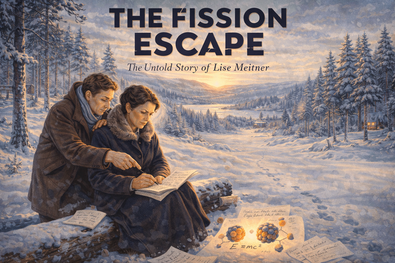

    
Cover Image Prompt

Please generate a new wide-landscape cover illustration in 16:9 format.

A dramatic, colorful wide-landscape illustration capturing the historic moment of December 1938 when Lise Meitner discovered nuclear fission. The scene is set in the snow-covered Swedish countryside near Kungälv. Lise Meitner, a dignified woman in her late fifties with graying hair pulled back, sits on a fallen snow-dusted log, intensely focused on calculations she's scribbling on scraps of paper. She wears a heavy dark winter coat with a fur collar—the coat she fled Germany in—and her breath is visible in the frigid air.

Her nephew Otto Frisch stands beside her, leaning over her shoulder, pointing at the equations with growing excitement. Between them, a letter from Otto Hahn lies partially visible—the letter that contained the puzzling experimental results. Scattered around them are more papers with atomic diagrams and mathematical formulas, some weighed down by small stones against the winter wind.

The Swedish winter landscape stretches behind them: snow-laden pine and birch forests, a frozen lake in the middle distance reflecting the pale winter sky, and gentle hills fading into a cold blue haze. The lighting is that unique Scandinavian winter light—soft, diffused, with the sun low on the horizon casting long blue shadows across the pristine snow while bathing the figures in a warm golden glow.

In the center of Lise's papers, visible to the viewer, is a simple diagram: a large circle (uranium nucleus) splitting into two smaller circles (barium and krypton), with small dots (neutrons) flying outward and the equation "E = mc²" connecting them—the moment she realized the nucleus was splitting and releasing Einstein's energy.

The composition should feel intimate yet monumental—two exiled scientists in a frozen wilderness, working out on scraps of paper one of the most consequential discoveries in human history. Lise's expression shows the "eureka" moment: wonder, certainty, and perhaps a shadow of concern about what this discovery might mean.

At the top of the image, display the title "THE FISSION ESCAPE" in bold, stark lettering that evokes both 1930s typography and the splitting of an atom—perhaps with a subtle crack or split running through one of the letters. Below it, in elegant smaller text: "The Untold Story of Lise Meitner". The typography should feel period-appropriate to the late 1930s, with clean Art Deco influences, rendered in colors that stand out against the snowy background—perhaps deep navy blue with gold accents, or white text with dark shadows.

In the distant background, barely visible through the trees, hint at a small Swedish village with warm lights in windows—representing the safety of exile but also her isolation from the scientific community she built in Germany. A single set of footprints in the snow leads to where they sit, emphasizing their journey to this moment.

The overall mood should balance scientific triumph with melancholy—this is a refugee making one of history's greatest discoveries in exile, knowing her former colleagues and country have betrayed her, yet still driven by the pure joy of understanding nature's secrets.

    
Narrative Prompt

Please generate a detailed narrative for a new graphic novel about Lise Meitner
and her discovery of nuclear fission. The target audience is high school students
studying introductory physics.

The story begins in Vienna in the late 1800s, where young Lise dreams of studying
physics despite barriers against women in academia. Show her determination to
become one of the first women in Austria to earn a physics doctorate.

Describe her move to Berlin in 1907 to work with Max Planck and chemist Otto Hahn.
Show the discrimination she faced—forced to work unpaid, banned from the main
laboratory, hidden in a basement workshop. Yet she persevered and became one of
the leading nuclear physicists in the world.

The central drama is her escape from Nazi Germany in 1938. As a Jewish Austrian,
she was suddenly in mortal danger after the Anschluss. Show her harrowing flight
to Sweden with just two suitcases, a diamond ring sewn into her coat, and ten
marks in her pocket.

The climax comes at Christmas 1938: while walking in the snowy Swedish countryside
with her nephew Otto Frisch, she receives a letter from Hahn describing puzzling
experimental results. In that frozen moment, she realizes the uranium nucleus has
split in two—nuclear fission. She and Frisch work out the physics on a tree stump.

End with the bitter injustice: Hahn alone received the 1944 Nobel Prize. Meitner
was nominated multiple times but never won. Yet her legacy endures—element 109
is named Meitnerium in her honor.

When you describe an image, make sure to mention that it should be a colorful,
bright wide-landscape illustration in an early 20th century European scientific
style with period-accurate details and dramatic lighting.

### Prologue – A Mind That Would Not Be Contained

In 1878, the Austro-Hungarian Empire stretched across Central Europe, its capital Vienna glittering with music, art, and intellectual ferment. But for women, most doors remained firmly closed—especially the doors to universities.

In a comfortable Viennese apartment, eight-year-old **Lise Meitner** lay in bed, unable to sleep. Under her pillow, hidden from her parents, was a mathematics book. She was calculating the colors of an oil slick on water, trying to understand why thin films created rainbows.

She could not know that her restless curiosity would one day unlock the secret of the atom itself—or that the world would try to forget her name.

Image Prompt

Image 1:
Please generate a new wide-landscape illustration.
A colorful, bright wide-landscape illustration in a late 19th century Viennese style showing young Lise Meitner, about 8 years old, reading a mathematics book by candlelight in an ornate bedroom around 1886. The room reflects upper-middle-class Vienna: heavy curtains, carved wooden furniture, and a porcelain stove in the corner. Through the window, the spires of Vienna are visible against a moonlit sky. Lise's face is illuminated by the candle, showing intense concentration. A notebook with her own calculations lies beside her. The scene conveys forbidden knowledge, curiosity that cannot be suppressed, and the beginning of a scientific mind.

## Chapter 1 – Breaking the Barrier

Women were not permitted to attend gymnasium (academic high school) in Austria, so Lise educated herself with books and private tutors. When Austrian universities finally opened to women in 1901, she was ready. She passed the entrance exam and enrolled at the University of Vienna to study physics.

Her professor, Ludwig Boltzmann—one of the founders of statistical mechanics—recognized her brilliance immediately. "You have a gift for seeing what others miss," he told her. Under his guidance, Lise became only the second woman in Austria to earn a doctorate in physics.

But a doctorate meant nothing without a laboratory. No institution in Vienna would hire a woman physicist.

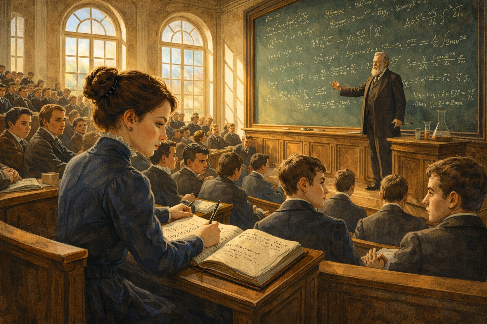

Image Prompt

Image 2:
Please generate a new wide-landscape illustration.
A colorful, bright wide-landscape illustration in an early 1900s Viennese academic style showing young Lise Meitner in a physics lecture hall at the University of Vienna around 1905. She sits among dozens of male students in a grand amphitheater with wooden benches rising in tiers. Professor Ludwig Boltzmann lectures at a massive chalkboard covered with thermodynamic equations. Lise takes meticulous notes, the only woman visible in the room. Some male students glance at her with curiosity or disapproval; she ignores them, focused entirely on the physics. Sunlight streams through tall arched windows. The scene conveys determination in the face of isolation.

## Chapter 2 – The Basement in Berlin

In 1907, Lise traveled to Berlin to attend lectures by the legendary Max Planck, founder of quantum theory. When she asked to work in his laboratory, Planck hesitated—he had once written that women were unsuited for science. But Lise's knowledge impressed him.

"You may work here," he said, "but you must collaborate with a chemist."

That chemist was **Otto Hahn**, a young researcher studying radioactive elements. The partnership would last thirty years—but it began in a basement. Women were forbidden from the main chemistry building, so Lise set up her equipment in a converted carpentry shop. She entered through a side door and was not permitted to use the upstairs facilities.

For years, she worked unpaid. But she worked.

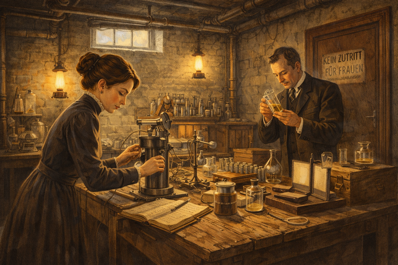

Image Prompt

Image 3:
Please generate a new wide-landscape illustration.
A colorful, bright wide-landscape illustration in an early 1900s Berlin industrial-scientific style showing Lise Meitner's basement laboratory around 1908. The cramped space has exposed pipes overhead and rough wooden workbenches. Lise, wearing a practical dark dress and her hair pinned up, adjusts radioactivity detection equipment while Otto Hahn examines chemical samples nearby. Despite the humble setting, sophisticated instruments—electroscopes, photographic plates, and sample containers—crowd the surfaces. A single high window provides dim light; gas lamps supplement it. A door marked "KEIN ZUTRITT FÜR FRAUEN" (No Entry for Women) is visible in the background. The scene conveys brilliant science conducted despite institutional contempt.

## Chapter 3 – Thirty Years of Discovery

The Hahn-Meitner partnership flourished. Together, they discovered new radioactive elements and pioneered techniques for studying atomic nuclei. Lise developed the theoretical explanations while Otto handled the chemistry.

By the 1920s, Lise was no longer hiding in basements. She became head of the physics department at the Kaiser Wilhelm Institute, one of the most prestigious positions in German science. Students traveled from across Europe to study with her. Albert Einstein called her "our German Madame Curie"—though Lise, ever precise, noted that Curie was Polish.

She was finally respected. She was finally home.

Then the Nazis came to power.

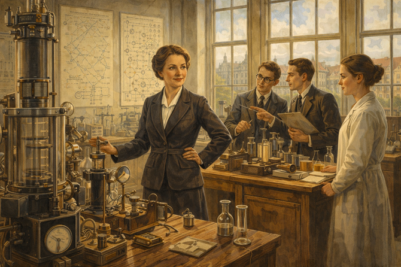

Image Prompt

Image 4:
Please generate a new wide-landscape illustration.
A colorful, bright wide-landscape illustration in a 1920s German academic style showing Lise Meitner at the height of her career around 1930. She stands confidently in a well-equipped laboratory at the Kaiser Wilhelm Institute, surrounded by advanced physics equipment and younger researchers who look to her for guidance. Now in her fifties, she wears a professional dark suit. On the walls hang charts of radioactive decay chains and atomic diagrams. Through large windows, the handsome buildings of the Institute are visible. Colleagues consult with her as equals. The scene conveys hard-won respect, scientific authority, and a brief golden age before catastrophe.

## Chapter 4 – The Shadow Falls

Adolf Hitler became Chancellor of Germany in January 1933. Within months, Jewish scientists were being expelled from universities. Lise's Austrian citizenship initially protected her—Austria was still independent—but she watched in horror as colleagues and friends fled or disappeared.

Otto Hahn remained loyal, but he was increasingly cautious. Other colleagues avoided her. Her name was quietly removed from publications. The Gestapo began compiling files on "non-Aryan" scientists.

Still, Lise stayed. The laboratory was her life. The work was too important. And surely, she thought, things could not get worse.

She was wrong.

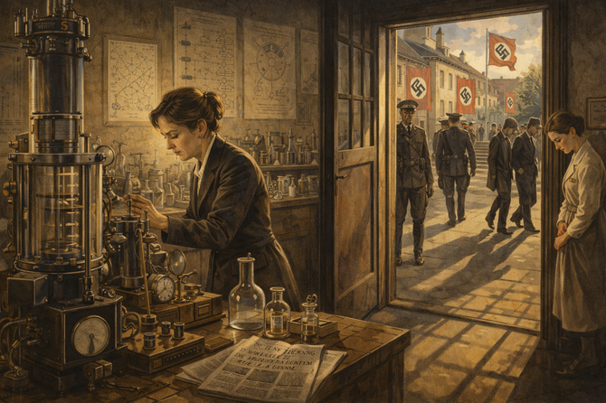

Image Prompt

Image 5:
Please generate a new wide-landscape illustration.
A colorful, bright wide-landscape illustration in a 1930s German style with ominous undertones showing the Kaiser Wilhelm Institute around 1936. The scene is split: the left side shows the familiar laboratory where Lise works at her instruments, maintaining scientific routine. The right side, seen through windows and doorways, shows the changed world outside—Nazi flags on buildings, uniformed officers walking the grounds, colleagues hurrying past with downcast eyes. Lise's face shows strain; her movements are careful, observed. A newspaper on a desk shows anti-Jewish headlines. The lighting creates long shadows. The scene conveys a trap slowly closing.

## Chapter 5 – The Anschluss

On March 12, 1938, Nazi Germany annexed Austria. Overnight, Lise Meitner was no longer protected by foreign citizenship. She was now a German Jew—and German Jews were being sent to concentration camps.

Her passport was confiscated. The borders were watched. Colleagues who had once sought her advice now refused to meet her eyes. One former student, a Nazi official, reportedly said: "The Jewess endangers the Institute."

Otto Hahn and other friends began secretly planning her escape. They had only weeks before the Gestapo would act.

Image Prompt

Image 6:
Please generate a new wide-landscape illustration.
A colorful, bright wide-landscape illustration in a 1938 historical documentary style showing the immediate aftermath of the Anschluss in Berlin. Lise Meitner walks alone through the Institute grounds, now decorated with Nazi swastika banners. She clutches her now-invalid Austrian passport. Other scientists—former colleagues—look away or cross the street to avoid her. In the background, radio loudspeakers broadcast Hitler's triumphant speech. Armed SS officers check papers at the gate. Lise's face shows controlled fear; she walks with dignity but her eyes scan for danger. The bright spring sunshine creates a cruel contrast with the terror of the moment. The scene conveys sudden, absolute danger.

## Chapter 6 – Flight to Freedom

On July 13, 1938, Lise Meitner left Germany forever. Dutch physicist Dirk Coster met her at the border, carrying emergency papers arranged through desperate diplomatic channels. She brought only two small suitcases. Hidden in her coat was a diamond ring—a gift from Otto Hahn—to bribe border guards if necessary.

At the Dutch frontier, Nazi guards examined her invalid passport. Her heart pounded. The guards conferred, looked at her, conferred again. The minutes stretched like hours.

Then they waved her through.

"I left Germany forever with 10 marks in my purse," she later wrote. "It was like a dream—or a nightmare I couldn't wake from."

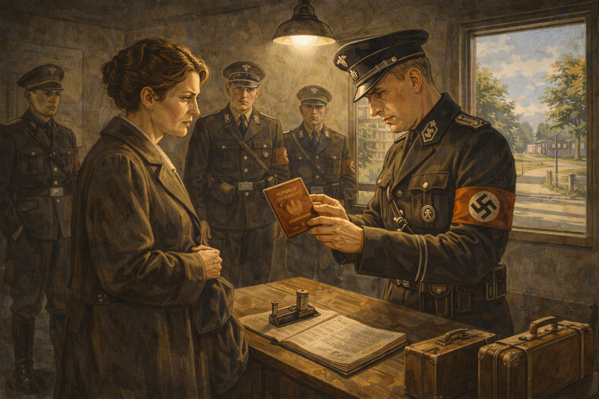

Image Prompt

Image 7:
Please generate a new wide-landscape illustration.
A colorful, bright wide-landscape illustration in a 1938 dramatic escape style showing the German-Dutch border crossing. Lise Meitner, 59 years old, hands her invalid passport to a Nazi border guard in a stark checkpoint building. Dirk Coster stands nervously nearby, holding official-looking papers. Two small suitcases sit at Lise's feet—everything she owns. Her coat is slightly bulky where the diamond ring is hidden. The guard examines the passport under harsh electric light while other guards watch. Through the window, the Dutch side of the border is visible—freedom just meters away. Lise's face shows controlled terror. The scene captures the razor's edge between escape and capture.

## Chapter 7 – Exile in Sweden

Lise found refuge in Stockholm at the Nobel Institute, but exile was bitter. She had no laboratory equipment, no research team, no students. Swedish colleagues were polite but distant—they didn't want to antagonize Nazi Germany.

She lived in a small hotel room, struggling with the language, far from everything she had built over thirty years. Letters from Otto Hahn were her lifeline to science. He continued their research on uranium, sending her results and asking for her theoretical insights.

"Sometimes I feel like a machine that just functions," she wrote to a friend. "Inside, I am completely broken."

But her scientific mind never stopped working.

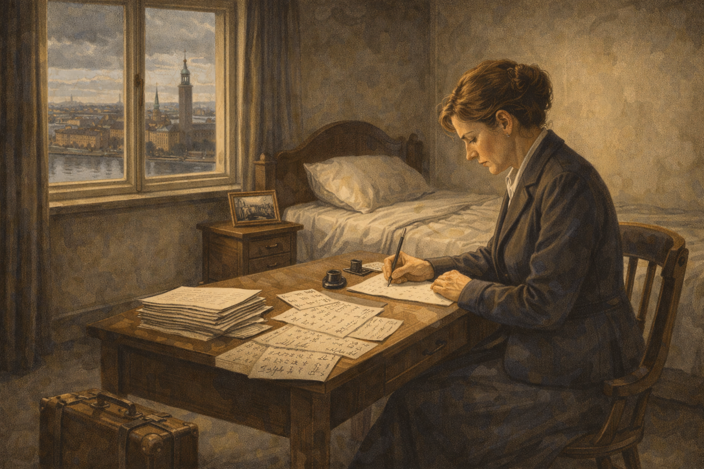

Image Prompt

Image 8:
Please generate a new wide-landscape illustration.
A colorful, bright wide-landscape illustration in a late 1930s Swedish style showing Lise Meitner in her sparse Stockholm hotel room in autumn 1938. The small, clean but impersonal room contains only a bed, desk, and chair. Lise sits at the desk writing a letter, surrounded by scientific papers covered with calculations. Through the window, the unfamiliar spires of Stockholm are visible under gray northern skies. A photograph of the Berlin laboratory sits on the nightstand. On the desk, letters from Otto Hahn are stacked neatly. Her expression is melancholy but thoughtful—even in exile, she is working. The scene conveys isolation, loss, but also unbroken intellectual determination.

## Chapter 8 – The Mysterious Letter

In December 1938, Lise received a letter from Otto Hahn that would change history. His experiments bombarding uranium with neutrons had produced baffling results. The products appeared to be barium—an element with roughly half the atomic weight of uranium.

"Perhaps you can come up with some sort of fantastic explanation," Hahn wrote. "We understand that it really can't break up into barium."

Lise was staying with Swedish friends for Christmas. Her nephew, physicist **Otto Frisch**, was visiting from Copenhagen. She showed him the letter.

"It's impossible," Frisch said. "You can't split an atom in half."

Lise stared at the numbers. "Unless..." she said slowly, "unless you can."

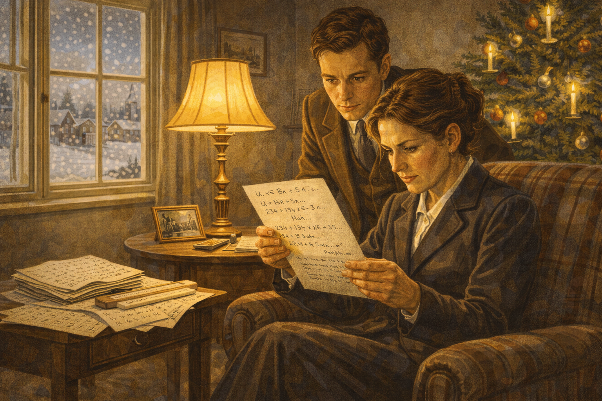

Image Prompt

Image 9:
Please generate a new wide-landscape illustration.
A colorful, bright wide-landscape illustration in a late 1938 winter Swedish style showing Lise Meitner reading Otto Hahn's letter by lamplight in a cozy Swedish living room decorated for Christmas. A Christmas tree with lit candles glows in the corner. Her nephew Otto Frisch looks over her shoulder at the letter, his expression puzzled. The letter itself is visible, showing chemical equations and Hahn's handwriting. Outside the frost-covered windows, snow falls on a Swedish village. Lise's face shows intense concentration—the beginning of understanding. Scientific papers and a slide rule are scattered on a side table. The warm domestic scene contrasts with the revolutionary physics about to be discovered.

## Chapter 9 – The Walk in the Snow

On December 24, 1938—Christmas Eve—Lise and Otto Frisch went for a walk in the snowy Swedish countryside. She was on cross-country skis; he struggled to keep up on foot. They couldn't stop thinking about Hahn's results.

Sitting on a fallen tree trunk in the frozen forest, they worked through the physics. What if the uranium nucleus was not a rigid sphere but more like a liquid drop? What if a neutron could cause it to wobble, stretch, and split in two?

Lise pulled out a scrap of paper. Using Einstein's famous equation **E = mc²**, she calculated the energy released if a uranium nucleus split. The numbers were staggering—millions of times more energy than any chemical reaction.

"It works," she whispered. "The nucleus splits. And it releases... enormous energy."

They named it **fission**, after the biological term for cell division.

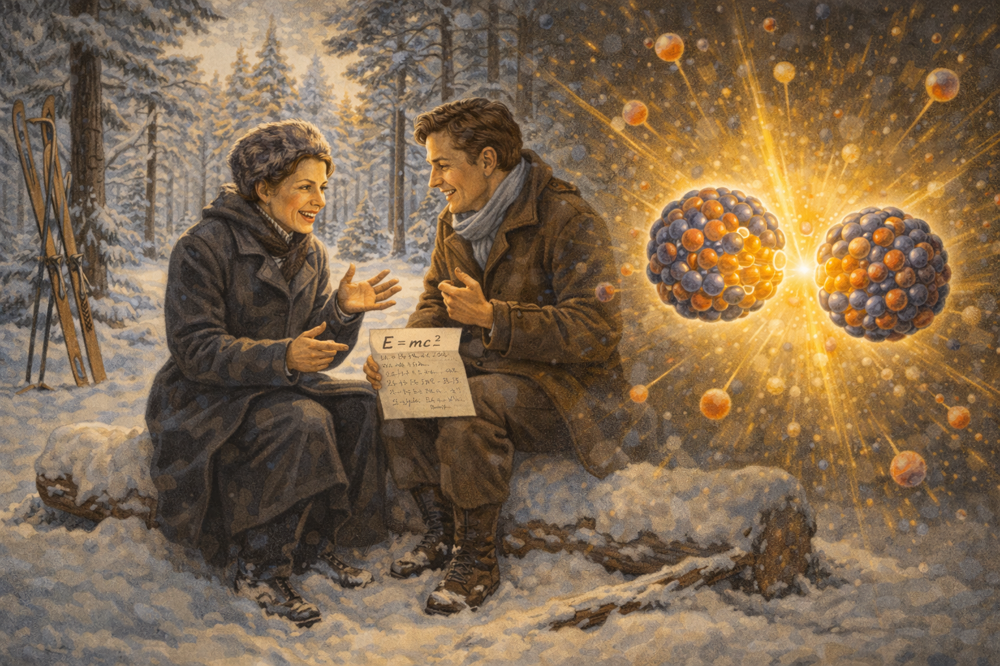

Image Prompt

Image 10:
Please generate a new wide-landscape illustration.
A colorful, bright wide-landscape illustration in a Swedish winter landscape style showing the historic moment of discovery. Lise Meitner and Otto Frisch sit on a snow-covered fallen log in a peaceful Swedish pine forest, both bundled in winter coats. Lise's cross-country skis lean against a tree. Between them, a scrap of paper shows E = mc² and hasty calculations. Their faces are animated with the excitement of understanding—the "eureka" moment. Snow blankets the landscape; weak winter sunlight filters through the trees. In an artistic overlay, a glowing visualization shows a uranium nucleus wobbling and splitting into two smaller nuclei, releasing energy. The scene captures science's most consequential walk in history.

## Chapter 10 – A World Transformed

Meitner and Frisch published their explanation in January 1939. Within weeks, physicists around the world had confirmed nuclear fission. Within months, scientists realized that fission could trigger a chain reaction—a bomb of unimaginable power.

The discovery she made while fleeing Nazi persecution would become the foundation of the atomic age. Some called her "the mother of the atomic bomb." Lise rejected the label fiercely. She refused to join the Manhattan Project and was horrified when the bomb was dropped on Hiroshima.

"I have done nothing for which I must be ashamed," she said. Understanding nature was not the same as weaponizing it.

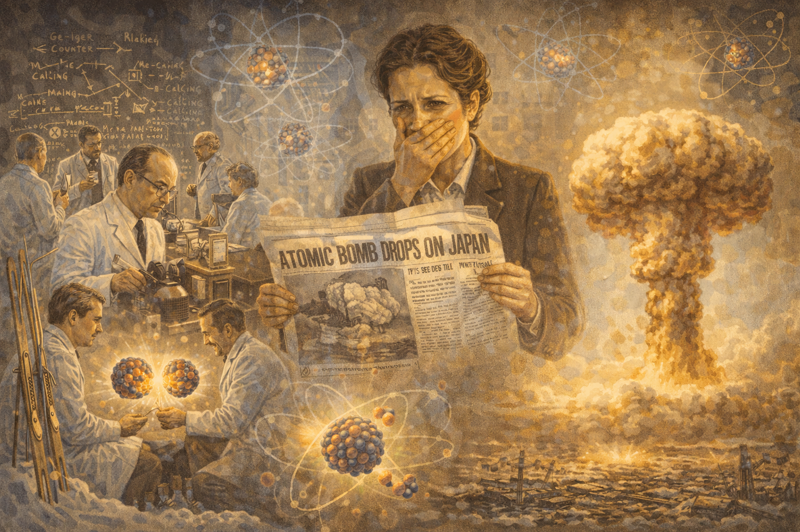

Image Prompt

Image 11:
Please generate a new wide-landscape illustration.
A colorful, bright wide-landscape illustration depicting the world reacting to nuclear fission in 1939-1945 as a montage. The left side shows excited scientists in laboratories replicating the fission experiment—chain reaction diagrams on blackboards, Geiger counters clicking. The center shows a newspaper headline "ATOMIC BOMB DROPS ON JAPAN" with Lise reading it in horror, hand over her mouth. The right side shows the mushroom cloud rising over Hiroshima. Throughout, ghostly atomic diagrams and the split uranium nucleus connect the scenes. Lise appears twice—once as the discoverer, once as the mourner. The scene conveys how pure science became terrible power, and one woman's complicated relationship with her discovery.

## Chapter 11 – The Stolen Prize

In 1944, the Nobel Committee announced that Otto Hahn would receive the Chemistry Prize "for his discovery of the fission of heavy nuclei." Lise Meitner's name was not mentioned.

She had been nominated repeatedly, but the Committee—influenced by Hahn's own accounts that minimized her role—gave him sole credit. Hahn himself never publicly acknowledged that Lise had provided the theoretical breakthrough that explained his confusing experimental results.

It was a theft hidden in plain sight. The physics community knew the truth; the Nobel Committee chose to ignore it. Lise never received the world's highest scientific honor.

"I am not bitter," she told friends. But her letters reveal the wound never healed.

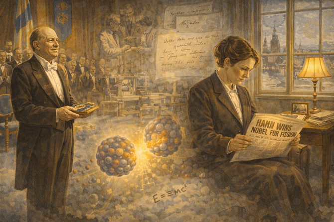

Image Prompt

Image 12:
Please generate a new wide-landscape illustration.
A colorful, bright wide-landscape illustration in a 1940s formal style with melancholic undertones. The scene is split: on the left, Otto Hahn receives the Nobel Prize in Stockholm, standing alone on stage in formal attire, accepting applause from the elegant audience. On the right, Lise Meitner sits alone in her modest Stockholm apartment, reading a newspaper with the headline "HAHN WINS NOBEL FOR FISSION." Her expression is dignified but pained. Between the two scenes, ghostly images show their shared laboratory, their letters, the equations she wrote in the snow. The lighting is warm on Hahn's ceremony, cooler and lonelier on Lise. The scene conveys historic injustice—credit stolen, contribution erased.

## Chapter 12 – The Long Life of a Forgotten Pioneer

Lise Meitner lived until 1968, just shy of her 90th birthday. She eventually received recognition—the Enrico Fermi Award, the Otto Hahn Prize (an honor she accepted with mixed feelings), and acclaim from scientists who knew the true story.

In 1992, element 109 was named **Meitnerium** in her honor—the only element named solely after a non-mythological woman. Her name is now inscribed in the periodic table forever.

On her gravestone, at her request, is inscribed: "Lise Meitner: A physicist who never lost her humanity."

She never did receive the Nobel Prize. But history, eventually, remembers.

Image Prompt

Image 13:
Please generate a new wide-landscape illustration.
A colorful, bright wide-landscape illustration blending mid-20th century and modern elements. The left side shows elderly Lise Meitner in the 1960s, still active and engaged, lecturing to young scientists who listen with respect. The center shows her gravestone in an English churchyard with the inscription about never losing her humanity, surrounded by flowers left by admirers. The right side shows the modern periodic table with element 109—Meitnerium (Mt)—glowing brightly. Scientific textbooks and biographies featuring her face appear throughout. Connecting all scenes, the image of the splitting nucleus glows like a signature. The scene conveys delayed justice, lasting legacy, and the power of truth to eventually emerge.

### Epilogue – The Price of Being Right

Lise Meitner's life teaches us that doing great science is not always enough—and that recognition often comes too late:

| Challenge | How Lise Responded | Lesson for Today |
|-----------|-------------------|------------------|
| **Banned from education** | Self-taught until universities opened; became only second woman physics PhD in Austria | Barriers can be overcome with persistence |
| **Forced into basement laboratory** | Worked there for years without complaint, producing world-class research | Great work transcends poor conditions |
| **Stripped of citizenship** | Escaped with ten marks and her mind; continued working in exile | Your knowledge travels with you |
| **Denied credit for discovery** | Continued doing science; let history judge | The truth eventually emerges |
| **Called "mother of the bomb"** | Refused to participate in weapons; maintained ethical stance | Scientists have moral responsibilities |
| **Denied Nobel Prize** | Lived with dignity; now recognized by element 109 | Official recognition is not the only validation |

Final Image Prompt

Image 14:
Please generate a new wide-landscape illustration.
A colorful, bright wide-landscape illustration blending historical and modern elements with an inspiring, forward-looking tone. A diverse group of modern physics students works in a nuclear physics laboratory. One examines a model of nuclear fission; another writes E=mc² calculations on a digital tablet; a third presents research on the energy released in atomic reactions. Behind them, translucent and luminous, Lise Meitner watches approvingly—her image formed from the glow of atomic symbols. On the wall hang the periodic table with Meitnerium highlighted, a portrait of Lise, and her quote about never losing humanity. Through the windows, both 1930s Berlin and a modern research campus are visible, merging past and future. A young woman scientist holds a Nobel medal—the prize Lise never received but future generations might. The scene conveys that Lise's perseverance, ethics, and brilliance inspire scientists who will be properly recognized.

### Call to Action

Lise Meitner unlocked the secret of nuclear energy while fleeing for her life, then watched others take credit for her discovery. She could have been bitter. Instead, she kept working, kept teaching, kept believing that science—done with integrity—mattered more than prizes.

Her life shows us that:

- **Persistence** breaks through even institutional barriers
- **Collaboration** advances science, but credit must be shared fairly
- **Integrity** means accepting responsibility for discoveries—and refusing to weaponize them
- **Recognition** may come late, but truth endures

Element 109 is named Meitnerium. Her name is etched in the periodic table forever—more permanent than any prize.

The next discovery awaits. Will you have the courage to make it—and the integrity to use it wisely?

---

*"Science makes people reach selflessly for truth and objectivity; it teaches people to accept reality, with wonder and admiration."*
—Lise Meitner

---

## References

1. [Lise Meitner | Biography & Facts](https://www.britannica.com/biography/Lise-Meitner) - Updated 2024 - Britannica - Complete biography of the physicist who explained nuclear fission but was denied the Nobel Prize that went to her collaborator Otto Hahn.

2. [Lise Meitner](https://ahf.nuclearmuseum.org/ahf/profile/lise-meitner/) - 2024 - Atomic Heritage Foundation/Nuclear Museum - Detailed account of Meitner's escape from Nazi Germany and her Christmas 1938 walk in the snow where she worked out the physics of fission.

3. [Women in Radiation History: Lise Meitner](https://www.epa.gov/radtown/women-radiation-history-lise-meitner) - 2024 - U.S. Environmental Protection Agency - Learn how Meitner's work on radioactivity and fission connects to modern nuclear science and radiation safety.

4. [December 1938: Discovery of Nuclear Fission](https://www.aps.org/apsnews/2007/12/december-1938-discovery-nuclear-fission) - 2007 - American Physical Society - The scientific story of how Meitner and Frisch explained Hahn and Strassmann's puzzling experimental results.

5. [Women of the Manhattan Project: Lise Meitner](https://www.nps.gov/people/women-of-the-manhattan-project-lise-meitner.htm) - 2024 - U.S. National Park Service - Explores Meitner's refusal to work on the atomic bomb and her complex feelings about how her discovery was used.

