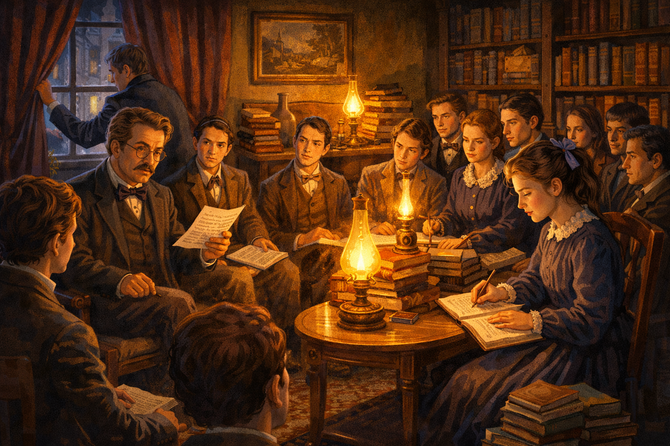
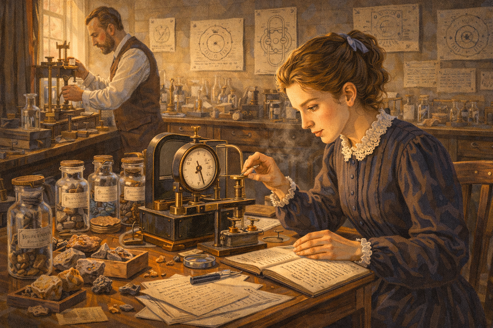
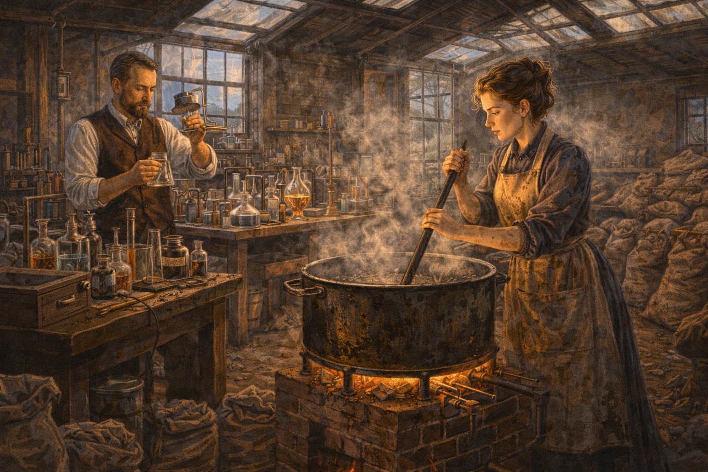
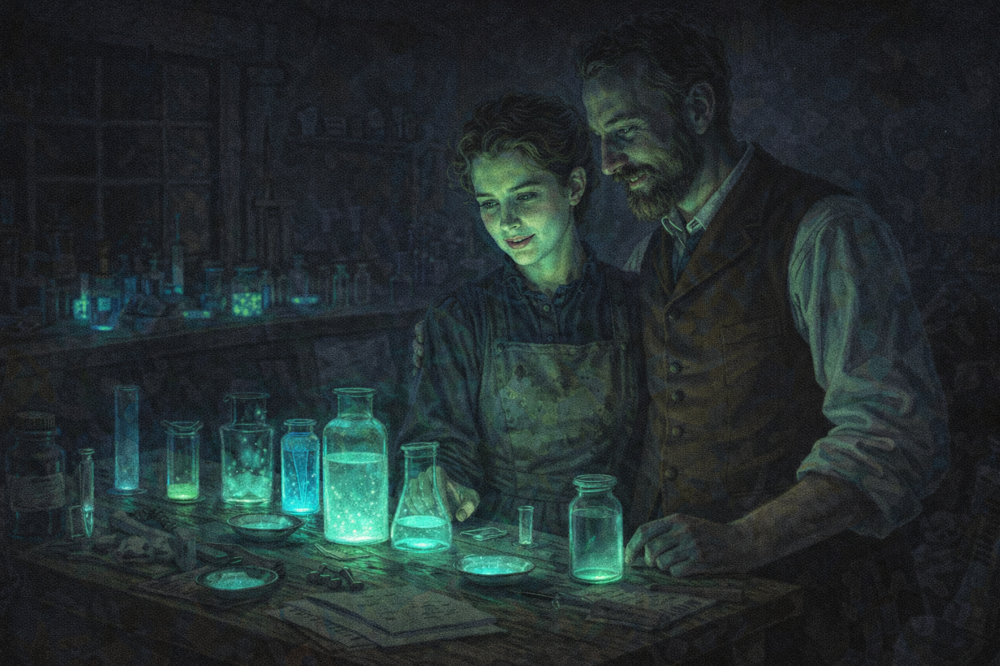
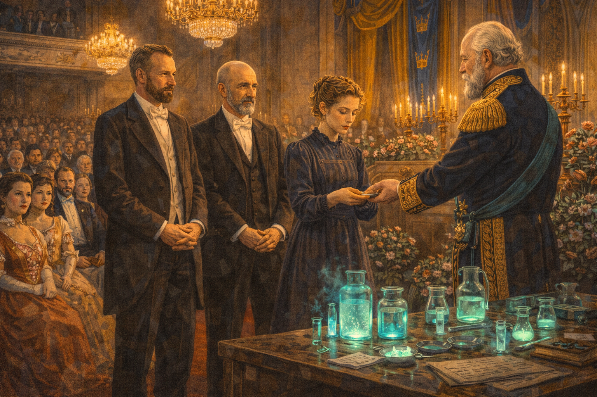
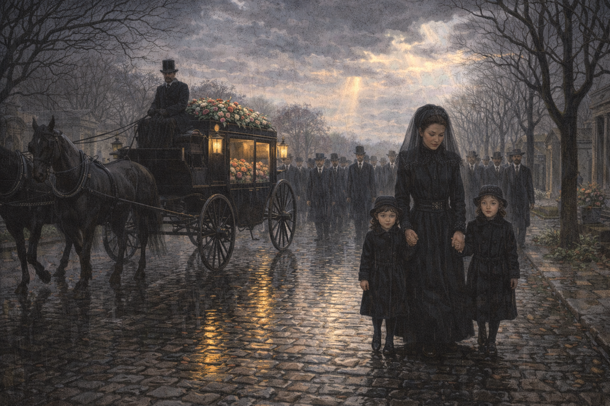
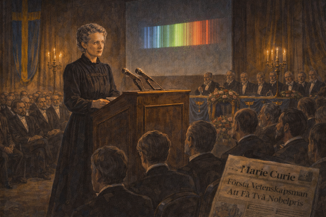
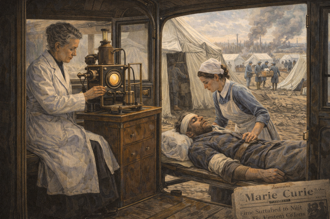
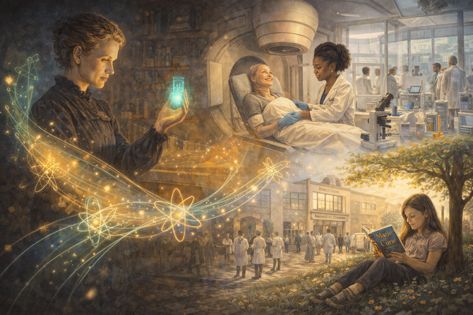
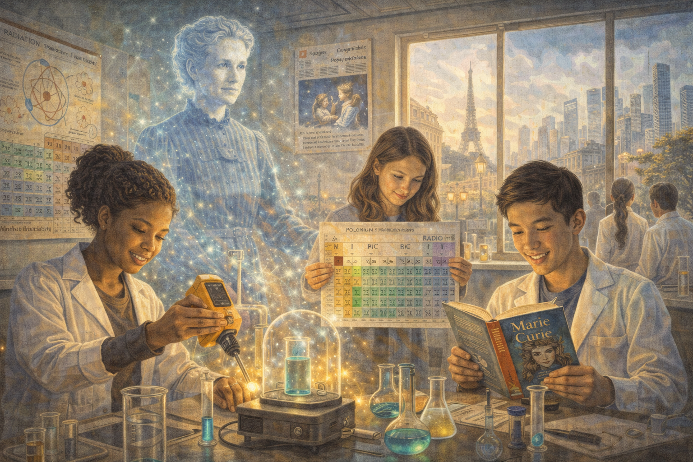

# Glowing in the Dark: The Radiant Life of Marie Curie

    
Narrative Prompt

Please generate a detailed narrative for a new graphic novel about Marie Curie
and her discovery of radioactivity. The target audience is high school students
studying introductory physics.

The story begins in Russian-occupied Poland in the 1870s, where young Maria
Sklodowska dreams of an education forbidden to women. Show her secret studies
in the "Flying University," her years working as a governess to fund her
sister's education, and her eventual journey to Paris.

Describe her struggles as a poor Polish immigrant at the Sorbonne, studying
physics while nearly starving in an unheated garret. Show her meeting Pierre
Curie—a fellow scientist who recognized her brilliance—and their partnership
in both love and science.

The central story follows their discovery of radioactivity in a converted
shed, working with tons of pitchblende ore to isolate tiny amounts of two
new elements: polonium (named for her homeland) and radium. Capture the
eerie blue glow of radium in the darkness and the grueling physical labor
required.

Include the tragedy of Pierre's death, Marie's perseverance as a widow and
single mother, and her historic second Nobel Prize. Address the sexism she
faced—nearly denied credit, attacked by the French press, initially rejected
by the French Academy of Sciences.

End with her legacy: mobile X-ray units in World War I, the Curie Institutes,
and the bittersweet fact that her notebooks remain radioactive to this day.

When you describe an image, make sure to mention that it should be a colorful,
bright wide-landscape illustration in a late Victorian/early modern scientific
style with rich period details and dramatic lighting contrasts.

### Prologue – A Girl Who Dreamed of Learning

In 1867, the Russian Empire ruled Poland with an iron fist. Polish language was banned in schools. Polish history was forbidden. And for girls, higher education was simply... impossible.

But in a modest Warsaw apartment, a professor's daughter named **Maria Sklodowska** refused to accept "impossible." While her brothers attended university, Maria devoured her father's physics books by candlelight, dreaming of a world where her mind—not her gender—would define her future.

She could not know that she would one day become **Marie Curie**, the most celebrated woman scientist in history, discoverer of radioactivity, and the only person ever to win Nobel Prizes in two different sciences.

Image Prompt

Image 1:
Please generate a new wide-landscape illustration.
A colorful, bright wide-landscape illustration in a late Victorian style showing young Maria Sklodowska, about 15 years old, reading a physics textbook by candlelight in a modest Warsaw apartment around 1882. She sits at a wooden desk covered with books and scientific instruments belonging to her father. Through a frosted window, snow falls on gas-lit Warsaw streets where Russian soldiers patrol. A Polish eagle emblem is hidden behind books on the shelf. Her face is illuminated by warm candlelight, showing intense concentration and determination. The scene conveys forbidden knowledge, quiet rebellion, and burning ambition despite oppression.

## Chapter 1 – The Flying University

Since women could not officially attend university in Russian-occupied Poland, Maria joined the secret **"Flying University"**—an underground network of scholars who met in private homes, moving locations constantly to evade the police. Here, young Poles learned forbidden subjects: Polish literature, real history, and science.

Maria made a pact with her sister Bronya: she would work as a governess to fund Bronya's medical studies in Paris. Then, when Bronya became a doctor, she would help Maria follow.

For six years, Maria taught other people's children while teaching herself advanced mathematics and physics from borrowed books.

Image Prompt

Image 2:
Please generate a new wide-landscape illustration.
A colorful, bright wide-landscape illustration in a late Victorian style depicting a secret meeting of the Flying University in a Warsaw parlor around 1885. A dozen young Polish men and women sit in a circle while a professor lectures from handwritten notes. Books are stacked ready to be hidden. Maria Sklodowska takes detailed notes, her eyes bright with hunger for knowledge. Heavy curtains are drawn against the windows. A lookout peers through a gap in the curtains at the street below. Oil lamps cast warm but secretive light. The atmosphere combines intellectual excitement with the tension of doing something forbidden.

## Chapter 2 – Paris at Last

In 1891, at age 24, Maria finally scraped together enough money for a fourth-class train ticket to Paris. She enrolled at the Sorbonne as "Marie"—easier for the French to pronounce—and began her studies in physics and mathematics.

She rented a tiny sixth-floor garret in the Latin Quarter. In winter, the water in her washbasin froze overnight. She survived on bread, chocolate, and occasional eggs, sometimes fainting from hunger in class. But she was *free*—free to learn everything.

Within two years, she finished first in her physics degree. The following year, she placed second in mathematics. Her professors had never seen anyone quite like her.

Image Prompt

Image 3:
Please generate a new wide-landscape illustration.
A colorful, bright wide-landscape illustration in a late Victorian Parisian style showing Marie's tiny attic room in the Latin Quarter around 1892. The cramped space under slanted eaves contains only an iron bed, a small table covered with physics books and notes, and a single oil lamp. Frost patterns cover the inside of the small window; a frozen water pitcher sits on a washstand. Marie, thin and pale but fiercely determined, studies by lamplight wrapped in a blanket, her breath visible in the cold air. Through the window, the rooftops of Paris and a distant glimpse of the Eiffel Tower are visible against a winter sunset. The scene conveys poverty, isolation, but also fierce dedication.

## Chapter 3 – A Meeting of Minds

In 1894, Marie was searching for laboratory space to conduct research on the magnetic properties of steel. A Polish physicist introduced her to **Pierre Curie**, a brilliant but shy French scientist who had already made important discoveries about crystals and magnetism.

Pierre was enchanted—not by her beauty, but by her mind. "She spoke of science with such passion," he later wrote. "I knew I had found my intellectual equal."

For a year, he courted her with letters about physics. When he proposed, Marie hesitated—returning to Poland to help her country had always been her plan. But Pierre offered something remarkable: a true partnership of equals.

They married in 1895. Marie wore a practical dark blue dress that she could later use in the laboratory.

Image Prompt

Image 4:
Please generate a new wide-landscape illustration.
A colorful, bright wide-landscape illustration in a late Victorian Parisian style showing Marie and Pierre Curie's first meeting in a physics laboratory around 1894. Pierre, with his distinctive beard and gentle eyes, leans against a lab bench covered with magnetism equipment while Marie, in a simple dark dress, gestures animatedly while explaining her research. Sunlight streams through tall windows onto crystal specimens and galvanometers. Their body language shows mutual fascination—two scientists recognizing kindred spirits. Other researchers work in the background, but Marie and Pierre exist in their own world of shared intellectual passion. The scene conveys the spark of both scientific collaboration and romantic connection.

## Chapter 4 – Mysterious Rays

In 1896, physicist Henri Becquerel made a puzzling discovery: uranium salts emitted invisible rays that could fog photographic plates—even in total darkness. Most scientists considered it a curiosity. Marie saw an opportunity.

For her doctoral research, she decided to investigate these "Becquerel rays" systematically. Using an electrometer designed by Pierre, she measured the rays from every uranium compound she could find. Her results were startling: the rays came from the uranium atoms *themselves*, not from any chemical reaction.

Even more surprising, she found that another element—thorium—emitted similar rays. Marie coined a new word for this phenomenon: **radioactivity**.

Image Prompt

Image 5:
Please generate a new wide-landscape illustration.
A colorful, bright wide-landscape illustration in a late Victorian scientific style showing Marie Curie working with a precision electrometer in a small laboratory around 1897. She carefully positions uranium samples while reading measurements from a delicate needle gauge. Scattered around her workbench are mineral samples, labeled glass containers, and her meticulous handwritten notes. Pierre observes in the background, making adjustments to the equipment. Scientific diagrams of atomic theory (as understood then) are pinned to the walls. Afternoon light illuminates the precise, methodical nature of her work. The scene conveys the birth of a new science through careful, systematic measurement.

## Chapter 5 – The Leaky Shed

Marie's measurements revealed something impossible: the mineral pitchblende was *more* radioactive than pure uranium. Something else must be hiding in the ore—something unknown to science.

To find it, Marie and Pierre needed space for large-scale chemistry. The Sorbonne offered them an abandoned dissection shed—no floor, a leaky glass roof, and temperatures that plunged below freezing in winter. It was all they had.

For the next four years, the shed became their universe. Marie worked like a factory laborer, grinding and dissolving tons of pitchblende ore. Her hands grew cracked and burned from acids. Pierre analyzed the radioactivity of each fraction. Together, they were hunting ghosts.

Image Prompt

Image 6:
Please generate a new wide-landscape illustration.
A colorful, bright wide-landscape illustration in a late Victorian industrial style showing the famous converted shed where the Curies worked, around 1899. The large, bare space has a dirt floor, rough wooden tables laden with chemical apparatus, and a glass roof patched with boards. Enormous cast-iron cauldrons steam on brick furnaces where Marie, wearing a stained work apron, stirs pitchblende residue with a heavy iron rod. Pierre examines solutions in glass vessels nearby. Bags of mineral ore are stacked against the walls. Despite the harsh conditions—visible breath, rough surfaces, industrial grime—there is an atmosphere of determined purpose. The scene conveys the grueling physical labor hidden behind great discoveries.

## Chapter 6 – Polonium and Radium

In July 1898, Marie announced the discovery of a new radioactive element—hundreds of times more active than uranium. She named it **polonium**, after her beloved homeland still suffering under occupation.

But the most radioactive fractions pointed to something even more extraordinary. By December, the Curies announced a second new element: **radium**. They predicted it would be *millions* of times more radioactive than uranium.

The scientific community was skeptical. Where was the proof? To silence the doubters, Marie set herself an almost impossible task: she would isolate pure radium and determine its atomic weight. It would take four more years of backbreaking labor.

Image Prompt

Image 7:
Please generate a new wide-landscape illustration.
A colorful, bright wide-landscape illustration in a late Victorian scientific style showing the moment of discovery. Marie and Pierre stand together at a laboratory bench, examining test results by gaslight. Marie holds a paper showing spectral lines—proof of a new element. Their faces show exhausted triumph. On the bench are chemical solutions glowing faintly in the dim light. A periodic table on the wall has a question mark where polonium and radium will soon appear. Through the shed's dirty windows, night has fallen on Paris. The scene captures the electric moment of scientific breakthrough—years of toil crystallized into certainty.

## Chapter 7 – Blue Glow in the Darkness

One evening, the Curies returned to their shed after dinner. They had left some radium samples in solution, and Marie wanted to check on them.

"Don't light the lamp," Pierre said as they entered.

In the darkness, the laboratory glowed. Faint blue-green light emanated from the glass tubes and dishes containing radium—an ethereal luminescence that seemed to come from nowhere. They stood in silence, watching the ghostly radiance.

"It's beautiful," Marie whispered.

They could not know that this beautiful glow was slowly killing them. The radiation that made radium gleam was bombarding their bodies with invisible particles, damaging cells and DNA with every exposure.

Image Prompt

Image 8:
Please generate a new wide-landscape illustration.
A colorful, bright wide-landscape illustration in a late Victorian style with dramatic lighting contrasts. Marie and Pierre Curie stand in their dark laboratory shed at night, illuminated only by the eerie blue-green glow of radium samples in glass containers on the workbench. Their faces are lit from below by the phosphorescent light, creating an almost supernatural atmosphere. The rest of the shed fades into deep shadow. Small dishes and tubes containing radium compounds create points of ghostly light around the room like strange stars. Marie's expression shows wonder and fascination; Pierre watches her with love and shared amazement. The scene is hauntingly beautiful while foreshadowing unseen danger.

## Chapter 8 – Nobel Glory

In 1903, the Nobel Committee decided to award the Physics Prize for the discovery of radioactivity—to Henri Becquerel and Pierre Curie. Marie's name was not included.

Pierre was furious. He wrote to the committee that he could not accept the prize unless Marie was recognized equally. "The research was joint," he insisted. "She originated the investigation."

The committee relented. Marie Curie became the first woman ever to receive a Nobel Prize. She was too ill from radiation exposure to attend the ceremony in Stockholm. When they finally visited Sweden, Marie charmed the king and queen with her quiet dignity—even as French newspapers questioned whether a *woman* really deserved such an honor.

Image Prompt

Image 9:
Please generate a new wide-landscape illustration.
A colorful, bright wide-landscape illustration in an early 1900s formal European style showing the Nobel Prize ceremony in Stockholm, 1903. In the grand concert hall decorated with flowers and candelabras, Marie Curie—thin, pale, and simply dressed compared to the elaborate gowns around her—stands with Pierre and Becquerel to receive their medals from the Swedish king. The audience of dignitaries in formal attire watches with mixed expressions: admiration, curiosity, and for some, skeptical surprise at a woman in such company. Golden chandeliers illuminate the scene. Marie's face shows quiet pride tempered by exhaustion. The scene captures both triumph and the subtle hostility she faced.

## Chapter 9 – Tragedy

On April 19, 1906, Pierre Curie crossed a busy Paris street in the rain, lost in thought about laboratory work. He slipped, fell beneath the wheels of a horse-drawn wagon, and was killed instantly.

Marie was devastated. "I put my head against the [casket] and spoke to him," she wrote in her diary. "I told him I loved him." She would continue writing letters to Pierre in her journal for years.

But she did not collapse. Two weeks after the funeral, the Sorbonne offered her Pierre's professorship—the first woman ever to teach at the university in its 650-year history. Marie accepted. She would carry on their work alone.

Image Prompt

Image 10:
Please generate a new wide-landscape illustration.
A colorful, bright wide-landscape illustration in an early 1900s Parisian style, somber but not graphic. A rainy Paris street scene with cobblestones reflecting gray light. In the foreground, a black funeral carriage passes, bearing flowers. Marie, dressed in black mourning clothes, walks behind with her two young daughters Irène and Ève, their small hands in hers. Scientists and dignitaries follow at a respectful distance. Leafless trees line the cemetery avenue. The sky is heavy with clouds, but a single ray of light breaks through in the distance—suggesting that Marie's work will continue. The scene conveys grief, loss, but also quiet determination to persevere.

## Chapter 10 – Standing Alone

As a widow, Marie faced the full force of French xenophobia and sexism. When she was nominated for the French Academy of Sciences, newspapers attacked her as a "foreign woman" unfit for such an honor. She lost the vote by two ballots.

But science recognized what society refused to see. In 1911, Marie received her second Nobel Prize—this time in Chemistry—for isolating pure radium and determining its atomic properties. She remains the only person in history to win Nobel Prizes in two different sciences.

"I am among those who think that science has great beauty," Marie said. "A scientist in a laboratory is not a mere technician; he is also a child confronting natural phenomena that impress him as though they were fairy tales."

Image Prompt

Image 11:
Please generate a new wide-landscape illustration.
A colorful, bright wide-landscape illustration in an early 1910s formal scientific style. Marie Curie stands alone at a podium in Stockholm, receiving her second Nobel Prize. Now in her mid-forties, gray-streaked hair pulled back severely, she wears a simple black dress—still in mourning for Pierre. Her expression is dignified but weary; dark circles under her eyes hint at radiation sickness. The audience of formally dressed scientists, mostly men, watches with respect. Behind her, a projection shows the glowing spectral lines of radium. A Swedish newspaper headline visible in the corner celebrates "First Scientist to Win Two Nobels." The scene conveys both triumph and isolation.

## Chapter 11 – The Petites Curies

When World War I erupted in 1914, Marie found a new mission. Wounded soldiers were dying because surgeons couldn't locate bullets and shrapnel. X-ray machines existed, but only in major hospitals far from the front lines.

Marie created a fleet of mobile X-ray units—ordinary cars outfitted with X-ray equipment and powered by their own generators. Soldiers called them **"Petites Curies"** (Little Curies). Marie drove them herself to the battlefields, often with her teenage daughter Irène as assistant.

Together, they X-rayed over one million wounded soldiers, saving countless lives. The French government never formally thanked her.

Image Prompt

Image 12:
Please generate a new wide-landscape illustration.
A colorful, bright wide-landscape illustration in a World War I documentary style. A converted Renault automobile—a "Petite Curie"—is parked outside a field hospital tent near the Western Front around 1916. Marie, now gray-haired and wearing a nurse's white coat over practical clothes, operates an X-ray machine inside the cramped vehicle while her daughter Irène, about 18, assists a wounded soldier onto the examination table. Through the open doors, medical staff carry stretchers past rows of white tents. In the background, the war-torn French countryside shows damaged trees and distant smoke. The scene conveys humanitarian purpose amid the horrors of war—science serving humanity.

## Chapter 12 – Immortal Light

Marie Curie died on July 4, 1934, from aplastic anemia—her bone marrow destroyed by decades of radiation exposure. She had carried test tubes of radium in her pockets, breathed radioactive dust, and never used protective equipment that didn't yet exist.

Her laboratory notebooks, stored in lead-lined boxes at the Bibliothèque nationale de France, remain dangerously radioactive to this day. Visitors must sign a liability waiver and wear protective clothing to view them.

But her legacy glows brighter than radium. Cancer treatments using radiation save millions of lives. Her daughter Irène won her own Nobel Prize. The Curie Institutes in Paris and Warsaw continue groundbreaking research. And every girl who dreams of becoming a scientist stands on Marie Curie's shoulders.

Image Prompt

Image 13:
Please generate a new wide-landscape illustration.
A colorful, bright wide-landscape illustration blending early 20th century and modern elements. The left side shows Marie Curie in her laboratory, handling a glowing radium sample in the characteristic blue light. A soft golden aura surrounds her. The right side transitions into the modern world: a cancer patient receiving radiation therapy smiles with hope; a young woman scientist of color works in a gleaming modern laboratory; the Curie Institute in Paris bustles with researchers; a girl reads a biography of Marie Curie under a tree. Connecting both eras, streams of light and atomic symbols flow from Marie's radium to all these modern scenes. The scene conveys how one woman's sacrifice illuminated the path for generations.

### Epilogue – The Price of Discovery

Marie Curie's life teaches us that great discoveries demand great sacrifices—but also that one determined person can change the world:

| Challenge | How Marie Overcame It | Lesson for Today |
|-----------|----------------------|------------------|
| **Denied education** | Attended secret "Flying University," self-taught for years | Find ways to learn despite barriers |
| **Poverty** | Survived on bread and chocolate while excelling at the Sorbonne | Determination outweighs resources |
| **Sexism** | Insisted on credit for her work; proved skeptics wrong with results | Let your work speak for itself |
| **Primitive conditions** | Made world-changing discoveries in a leaky shed | Great science doesn't require great facilities |
| **Grief** | Continued Pierre's work after his death; trained the next generation | Honor those we've lost by carrying on |
| **War** | Created mobile X-ray units that saved a million soldiers | Use science to help humanity |

Final Image Prompt

Image 14:
Please generate a new wide-landscape illustration.
A colorful, bright wide-landscape illustration blending historical and modern elements with an optimistic, inspiring tone. A diverse group of modern high school students works in a chemistry laboratory. One examines radioactive decay using a Geiger counter. Another studies the periodic table, with polonium and radium highlighted. A third reads Marie Curie's biography. Behind them, translucent and ghost-like, Marie Curie watches approvingly, her image formed from soft blue-white light reminiscent of radium's glow. On the classroom walls, posters show atomic structure, radiation therapy saving lives, and Marie's quote: "Nothing in life is to be feared, it is only to be understood." Through the windows, both 1900s Paris and a modern city are visible, merging past and future. The scene conveys that Marie's courage and curiosity live on in every student who pursues science despite obstacles.

### Call to Action

Marie Curie was told she couldn't go to university—so she attended an illegal one. She was told women didn't belong in laboratories—so she built her own. She was told she didn't deserve credit—so she won two Nobel Prizes.

She showed the world that:

- **Curiosity** is more powerful than prejudice
- **Persistence** transforms impossible into inevitable
- **Passion** for discovery can survive poverty, grief, and war
- **Sacrifice** for knowledge leaves a legacy that glows forever

Marie's notebooks still glow with radioactivity. Her example still glows with inspiration. The question is: what will *you* discover?

---

*"Nothing in life is to be feared, it is only to be understood. Now is the time to understand more, so that we may fear less."*
—Marie Curie

---

## References

1. [Marie Curie – Biographical](https://www.nobelprize.org/prizes/physics/1903/marie-curie/biographical/) - Ongoing - NobelPrize.org - The official Nobel Prize biography of the first woman to win a Nobel Prize and the only person to win in two different sciences.

2. [Marie Curie | Biography, Nobel Prize, Accomplishments, & Facts](https://www.britannica.com/biography/Marie-Curie) - Updated 2024 - Britannica - Comprehensive article covering her life from Warsaw to Paris, her discoveries, and her lasting legacy in science and medicine.

3. [Marie Sklodowska Curie](https://www.sciencehistory.org/education/scientific-biographies/marie-sklodowska-curie/) - 2024 - Science History Institute - Educational biography with primary source documents and photographs from Curie's life and laboratory.

4. [Marie Curie the Scientist | Bio, Facts & Quotes](https://www.mariecurie.org.uk/about-us/our-history/marie-curie-the-scientist) - 2024 - Marie Curie UK - The charity named after her explains her scientific legacy and how her work continues to inspire medical research today.

5. [Women Who Changed Science: Marie Curie](https://www.nobelprize.org/womenwhochangedscience/stories/marie-curie) - 2024 - NobelPrize.org - Interactive story exploring how Curie broke barriers for women in science while making discoveries that changed the world.

