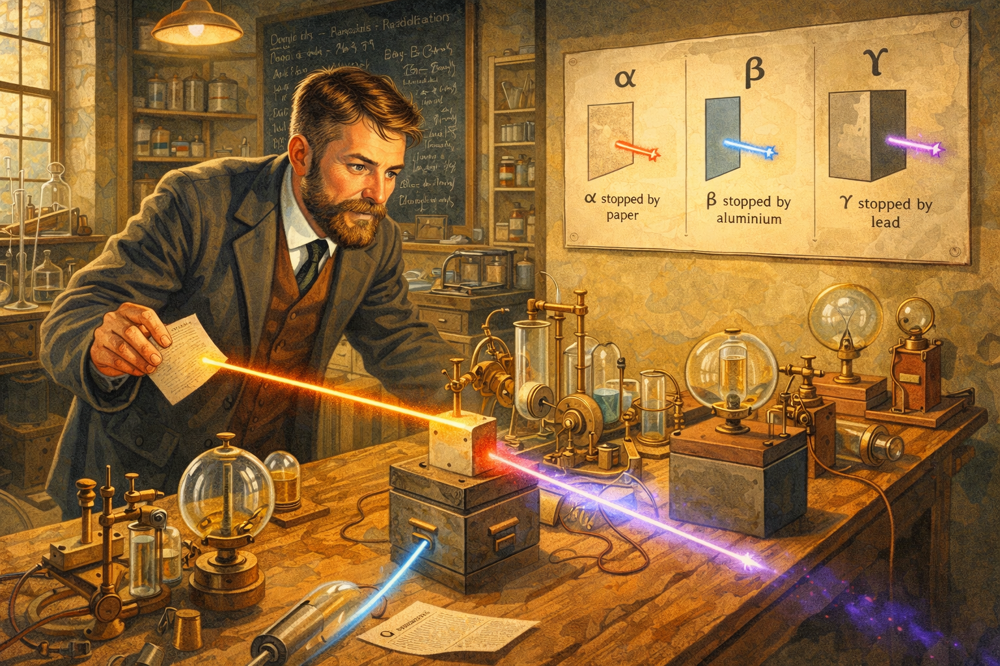
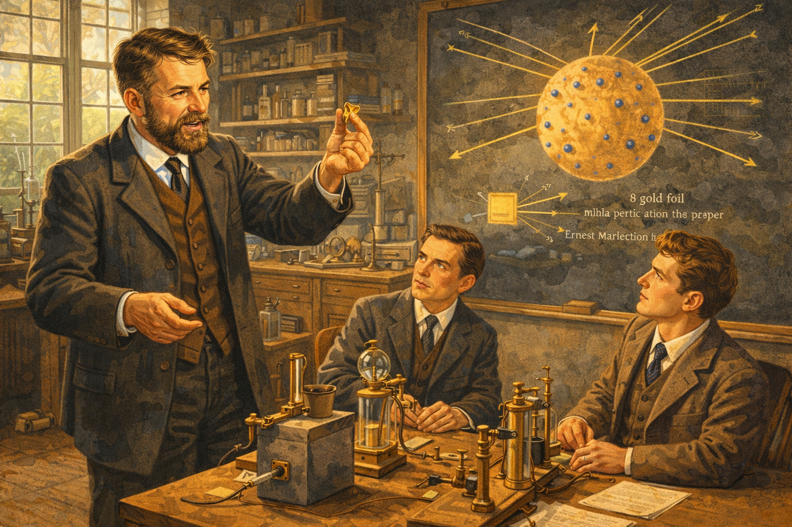
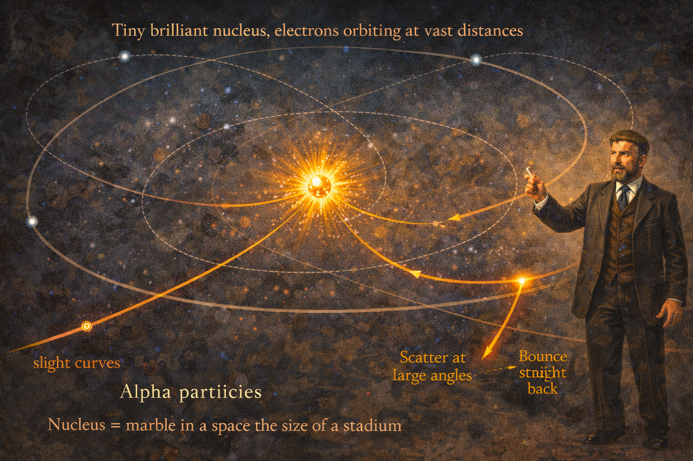
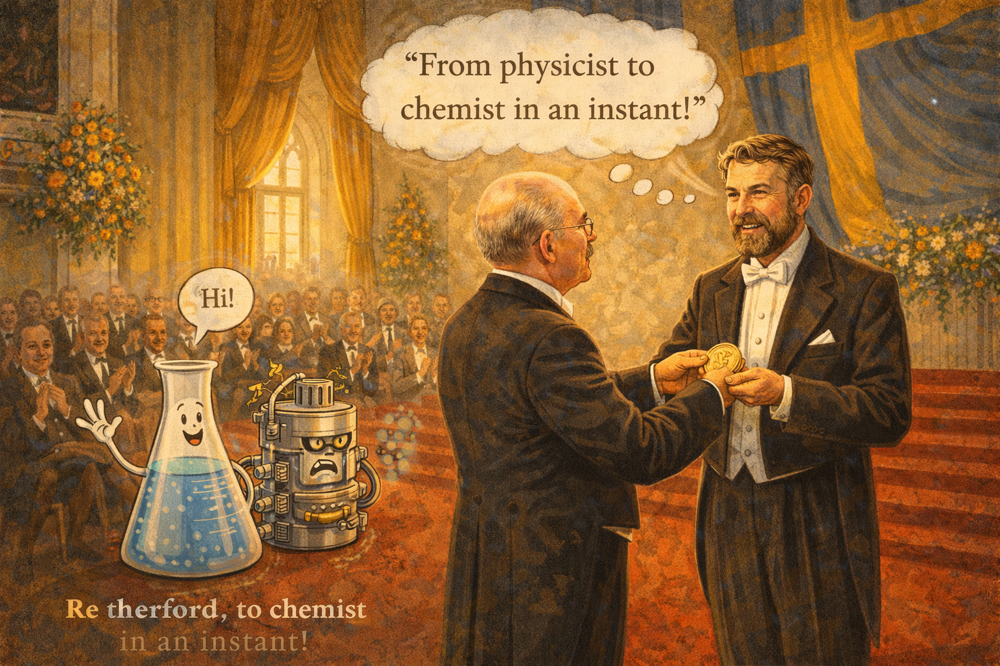
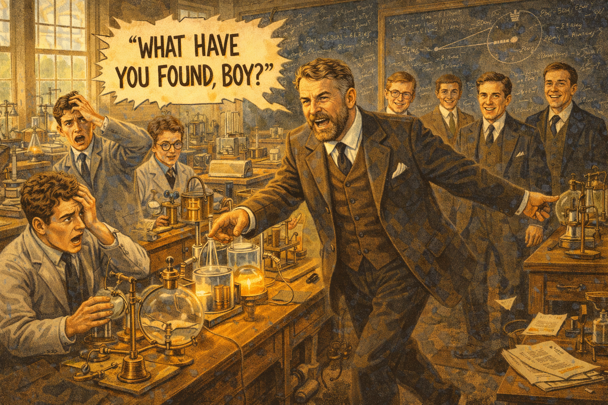
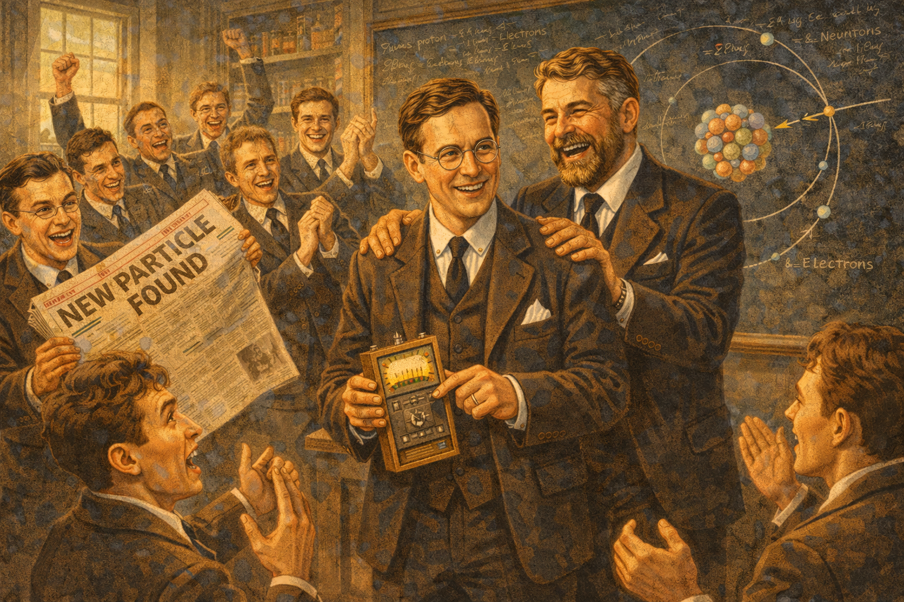
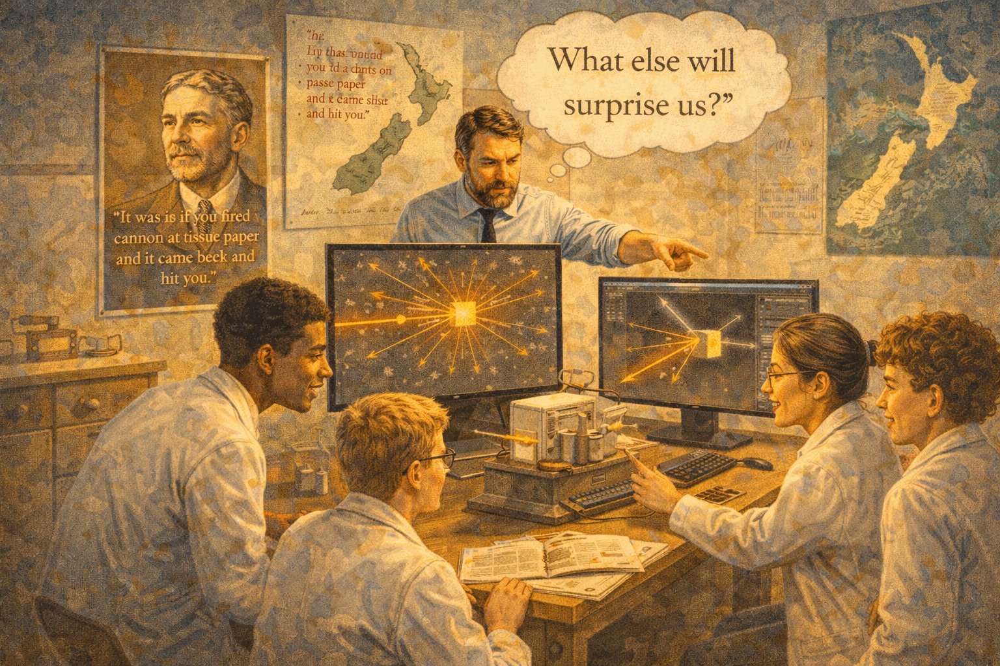

# The Gold Foil Surprise: Ernest Rutherford Discovers the Atom

    
Narrative Prompt

Please generate a detailed narrative for a new graphic novel about Ernest Rutherford
that is engaging and fun for teenagers. The target audience is high school students
studying introductory physics.

Rutherford was loud, blunt, energetic, and absolutely brilliant. He discovered the
structure of the atom through a beautifully simple experiment—and was genuinely
shocked by his own results. The story should capture his personality and the drama
of unexpected discovery.

Key elements:
- Born 1871 in rural New Zealand, one of 12 children
- Won a scholarship to Cambridge just as radio waves were being discovered
- Worked on radioactivity, classified alpha, beta, and gamma rays
- The gold foil experiment (1909-1911): fired alpha particles at thin gold foil
  - Expected them all to pass through with slight deflection
  - Some bounced STRAIGHT BACK
  - His famous quote: "like firing a cannon at tissue paper and it came back and hit you"
- Realized atoms must have tiny, dense nuclei—mostly empty space around them
- Later became the first person to artificially split an atom (1917)
- Won Nobel Prize in Chemistry (not Physics!)—he joked about his "instant transmutation"
- Famous for saying "All science is either physics or stamp collecting"
- Mentored 11 scientists who would win Nobel Prizes
- Loud, energetic, could be heard across the building, loved rugby

When you describe an image, make sure to mention that it should be a colorful,
bright wide-landscape illustration in an early 20th century British academic/
scientific style with energetic composition and period-accurate details.

### Prologue – The Kid from the End of the World

In 1871, on a farm in rural New Zealand—literally the opposite side of the world from the great scientific centers of Europe—a baby was born to a flax farmer and a schoolteacher. He was the fourth of twelve children. There was no electricity, no laboratory, and absolutely no reason to expect he would become one of the most important scientists in history.

His name was **Ernest Rutherford**. And he would discover what atoms are actually made of—by shooting things at them and seeing what happened.

Image Prompt

Image 1:
Please generate a new wide-landscape illustration.
A colorful, bright wide-landscape illustration in a late 19th century New Zealand pastoral style showing the Rutherford family farm around 1880. Rolling green hills dotted with sheep stretch toward distant mountains. A modest wooden farmhouse with a vegetable garden sits in the foreground. Young Ernest, about 9 years old, sturdy and energetic, helps his father with farm work while looking curiously at a book his mother—a schoolteacher—has given him. Flax plants grow nearby (the family business). The scene is remote, rustic, and about as far from Cambridge as imaginable. Yet this is where a scientific giant began.

## Chapter 1 – The Scholarship That Changed Everything

Ernest was brilliant at school, especially in mathematics and science. He won scholarship after scholarship, each one taking him further from the farm. Finally, in 1895, he won a spot at Cambridge University in England—funded by a prize from an exhibition.

Legend has it that when the telegram arrived, Ernest was digging potatoes in the field. He threw down his spade and shouted: "That's the last potato I'll ever dig!"

He arrived at Cambridge's Cavendish Laboratory just as the scientific world was exploding. X-rays had just been discovered. Radioactivity was brand new. The atom was a mystery waiting to be solved.

Ernest planned to solve it.

Image Prompt

Image 2:
Please generate a new wide-landscape illustration.
A colorful, bright wide-landscape illustration in a late Victorian transition style split into two scenes. Left: young Ernest Rutherford, about 24, throws down a spade in a New Zealand potato field, telegram clutched in hand, face lit with joy—he's going to Cambridge! Right: the grand Gothic buildings of Cambridge University, intimidating and ancient, with young scholars in academic robes walking the lawns. Ernest, now in a suit but still looking like a farm boy, walks through the gates of the Cavendish Laboratory for the first time, eyes wide with determination. The scene captures the leap from the end of the world to its intellectual center.

## Chapter 2 – Taming the Rays

Rutherford quickly made his mark. Working with the great J.J. Thomson (who had just discovered the electron), Rutherford tackled radioactivity—the mysterious rays emanating from uranium and other elements.

Through careful experiments, he identified three types of radiation:
- **Alpha rays**: heavy, positively charged, stopped by paper
- **Beta rays**: lighter, negatively charged, stopped by aluminum
- **Gamma rays**: no charge, penetrating, stopped only by lead

He named them after the first three letters of the Greek alphabet. Scientists still use his names today.

But what fascinated Rutherford most were alpha particles. They were tiny, fast, and positively charged. Perfect little bullets.

What if he shot them at something?

Image Prompt

Image 3:
Please generate a new wide-landscape illustration.
A colorful, bright wide-landscape illustration in an early 1900s Cavendish Laboratory style showing Rutherford's radioactivity experiments around 1899. The laboratory is filled with vacuum tubes, electroscopes, and radioactive samples in lead containers. Rutherford, now bearded and confident, directs radiation from a sample toward different materials. Diagrams on the wall show his classification: alpha (stopped by paper), beta (stopped by aluminum), gamma (stopped by lead). Glowing paths represent the invisible rays. His expression shows intense curiosity—these are tools for discovery. The scene conveys physics becoming experimental science.

## Chapter 3 – The Plum Pudding Problem

In 1909, Rutherford was a professor at the University of Manchester, leading a team of brilliant researchers. The big question on everyone's mind: what did atoms actually look like?

The popular model was J.J. Thomson's **"plum pudding"** model. Atoms were thought to be spheres of positive charge with electrons embedded throughout—like raisins in a pudding. There was no nucleus, no empty space.

Rutherford had an idea: shoot alpha particles at very thin gold foil. The particles should pass straight through with tiny deflections, like bullets through Jello. Measuring the deflections would reveal how charge was distributed inside atoms.

He gave the project to two younger scientists: Hans Geiger and Ernest Marsden.

What happened next shocked everyone.

Image Prompt

Image 4:
Please generate a new wide-landscape illustration.
A colorful, bright wide-landscape illustration in an early 20th century British academic style showing Rutherford's Manchester laboratory around 1909. Rutherford, now commanding and energetic, briefs his team: Hans Geiger (German, precise) and Ernest Marsden (young, eager). On the blackboard behind them is Thomson's plum pudding model—a sphere of uniform positive charge with electrons scattered throughout. Rutherford points to a piece of gold foil thinner than paper. Alpha particle paths are drawn showing expected results: minor deflections as particles pass through the uniform "pudding." The scene conveys confident expectations about to be shattered.

## Chapter 4 – The Experiment

The setup was simple but demanding. A radioactive source shot alpha particles at gold foil so thin that light could pass through it. Around the foil, a zinc sulfide screen would flash whenever an alpha particle hit it. Geiger and Marsden had to sit in complete darkness, count the flashes by eye, and note their positions.

Hour after hour, they counted. Most particles went straight through or deflected slightly, just as expected.

But then Marsden noticed something impossible: occasional flashes coming from the *wrong side* of the apparatus. Some alpha particles were bouncing *backward*.

He ran to tell Rutherford.

Image Prompt

Image 5:
Please generate a new wide-landscape illustration.
A colorful, bright wide-landscape illustration in an early 20th century scientific laboratory style showing the gold foil experiment in progress around 1910. A dark room with the apparatus at center: a lead-shielded radioactive source aims alpha particles at a tiny sheet of gold foil; a movable zinc sulfide screen surrounds the setup. Marsden peers through a microscope at the screen, counting tiny flashes of light. Geiger records numbers. The room is nearly black except for the glow of occasional flashes. On a diagram, arrows show expected paths through the foil. But one arrow—highlighted—bounces straight back. Marsden's expression shows shock. The scene captures the moment the impossible happened.

## Chapter 5 – "It Was Almost Incredible"

When Rutherford heard that alpha particles were bouncing backward, he was stunned.

"It was almost incredible," he later wrote. "It was as if you fired a 15-inch cannon shell at a piece of tissue paper and it came back and hit you."

Alpha particles were heavy and moving incredibly fast. For one to bounce back, it must have hit something enormously dense and concentrated—not a diffuse "pudding" but a tiny, massive core.

Rutherford spent months working through the mathematics. Finally, he understood.

The atom was mostly empty space. Almost all its mass was concentrated in a tiny **nucleus** at the center—10,000 times smaller than the atom itself. The electrons orbited far away, like planets around a distant sun.

Image Prompt

Image 6:
Please generate a new wide-landscape illustration.
A colorful, bright wide-landscape illustration in an early 20th century "eureka moment" style showing Rutherford's realization. Rutherford stands in his office, papers scattered everywhere, chalk in hand, staring at the mathematics on his blackboard. The key diagram shows an alpha particle approaching a gold atom—and bouncing directly backward off a tiny central point. His famous quote floats in the air: "It was as if you fired a cannon at tissue paper and it came back and hit you." His expression mixes shock and dawning understanding. The plum pudding model is crossed out; the nuclear model is being born. The scene captures revolutionary insight.

## Chapter 6 – The Nuclear Atom

In 1911, Rutherford published his revolutionary model of the atom:

- A tiny, dense, positively charged **nucleus** at the center
- **Electrons** orbiting at great distances
- Mostly **empty space** in between

This explained everything. Most alpha particles passed through because they never got close to the nucleus. The rare backward bounces happened when an alpha particle scored a nearly direct hit on the tiny nuclear target.

The scientific world was transformed. Atoms weren't solid balls or puddings—they were miniature solar systems, almost entirely empty, with all their mass packed into an impossibly small center.

Image Prompt

Image 7:
Please generate a new wide-landscape illustration.
A colorful, bright wide-landscape illustration in an early 20th century scientific visualization style showing Rutherford's nuclear model of the atom. A large artistic representation of the atom fills most of the image: a tiny brilliant nucleus at center, with electrons orbiting at vast distances. The scale is emphasized—the nucleus is shown as a marble in a space the size of a stadium. Alpha particle paths are traced: most curve slightly and pass through; rare ones that approach the nucleus closely scatter at large angles; extremely rare ones bounce straight back. Rutherford stands beside the diagram like a lecturer. The scene makes the invisible visible.

## Chapter 7 – Nobel Prize (in the Wrong Subject!)

In 1908—even before the gold foil experiment—Rutherford won the Nobel Prize. But there was a catch: it was in **Chemistry**, not Physics.

The prize honored his work on radioactive decay, showing that elements could transform into other elements—what medieval alchemists had dreamed of. The Chemistry committee claimed his work.

Rutherford, a physicist to his core, joked about it for years. "I have dealt with many different transformations with various periods of time," he said in his acceptance speech, "but the quickest I have ever encountered was my own transformation from a physicist to a chemist."

He later famously declared: "All science is either physics or stamp collecting."

(The chemists were not amused.)

Image Prompt

Image 8:
Please generate a new wide-landscape illustration.
A colorful, bright wide-landscape illustration in an early 20th century formal ceremony style showing Rutherford receiving the Nobel Prize in Stockholm, 1908. The grand hall is decorated for the occasion. Rutherford, in formal dress, accepts the medal with a bemused grin. A thought bubble shows his joke: "From physicist to chemist in an instant!" Nearby, chemistry and physics equipment are humorously personified—a beaker waves hello while a particle accelerator looks jealous. The scene is warm and celebratory but captures Rutherford's playful irreverence.

## Chapter 8 – Splitting the Atom

Rutherford wasn't done. During World War I, he wondered: if alpha particles could probe the nucleus, could they change it?

In 1917, he fired alpha particles at nitrogen gas and detected something new coming out: hydrogen nuclei (protons). The alpha particles had knocked protons out of nitrogen nuclei, transforming nitrogen into oxygen.

He had **split the atom**—the first artificial nuclear reaction in history.

"Playing with marbles," he called it dismissively. But this "playing" would eventually lead to nuclear power and, unfortunately, nuclear weapons.

Image Prompt

Image 9:
Please generate a new wide-landscape illustration.
A colorful, bright wide-landscape illustration in a late 1910s wartime laboratory style showing Rutherford's atom-splitting experiment at Manchester around 1917. While war rages outside (glimpsed through windows as searchlights and distant explosions), Rutherford works intently on his apparatus. Alpha particles bombard nitrogen gas; a detection screen registers unusual particles coming out. A diagram shows what's happening: an alpha particle strikes a nitrogen nucleus, and a proton flies out, leaving behind a different element. Rutherford's expression shows focused intensity. The scene contrasts war's destruction with creation of nuclear physics.

## Chapter 9 – The Cavendish Commander

In 1919, Rutherford returned to Cambridge as director of the Cavendish Laboratory—the same place where he'd arrived as a nervous colonial student 24 years earlier. Now he was in charge.

His leadership style was... unforgettable. He was loud—his voice could be heard throughout the building. He burst into labs unannounced, demanding to know what people had discovered. He called everyone "boy" regardless of age. He sang "Onward, Christian Soldiers" while working.

But he was also generous, inspiring, and brilliant at spotting talent. Eleven of his students would go on to win Nobel Prizes.

"We're like children playing on a beach," he told them.  "The great ocean of truth lies before us, unexplored."

Image Prompt

Image 10:
Please generate a new wide-landscape illustration.
A colorful, bright wide-landscape illustration in a 1920s Cambridge academic style showing Rutherford as director of the Cavendish Laboratory. The scene shows his energetic leadership: Rutherford strides through the lab, booming questions at researchers, gesturing enthusiastically. Young scientists scramble to explain their work. The walls are lined with equipment and chalkboards full of equations. Sound effects suggest his famous loud voice: "WHAT HAVE YOU FOUND, BOY?" Some students look terrified; others grin—they adore him. In the background, a who's-who of future Nobel laureates: Chadwick, Blackett, Cockcroft, Walton. The scene conveys chaotic genius and inspiration.

## Chapter 10 – The Neutron and Beyond

Rutherford predicted that the nucleus must contain a neutral particle—something with mass but no charge. His student James Chadwick proved it in 1932, discovering the **neutron** and completing our picture of the atom.

Around the same time, Rutherford's "boys" John Cockcroft and Ernest Walton became the first to split an atom using an artificial accelerator rather than natural radiation. They proved Einstein's E=mc² directly: the energy released matched the mass lost.

Rutherford, now elderly but still energetic, celebrated with his team. The atom he'd explored was now yielding its deepest secrets.

Image Prompt

Image 11:
Please generate a new wide-landscape illustration.
A colorful, bright wide-landscape illustration in a 1930s British scientific triumph style showing Chadwick's neutron discovery. The Cavendish Laboratory is alive with excitement. James Chadwick holds evidence of the neutron—a particle detector showing the telltale signs. Rutherford claps him on the back, beaming with pride. A chalkboard shows the completed atom: protons and neutrons in the nucleus, electrons orbiting outside. Around them, other "Cavendish boys" celebrate. Newspaper headlines visible: "NEW PARTICLE FOUND." The scene conveys the fulfillment of Rutherford's predictions.

## Chapter 11 – The Man from Down Under

Rutherford never forgot his origins. He remained informal, approachable, and proudly New Zealand despite his towering reputation. He married his college sweetheart Mary Newton (they met in New Zealand) and remained devoted to her for life.

He loved rugby, gardening, and good-natured arguments. He distrusted "fancy" mathematics, preferring experiments he could visualize. "If you can't explain your physics to a barmaid," he reportedly said, "it's probably not very good physics."

He made enemies too—especially among scientists who felt his "stamp collecting" comments were insulting. But he made far more friends and disciples who would carry his methods into the future.

Image Prompt

Image 12:
Please generate a new wide-landscape illustration.
A colorful, bright wide-landscape illustration in a 1930s informal portrait style showing Rutherford's full personality. Multiple scenes: Rutherford in his garden, pipe in mouth, tending roses; Rutherford cheering loudly at a rugby match (Cambridge vs. New Zealand); Rutherford at a pub, explaining physics to an amused barmaid using salt shakers as atoms; Rutherford receiving honors but looking uncomfortable in formal dress. At center, he relaxes with his wife Mary. A New Zealand flag and a Union Jack appear together—both homelands. The scene shows the human being behind the scientific giant.

## Chapter 12 – The Legacy of Surprise

Ernest Rutherford died on October 19, 1937, from a strangulated hernia that wasn't treated quickly enough—a baron of science done in by medical delay. He was buried in Westminster Abbey, near Newton and Darwin.

His legacy is the atom itself—or rather, our understanding of it. Because of the gold foil experiment:

- We know atoms are mostly **empty space**
- We know all positive charge is in the **nucleus**
- We understand why matter is **solid** (electrons repel each other)
- Nuclear physics, nuclear energy, and particle accelerators all began with his work

And it all started because some particles bounced backward—and Rutherford was smart enough to be surprised.

Image Prompt

Image 13:
Please generate a new wide-landscape illustration.
A colorful, bright wide-landscape illustration blending 1930s and modern elements showing Rutherford's scientific legacy. Center: Rutherford's plaque in Westminster Abbey. Radiating outward: nuclear power plants, medical radiation therapy, the Large Hadron Collider, atomic models in textbooks, the periodic table with atomic numbers he established. Ghostly gold foil and bouncing alpha particles weave through the image as motifs. A quote floats: "It was as if the cannon shell came back and hit you." Modern physicists and students work with concepts he founded. The scene conveys how one shocking result reshaped science.

### Epilogue – Expect to Be Surprised

Rutherford's gold foil experiment teaches the most important lesson in science: **be ready for nature to prove you wrong.**

| What Scientists Expected | What Actually Happened | The Lesson |
|-------------------------|----------------------|------------|
| Alpha particles pass straight through | Some bounced backward | Nature doesn't care about your theories |
| Atoms are uniform "pudding" | Atoms are mostly empty with dense nuclei | Reality is weirder than imagination |
| Simple experiment, minor results | Revolutionary discovery | Simple questions can have huge answers |
| Only big labs do important work | A farm boy changed physics | Background doesn't determine contribution |
| Rutherford won Physics Nobel | He won Chemistry Nobel | Even prizes can surprise you |

Final Image Prompt

Image 14:
Please generate a new wide-landscape illustration.
A colorful, bright wide-landscape illustration blending early 20th century and modern styles. Modern students perform a version of the gold foil experiment in a physics lab—perhaps using simulation software or educational apparatus. On screens, they watch alpha particles scattering, most passing through, a few bouncing back. A teacher points out the surprising results. On the wall: a poster of Rutherford with his famous quote about tissue paper and cannonballs. A New Zealand map is visible, emphasizing that great scientists can come from anywhere. One student has a thought bubble: "What else will surprise us?" The scene conveys that the scientific method—testing assumptions and accepting surprises—belongs to everyone.

### Call to Action

Ernest Rutherford expected alpha particles to sail through gold foil like bullets through fog. When some bounced straight back, he could have ignored it, explained it away, or blamed faulty equipment.

Instead, he was surprised. And he let that surprise lead him to the truth.

Here's what Rutherford teaches us:

- **Simple experiments can change everything** — the gold foil setup was basic
- **Background doesn't matter** — a New Zealand farm boy revolutionized physics
- **Expect surprises** — if your results match your expectations perfectly, you might be missing something
- **Keep it real** — "If you can't explain it to a barmaid, it's probably not very good physics"
- **Be loud about what matters** — Rutherford's enthusiasm was infectious

The atom turned out to be almost entirely empty space, with all its mass concentrated in a tiny nucleus. That's weird. That's surprising. And it's true.

Science progresses when we let nature tell us what's real—even when it's not what we expected.

What will surprise you?

---

*"It was quite the most incredible event that ever happened to me in my life. It was almost as incredible as if you had fired a 15-inch shell at a piece of tissue paper and it came back and hit you."*
—Ernest Rutherford

*"All science is either physics or stamp collecting."*
—Also Rutherford (the chemists still haven't forgiven him)

---

## References

1. [Ernest Rutherford | Accomplishments, Atomic Theory, & Facts](https://www.britannica.com/biography/Ernest-Rutherford) - Updated 2024 - Britannica - Complete biography of the New Zealand-born physicist who discovered the atomic nucleus and is called the "father of nuclear physics."

2. [May 1911: Rutherford and the Discovery of the Atomic Nucleus](https://www.aps.org/apsnews/2006/05/rutherford-discovery-atomic-nucleus) - 2006 - American Physical Society - Detailed account of how Rutherford's gold foil experiment overturned the "plum pudding" model and revealed atoms are mostly empty space.

3. [Rutherford's Experiment: The Nuclear Model of the Atom](https://chem.libretexts.org/Bookshelves/Introductory_Chemistry/Chemistry_for_Changing_Times_(Hill_and_McCreary)/03:_Atomic_Structure/3.04:_Rutherford's_Experiment-_The_Nuclear_Model_of_the_Atom) - 2024 - Chemistry LibreTexts - Free online textbook chapter explaining the gold foil experiment with diagrams and the math behind calculating nuclear size.

4. [Rutherford's Nuclear World](https://history.aip.org/exhibits/rutherford/) - Ongoing - American Institute of Physics - Virtual exhibit exploring Rutherford's lab, his experiments, and the personalities of his research team including Geiger and Marsden.

5. [Gold Foil Experiment](https://chem.libretexts.org/Bookshelves/Introductory_Chemistry/Introductory_Chemistry_(CK-12)/04:_Atomic_Structure/4.14:_Gold_Foil_Experiment) - 2024 - CK-12/Chemistry LibreTexts - Step-by-step explanation of the experiment with interactive simulations you can try yourself.

