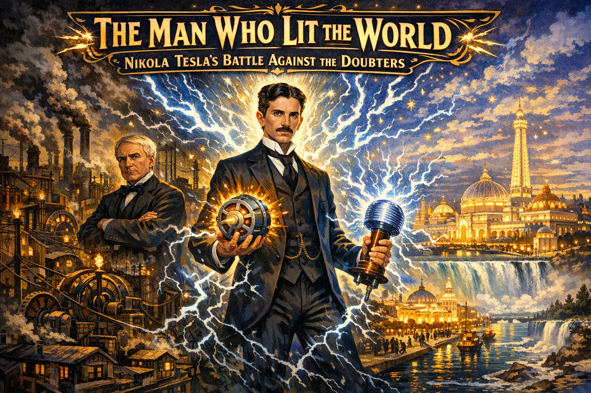
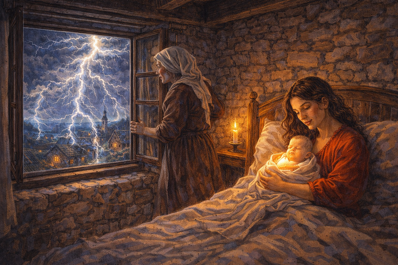
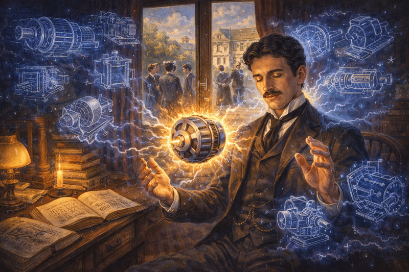
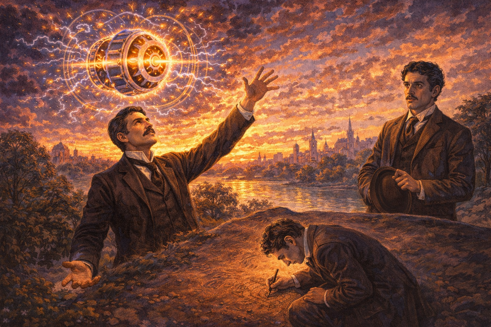
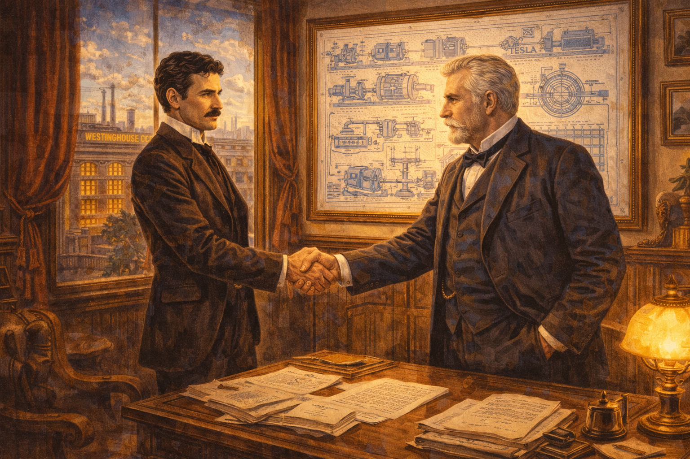
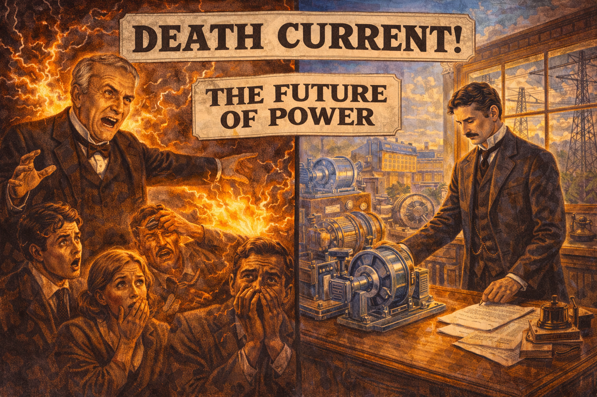
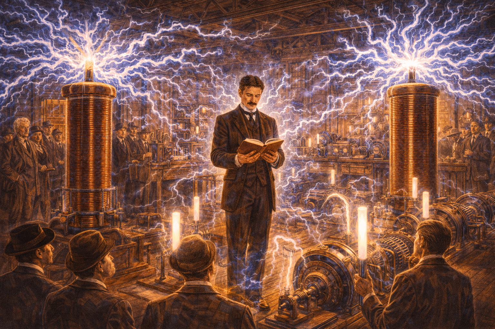
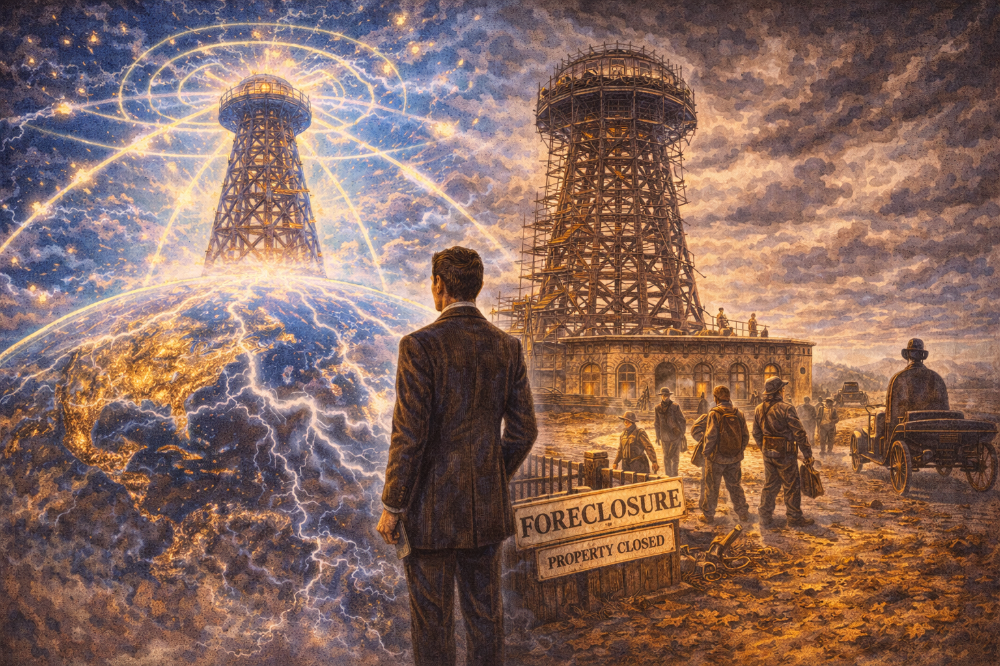
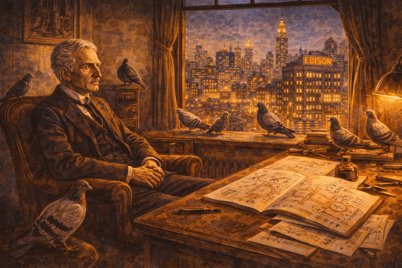
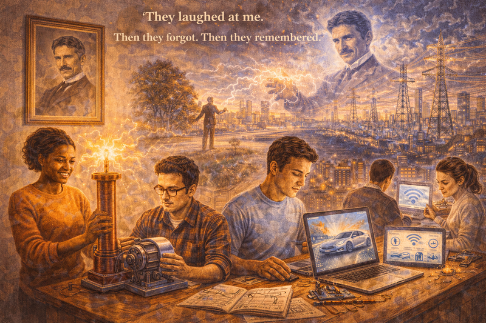

# The Man Who Lit the World: Nikola Tesla's Battle Against the Doubters

Cover Image Prompt

Create a colorful, bright wide-landscape 16:9 cover illustration in a late 19th century American Gilded Age style with dramatic electrical lighting and period-accurate industrial details.

Title Text: Place the title "The Man Who Lit the World: Nikola Tesla's Battle Against the Doubters" prominently at the top of the image in bold Art Nouveau typography with electrical spark embellishments, against a darker area to ensure readability.

Central Figure: Nikola Tesla stands at the center, tall and elegant in a formal suit, his intense eyes gazing confidently into the future. Around him, brilliant bolts of electricity arc and dance—he is completely unafraid, standing amid the lightning he controls.

Visual Journey: The composition shows the conflict and triumph:
- Left side: Dark industrial chaos—Edison's DC power plants belching smoke, tangled wires everywhere, the old way of doing things. Edison himself stands in shadow, arms crossed skeptically.
- Center: Tesla holds a glowing AC motor in one hand and a Tesla coil crackling with electricity in the other—the revolutionary technologies that would change everything
- Right side: The brilliant White City of the 1893 Chicago World's Fair, lit entirely by Tesla's AC power—a vision of the electric future

Background Elements: The transition from gaslit darkness to electric brilliance. Niagara Falls appears in the distance, its power being harnessed. The skyline of New York City transforms from dark to illuminated.

Lighting: Dramatic contrast between the dark, smoky DC world and the clean, brilliant AC future. Tesla stands in pure white electrical light, seemingly immune to the 250,000-volt discharges around him.

Color Palette: Deep industrial blacks and browns contrasting with brilliant electric blues, purples, and whites. Gold accents for the Gilded Age elegance. The overall effect should feel like witnessing the birth of the modern electrical age.

Mood: Triumphant and visionary—capturing a man who saw the future, was called crazy for it, and proved everyone wrong.

    
Narrative Prompt

Please generate a detailed narrative for a new graphic novel about Nikola Tesla
that is engaging and inspiring for teenagers. The target audience is high school
students studying introductory physics.

Tesla's story is one of vision against doubt, persistence against ridicule:
- Born in 1856 in the Serbian village of Smiljan (modern-day Croatia)
- Arrived in America in 1884 with four cents in his pocket and a letter of recommendation
- Worked briefly for Thomas Edison, who dismissed his AC ideas as dangerous fantasy
- Quit Edison's company after a broken promise of $50,000
- Found George Westinghouse, who believed in AC when no one else did
- Fought and won the "War of Currents" against Edison's DC power
- Lit the 1893 Chicago World's Fair with AC power—the most dramatic demonstration in history
- Built the first AC hydroelectric power plant at Niagara Falls
- Invented the AC motor, polyphase electrical systems, the Tesla coil, radio fundamentals
- Envisioned wireless power, smartphones, and the internet decades before they existed
- Died poor and alone in a New York hotel room, his genius finally recognized too late

The story should emphasize that being right isn't enough—you must persist when everyone
says you're wrong. Tesla was mocked, cheated, and dismissed by the establishment, but
he never stopped believing in his vision. He saw the future more clearly than anyone,
and he fought to make it real.

When you describe an image, make sure to mention that it should be a colorful,
bright wide-landscape illustration in a late 19th century American Gilded Age/
Art Nouveau style with dramatic electrical effects and period-accurate industrial details.

---
Image preamble

In this session our goal is to create images for a graphic novel about Nikola Tesla
that is engaging and inspiring for teenagers. The target audience is high school
students studying introductory physics.

Image Format: Each image must be rendered in a wide-landscape format with a width:height ratio of 16:9.

Image style: Each image should be a colorful, bright wide-landscape illustration
in a late 19th century American Gilded Age/Art Nouveau style with dramatic
electrical lighting effects and period-accurate industrial details.

### Prologue – The Boy Who Saw Lightning

In 1856, during a violent lightning storm, a baby was born in a small village in the Austrian Empire. The midwife declared it a bad omen: "This child will be a child of darkness."

His mother replied: "No. He will be a child of light."

His name was **Nikola Tesla**. And he would grow up to literally light the world.

From childhood, he saw things others couldn't—complete inventions appearing in his mind, fully formed and functioning. He could visualize machines so precisely that he could test them mentally before ever building them. Doctors called it a disorder. Tesla called it a gift.

This is the story of how a penniless immigrant with impossible dreams defeated the most powerful inventor in America—and gave humanity the electric age.

Image Prompt

Image 1:
Please generate a new 16:9 w:h ratio illustration.
A colorful, bright illustration of a room of mid-19th century Eastern European village showing Tesla's dramatic birth in Smiljan in 1856. The scene is a bedroom in a small stone house with a large window. Outside, through the window, we see a violent thunderstorm—lightning fills the sky, illuminating the village. In the bedroom a baby has just been born and is being
held by his mother. The midwife looks out the window, frightened at the storm, but the mother gazes at her newborn with fierce love. Outside, lightning strikes repeatedly, as if announcing something momentous. The scene should blend the humble village setting with supernatural electrical drama. Young Nikola seems to glow faintly even as an infant, connected somehow to the storm outside.

## Chapter 1 – A Mind Like No Other

Young Nikola was different. He experienced intense visions—flashes of light, complete machines appearing in his mind, ideas so vivid they seemed more real than reality. Doctors worried. His parents prayed.

But Tesla learned to harness these visions. He could imagine a machine, examine it from every angle in his mind, run it mentally, find the flaws, and fix them—all without drawing a single line on paper.

"My method is different," he later wrote. "I do not rush into actual work. When I have an idea, I start at once building it up in my imagination."

At 17, he nearly died from cholera. His father, who wanted him to become a priest, promised that if Nikola survived, he could study engineering instead.

Tesla survived. And his destiny began.

Image Prompt

Image 2:
Please generate a new wide-landscape illustration.
A colorful, bright wide-landscape illustration in a 19th century European academic style showing young Tesla's unique mental abilities. The scene shows teenage Tesla in his room, but his imagination is visible: ghostly, translucent blueprints of machines float around him—motors, generators, devices that don't exist yet. His eyes are closed in concentration as a fully-formed electric motor rotates in the air before him, glowing with inner light. Books on electricity and engineering are scattered around. Through the window, the real world is mundane, but inside Tesla's mind, the future is already being built. Other students outside look normal; Tesla is clearly extraordinary.

## Chapter 2 – The Vision in the Park

In 1882, while walking through a Budapest park at sunset, Tesla had the breakthrough that would change history.

He had been wrestling with a problem: how to create an electric motor that didn't need brushes—the sparking, wearing parts that made existing motors unreliable. The solution had eluded him for years.

Then, while reciting poetry to a friend, it struck him like lightning. He saw it complete: a rotating magnetic field, created by alternating currents out of phase with each other. The field itself would spin, dragging the motor with it. No brushes. No sparks. Perfect rotation.

He grabbed a stick and drew the design in the dirt. **The AC induction motor was born**—in a park, at sunset, from pure imagination.

Image Prompt

Image 3:
Please generate a new wide-landscape illustration.
A colorful, bright wide-landscape illustration in a late 19th century European Romantic style showing Tesla's breakthrough moment in Budapest's City Park in 1882. Tesla stands transfixed at sunset, arm outstretched, as if receiving a vision from the heavens. His friend Szigety watches in confusion. Above Tesla's head, visible only to him (and us), the complete AC induction motor appears as a glowing, rotating diagram—magnetic field lines spinning, rotor following. Below, Tesla is frantically drawing in the dirt with a stick. The sunset paints everything in dramatic oranges and purples. The scene captures the exact moment when the future of electrical power was conceived.

## Chapter 3 – Four Cents and a Dream

In 1884, Tesla arrived in New York City. He had four cents in his pocket, the clothes on his back, and a letter of introduction to the most famous inventor in America: **Thomas Edison**.

Edison was the king of electricity. His direct current (DC) power stations were lighting Manhattan. His name meant "genius" to millions. Getting Edison's approval would mean everything.

Tesla walked into Edison's office and presented his ideas for alternating current. Motors without brushes. Power transmitted over hundreds of miles. A complete system that could electrify the world.

Edison listened. Then dismissed it all.

"Forget your fancy AC," Edison said. "It's dangerous. Impractical. Stick with DC."

But he offered Tesla a job anyway—fixing the problems with Edison's own DC generators.

Image Prompt

Image 4:
Please generate a new wide-landscape illustration.
A colorful, bright wide-landscape illustration in a Gilded Age American industrial style showing Tesla's first meeting with Edison in 1884. Edison's laboratory on Pearl Street is cluttered with DC equipment, wires, and partially-assembled machines. Edison, stocky and rumpled, sits skeptically behind a desk. Tesla, tall and immaculately dressed despite his poverty, stands before him with passionate intensity, gesturing as he explains AC power. Edison's assistants smirk in the background. On Tesla's side of the room, faint ghostly images of his AC vision appear—motors, generators, transmission lines. Edison's side is dark, smoky, chaotic with DC equipment. The tension between the two visions of the future is palpable.

## Chapter 4 – The Broken Promise

Tesla worked obsessively for Edison, often 18 hours a day. He solved problems that had stumped Edison's best engineers. He redesigned Edison's DC generators, making them far more efficient.

According to Tesla, Edison made him a promise: improve the generators, and there would be a $50,000 bonus—a fortune in 1884.

Tesla delivered. The generators were transformed.

Edison laughed. "Tesla, you don't understand our American humor."

There would be no bonus. Not even a raise.

Tesla quit on the spot. He walked out of Edison's company with nothing—no job, no money, and an enemy in the most powerful inventor in the country.

But he still had his ideas. And now he was free to pursue them.

Image Prompt

Image 5:
Please generate a new wide-landscape illustration.
A colorful, bright wide-landscape illustration in a Gilded Age American dramatic style showing the confrontation between Tesla and Edison. Edison's office is opulent—signs of wealth and success everywhere. Edison sits smugly, waving dismissively. Tesla stands rigid with barely contained fury, his resignation letter on the desk between them. Other employees watch nervously from doorways. The lighting emphasizes the contrast: Edison in comfortable warm light, Tesla in harsh shadows as he's being cast out. Through the window, the electric lights of Edison's New York glow—the empire Tesla helped build but will never share in. The scene captures betrayal and the birth of a rivalry.

## Chapter 5 – The Darkest Year

1886 was Tesla's lowest point. Without Edison's backing, no one would fund his AC ideas. He was reduced to digging ditches for $2 a day—the same hands that had conceived the AC motor now blistered from manual labor.

The foreman of the work crew once asked what Tesla did before.

"I'm an electrical engineer," Tesla said.

The foreman laughed. "Sure you are. Keep digging."

But even in the ditches, Tesla never stopped thinking. He calculated. He designed. He refined his AC system in his mind, making it better, more practical, more complete.

He knew he was right. He just needed one person to believe him.

Image Prompt

Image 6:
Please generate a new wide-landscape illustration.
A colorful, bright wide-landscape illustration in a Gilded Age American social realism style showing Tesla's year of hardship in 1886. Tesla, his fine clothes now worn and dirty, digs a ditch alongside other laborers in a New York street. His face shows exhaustion but also distant concentration—even now, he's thinking. Above his head, faint and ghostly, his AC motor designs still spin—his mind never stops working. Other workers rest on their shovels, but Tesla works methodically. In the background, Edison's electric lights illuminate fancy buildings—a cruel irony. One small detail: Tesla's eyes still burn with intensity despite everything. The scene shows genius humbled but not defeated.

## Chapter 6 – The Believer

In 1887, Tesla finally found his champion: **George Westinghouse**, a brilliant industrialist who had already made millions from railroad air brakes.

Westinghouse was Edison's business rival—and he understood immediately what Tesla had created. AC could do what DC never could: transmit power over long distances without massive losses. It could electrify not just cities, but entire nations.

Westinghouse bought Tesla's AC patents for $60,000 plus royalties—finally giving Tesla the resources to build his dreams.

"The future of electricity," Westinghouse declared, "is alternating current."

Edison was furious. The **War of Currents** had begun.

Image Prompt

Image 7:
Please generate a new wide-landscape illustration.
A colorful, bright wide-landscape illustration in a Gilded Age American business style showing Tesla's partnership with George Westinghouse in 1887. The scene is Westinghouse's Pittsburgh office—industrial but elegant. Westinghouse, a distinguished man with a commanding presence, shakes Tesla's hand across a desk covered with patent documents. Both men look determined, like generals planning a campaign. On the wall, diagrams of Tesla's AC system are prominently displayed. Through the window, the Westinghouse Electric factory is visible. The lighting is bright and optimistic—finally, someone believes. In contrast to the Edison confrontation, this scene shows mutual respect and shared vision.

## Chapter 7 – The War of Currents

Edison fought dirty. He couldn't beat AC on technical merits, so he attacked it as deadly.

Edison's team publicly electrocuted animals—dogs, horses, even an elephant—using alternating current, calling it proof that AC was a killer. They invented the electric chair using AC, specifically to associate Tesla's system with death.

Edison coined a term for electrocution: to be "Westinghoused."

Newspapers ran terrifying stories. Politicians called for AC to be banned. Edison testified that AC was too dangerous to ever use in homes.

Tesla and Westinghouse fought back with facts: DC was equally dangerous, and AC was far more practical. But facts don't always win against fear.

They needed a dramatic demonstration.

Image Prompt

Image 8:
Please generate a new wide-landscape illustration.
A colorful, bright wide-landscape illustration in a late 19th century American propaganda style showing the War of Currents. The image is split dramatically: On Edison's side, dark and sinister, crowds watch in horror as electrical demonstrations go wrong—sparks, danger, frightened faces. Edison himself orchestrates the fear campaign like a showman. On Tesla's side, calm and bright, Tesla works in his laboratory, surrounded by harmless-looking AC equipment. Newspaper headlines float between them: "DEATH CURRENT!" vs "THE FUTURE OF POWER." The visual style should suggest competing propaganda, with Edison's side looking like fear-mongering and Tesla's side looking like quiet truth. The battle lines are drawn.

Note this got the following error from OpenAI ChatGPT:
We’re so sorry, but the prompt may violate our guardrails around nudity, sexuality, or erotic content. If you think we got it wrong, please retry or edit your prompt.

Please generate a new colorful bright illustration using a 16:9 width:height ratio.
Do not place any nudity in this image.
Do not place any people having sex in this image.
Do not place any erotic content in this image.
The image has two side-by-side panels showing the contrast in approaches to promoting new technology.
On the left is the "FUD" approach - sowing fear, uncertainty and doubt.
On the right is the analytical fact based approach.
The images uses a late 19th century American propaganda style showing the War of Currents. 
The image is split dramatically: On the left is the Edison's side showing the FUD strategy.
It has the faces of crowds watching in shock as electrical demonstrations go wrong—sparks, danger, frightened faces. 
Edison himself orchestrates the fear campaign like a showman. 

On right is Tesla's side, calm and bright, Tesla works in his laboratory, surrounded by harmless-looking AC equipment. 
Newspaper headlines float between them: "DEATH CURRENT!" vs "THE FUTURE OF POWER." 
The visual style should suggest competing propaganda, with Edison's side looking like fear-mongering and Tesla's side looking like quiet truth. The battle lines are drawn.

## Chapter 8 – The White City

The 1893 Chicago World's Fair—the Columbian Exposition—would showcase the wonders of the modern age to 27 million visitors. The fair's organizers wanted it lit by electricity, and they wanted it spectacular.

Edison bid for the contract at $554,000. Westinghouse, using Tesla's AC system, bid $399,000.

Westinghouse won.

Tesla and his team worked frantically to build the system. On May 1, 1893, President Grover Cleveland pressed a button, and 100,000 incandescent bulbs blazed to life.

The "White City" stunned the world. Visitors who had never seen electric light gasped at the brilliance. The message was undeniable: **AC worked. AC was safe. AC was the future.**

Edison's fear campaign collapsed in a blaze of light.

Image Prompt

Image 9:
Please generate a new wide-landscape illustration.
A colorful, bright wide-landscape illustration in a Gilded Age American celebration style showing the illumination of the 1893 Chicago World's Fair. The magnificent neoclassical buildings of the White City glow with 100,000 electric bulbs—an unprecedented spectacle. Crowds of visitors in Victorian dress stand in awe, hands raised, faces lit by the magical glow. In the foreground, Tesla stands quietly proud, watching his vision become reality. American flags wave. Fountains sparkle. The night sky above is dark, making the electric brilliance even more stunning. This is the moment AC won the War of Currents—not through argument, but through undeniable demonstration of beauty and power.

## Chapter 9 – Harnessing Niagara

Even before the World's Fair, planners had been debating how to harness Niagara Falls—one of the greatest sources of power on Earth. Edison insisted only DC could work. Tesla knew AC was the only practical choice.

In 1893, the Niagara Falls Power Company chose Westinghouse and Tesla's AC system.

By 1896, the first AC hydroelectric power plant was complete. Electricity generated at Niagara traveled 26 miles to Buffalo, New York—a distance impossible for DC.

Tesla returned to Niagara Falls and stood before the thundering water. Fourteen years earlier, as a student, he had told his professor he would one day harness these falls with alternating current.

His professor had called him a dreamer.

Now the dream was real.

Image Prompt

Image 10:
Please generate a new wide-landscape illustration.
A colorful, bright wide-landscape illustration in a late 19th century American industrial triumph style showing the Niagara Falls power plant in 1896. The massive falls thunder in the background, spray rising like clouds. In the foreground, the elegant powerhouse contains Tesla's AC generators—huge, beautiful machines that convert the falls' power into electricity. Tesla stands on an observation platform, gazing at the falls with quiet satisfaction. Power lines stretch toward Buffalo in the distance. Workers and engineers look on with pride. The scene should convey the scale of the achievement: humanity harnessing one of nature's greatest forces. A plaque reads: "Alternating Current—Tesla System."

## Chapter 10 – The Wizard's Laboratory

With his royalties and fame, Tesla built a legendary laboratory in New York City. Here he conducted experiments that seemed like magic.

He created the **Tesla coil**—capable of producing millions of volts, shooting lightning bolts across the room. He lit fluorescent tubes wirelessly, years before such lights were invented. He transmitted electrical energy through the air without wires.

Visitors watched in amazement as Tesla stood unharmed amid artificial lightning, electricity coursing around his body. Mark Twain became a regular visitor and friend.

Tesla was no longer the penniless ditch digger. He was the most famous inventor in the world—"The Wizard of Electricity."

Image Prompt

Image 11:
Please generate a new wide-landscape illustration.
A colorful, bright wide-landscape illustration in a late 19th century American scientific wonder style showing Tesla's laboratory in the 1890s. The room is filled with extraordinary equipment: massive Tesla coils discharge brilliant electrical arcs, fluorescent tubes glow without wires, sparks fly everywhere. Tesla stands calmly in the center, electricity dancing around him harmlessly, reading a book as if nothing unusual is happening. Visitors—including a recognizable Mark Twain—watch in astonishment from a safe distance. The scene should look like a combination of science and magic, with Tesla as the serene master of forces that terrify everyone else. His laboratory is the most wonderful place on Earth.

## Chapter 11 – Dreams Too Big

Tesla's visions grew ever more ambitious. At Colorado Springs in 1899, he built a massive magnifying transmitter and created artificial lightning bolts 130 feet long—the largest man-made electrical discharges in history.

He became convinced he could transmit power wirelessly around the entire planet. He began building Wardenclyffe Tower on Long Island—a 187-foot tower that would broadcast free electricity to the world.

But his investor, J.P. Morgan, had funded the project expecting a wireless communication system, not free power. When Morgan realized Tesla wanted to give electricity away for free, he withdrew his support.

"Where do I put the meter?" Morgan allegedly asked.

Without funding, Wardenclyffe was never completed. Tesla's greatest dream died unfinished.

Image Prompt

Image 12:
Please generate a new wide-landscape illustration.
A colorful, bright wide-landscape illustration in an early 20th century American visionary style showing the tragedy of Wardenclyffe Tower. The massive tower rises against a dramatic sky, but it's unfinished—scaffolding still attached, work halted. Tesla stands before it, looking up at his incomplete dream. In ghostly overlay, we see what the tower was meant to do: wireless energy beaming across the globe, free electricity for humanity. But reality intrudes: "FORECLOSURE" notices, workers walking away, J.P. Morgan's silhouette in a distant automobile. The sky is divided—half showing the brilliant future Tesla imagined, half showing the gray reality of abandoned ambition. Triumph and tragedy in one image.

## Chapter 12 – The Forgotten Genius

Tesla's final decades were difficult. He gave up his Westinghouse royalties to save the company during a financial crisis—sacrificing millions. He moved from hotel to hotel, increasingly eccentric, feeding pigeons in the park, claiming to receive messages from other planets.

The scientific establishment that once celebrated him now ignored him. Edison had died a hero; Tesla lived as a curiosity.

But Tesla never stopped thinking, never stopped inventing. In his papers, discovered after his death, were designs for vertical takeoff aircraft, particle beam weapons, wireless smartphones, and concepts that wouldn't be understood for decades.

On January 7, 1943, Nikola Tesla died alone in Room 3327 of the New Yorker Hotel. He was 86 years old.

Image Prompt

Image 13:
Please generate a new wide-landscape illustration.
A colorful, bright wide-landscape illustration in a 1940s American melancholy style showing Tesla's final years. An elderly Tesla sits in a modest hotel room, thin and frail, but his eyes still burn with intensity. Around him, pigeons he has befriended perch on the windowsill and furniture—his only companions. On the desk, notebooks filled with designs for impossible machines: particle beams, wireless energy, devices decades ahead of their time. Through the window, the New York skyline blazes with electric light—all powered by his inventions, but bearing Edison's name in the history books. The scene is bittersweet: poverty surrounded by the fruits of his genius. A forgotten prophet in the world he created.

## Chapter 13 – Lightning Returns

Today, Nikola Tesla is finally recognized as one of the greatest inventors in history. His name adorns the unit of magnetic flux density. The most innovative electric car company in the world bears his name.

His contributions power our civilization:

- **Alternating current** lights our homes and runs our industries
- **The AC induction motor** powers everything from elevators to electric vehicles
- **Polyphase electrical systems** form the backbone of power grids worldwide
- **Radio** (his patents, though long disputed) enabled wireless communication
- **Fluorescent lighting** came from his experiments with vacuum tubes
- **Remote control** was first demonstrated by Tesla in 1898

Every time you flip a light switch, you're using Tesla's gift to humanity.

Image Prompt

Image 14:
Please generate a new wide-landscape illustration.
A colorful, bright wide-landscape illustration blending historical and modern elements showing Tesla's eternal legacy. A statue of Tesla stands in the foreground—perhaps the real monument at Niagara Falls. Radiating from it, scenes of his impact: power lines crossing continents, electric motors in factories, a Tesla automobile bearing his name, smartphones communicating wirelessly (as he predicted), fluorescent lights, the glowing electrical grid seen from space. Above it all, the ghost of Tesla watches approvingly, no longer forgotten. Modern students and scientists look up at the statue with inspiration. Text floats: "They called him crazy. He called it the future." The scene celebrates vindication—the doubters are forgotten, but Tesla's light shines forever.

### Epilogue – What Made Tesla Different?

Tesla faced opposition that would have crushed most people. Here's what we can learn:

| Challenge | How Tesla Responded | Lesson for Today |
|-----------|---------------------|------------------|
| **Dismissed by Edison** | Found Westinghouse, who believed | One rejection isn't the end—find people who see your vision |
| **Called dangerous and crazy** | Proved his ideas worked publicly | Let your results speak louder than critics |
| **Lost everything digging ditches** | Never stopped designing in his mind | Circumstances can't take away what's in your head |
| **Cheated out of promised money** | Left and built something better | Don't stay where you're not valued |
| **Ahead of his time** | Kept detailed records for the future | Plant seeds you may not live to see grow |
| **Died poor and forgotten** | His work outlived his critics | History eventually corrects itself |

Final Image Prompt

Image 15:
Please generate a new wide-landscape illustration.
A colorful, bright wide-landscape illustration blending historical and modern styles with an inspiring tone. A diverse group of modern students studies electrical engineering, with Tesla's portrait on the wall behind them. One student holds a Tesla coil that sparks harmlessly; another examines an AC motor. On their laptops, modern electric cars and wireless technology are visible. Ghostly images connect past to present: young Tesla's vision in the Budapest park transforms into today's power grid. The room bridges 1890s and 2020s, showing how one immigrant with impossible dreams changed everything. A banner reads: "They laughed at me. Then they forgot. Then they remembered." The scene conveys that being called crazy today might mean being called visionary tomorrow.

### Call to Action

Nikola Tesla arrived in America with four cents. The most famous inventor in the country called him a fool. He dug ditches to survive. He died alone in a hotel room.

But he never stopped believing in his vision of the future.

He invented:
- The electrical system that powers the modern world
- The motor technology in electric vehicles
- The principles behind wireless communication
- Ideas about smartphones and the internet—in 1900

How?

- He **saw what others couldn't**—and trusted his vision over their doubt
- He **refused to give up** when everyone said he was wrong
- He **found believers** when the establishment rejected him
- He **let his work speak** instead of arguing with critics
- He **thought in decades** while others thought in days

The experts laughed at Tesla. Edison called him impractical. Financiers called him crazy. The newspapers called AC a death current.

They were all wrong. He was right.

What vision do you have that others doubt? What idea are you holding back because someone might laugh?

Tesla's lesson is simple: **Being ahead of your time isn't a flaw. It's a superpower.**

---

*"The present is theirs; the future, for which I really worked, is mine."*
—Nikola Tesla

*"Let the future tell the truth, and evaluate each one according to his work and accomplishments."*
—Nikola Tesla

---

## References

1. [Nikola Tesla | Biography, Facts, & Inventions](PLACEHOLDER) - Tesla's complete biography from a major encyclopedia

2. [Tesla vs Edison: The War of Currents](PLACEHOLDER) - Detailed history of the AC/DC battle that shaped electrical power

3. [The Life and Times of Nikola Tesla](PLACEHOLDER) - Academic biography exploring Tesla's inventions and struggles

4. [Tesla's AC Induction Motor](PLACEHOLDER) - Technical explanation of Tesla's most important invention

5. [Wardenclyffe Tower: Tesla's Dream of Wireless Power](PLACEHOLDER) - The story of Tesla's most ambitious project

6. [Tesla: Master of Lightning (PBS Documentary)](PLACEHOLDER) - Documentary exploring Tesla's life and legacy

