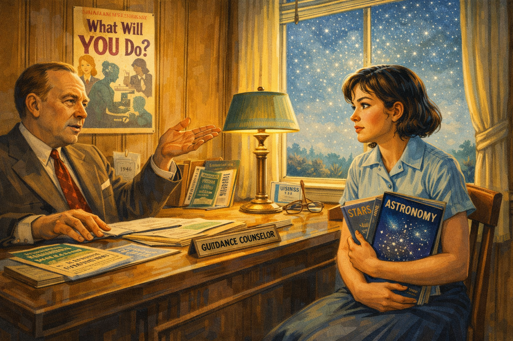
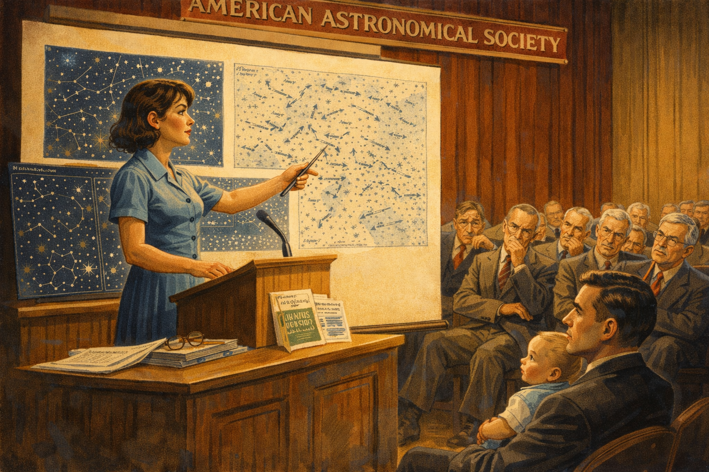
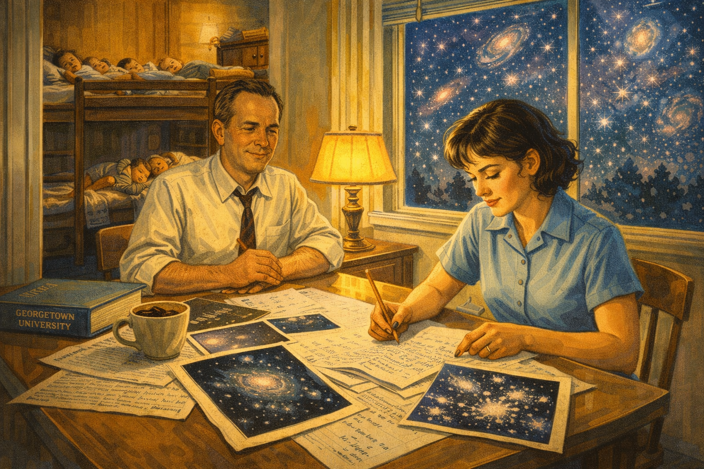
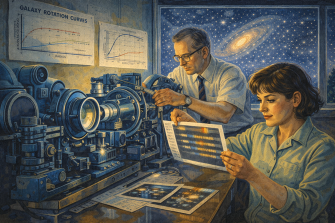
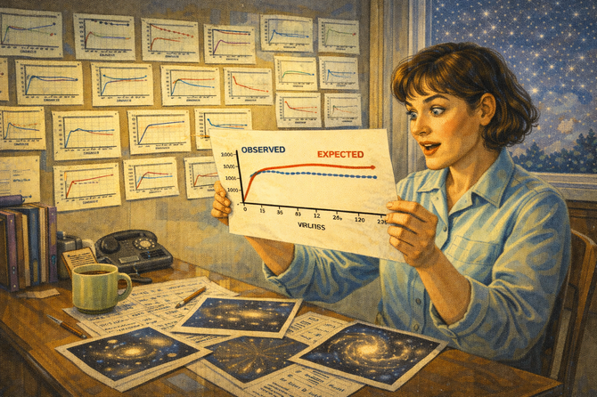
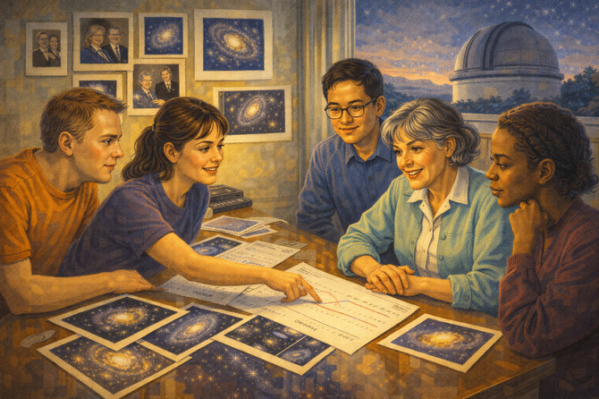
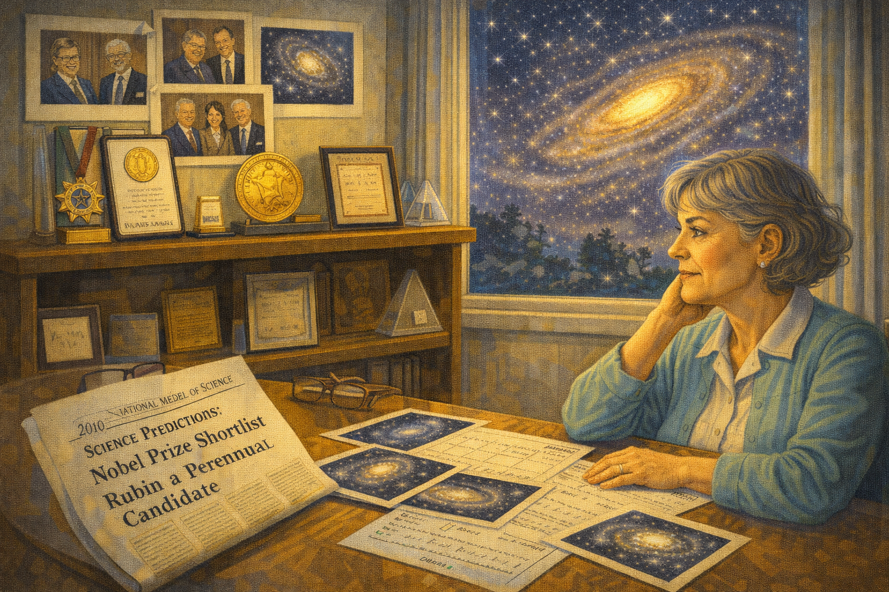
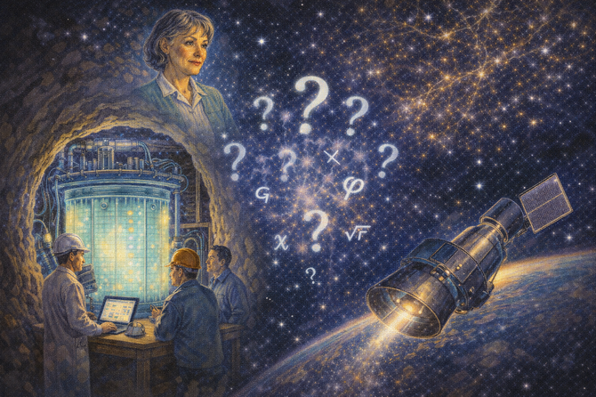

# The Missing Universe: Vera Rubin and Dark Matter

    
Narrative Prompt

Please generate a detailed narrative for a new graphic novel about Vera Rubin
and her discovery of dark matter. The target audience is high school students
studying introductory physics.

The story begins in 1930s Philadelphia, where young Vera watches the stars
from her bedroom window, fascinated by their motion across the sky. Show her
building her own telescope and her determination to become an astronomer
despite everyone telling her it was not a field for women.

Describe the barriers she faced: Princeton wouldn't even send her a graduate
catalog because they didn't admit women to astronomy. She got her PhD at
Georgetown while raising four children, commuting to night classes.

The central story follows her groundbreaking work on galaxy rotation in the
1970s. Using new spectrographic technology, she discovered that stars at the
outer edges of galaxies move just as fast as stars near the center—violating
everything astronomers expected from Newton's laws. The only explanation:
invisible matter, vastly outweighing the visible stars, was providing extra
gravitational pull.

Include the famous anecdote of her being the first woman allowed to observe at
Palomar Observatory (1965), where she had to tape a paper skirt to the
bathroom sign because there was no women's restroom.

End with her legacy: dark matter comprises about 27% of the universe. Despite
being nominated repeatedly, she never received the Nobel Prize before her
death in 2016—another case of a woman's revolutionary discovery being
overlooked.

When you describe an image, make sure to mention that it should be a colorful,
bright wide-landscape illustration in a mid-to-late 20th century scientific
style with astronomical imagery and dramatic cosmic lighting.

### Prologue – Watching the Stars Wheel

In 1938, a ten-year-old girl in Washington, D.C. pressed her face against her bedroom window, watching the stars wheel slowly overhead. While other children slept, **Vera Cooper** stayed awake, mesmerized by the silent dance of distant suns.

"Why do they move?" she whispered to herself. "Where are they going?"

Her father, an electrical engineer, encouraged her curiosity. Together, they built a simple telescope from a cardboard tube and lenses. Through it, Vera saw craters on the Moon, the rings of Saturn, and the fuzzy glow of distant galaxies—islands of billions of stars.

She decided, at age ten, that she would spend her life understanding the universe. The universe, unfortunately, was not ready for her.

Image Prompt

Image 1:
Please generate a new wide-landscape illustration.
A colorful, bright wide-landscape illustration in a 1930s American domestic style with cosmic elements showing young Vera Cooper, about 10 years old, at her bedroom window in Washington D.C. around 1938. She kneels on her bed, face pressed to the glass, watching a spectacular starry sky. A homemade cardboard telescope rests on the windowsill. Star trails arc across the night sky, showing the Earth's rotation. Through the window, the Capitol dome is visible in the distance. The warm yellow light of her bedroom contrasts with the deep blue of the night sky filled with thousands of stars. Her face shows wonder and determination. The scene conveys the birth of a lifelong passion for understanding the cosmos.

## Chapter 1 – "Women Don't Do That"

Vera excelled in mathematics and science. In high school, she built a working telescope that could track stars across the sky. When she told her guidance counselor she wanted to study astronomy, he laughed.

"Have you considered being a secretary?" he asked. "Women don't do astronomy."

Vera applied to Princeton, home of the nation's best astronomy program. They didn't even respond—Princeton's astronomy department didn't admit women. Instead, she attended Vassar, one of the few colleges where women could study science seriously.

She graduated in 1948 as the only astronomy major in her class. Everyone told her she had gone as far as a woman could go.

They were wrong.

Image Prompt

Image 2:
Please generate a new wide-landscape illustration.
A colorful, bright wide-landscape illustration in a 1940s American high school style showing young Vera Cooper, now about 17, sitting across from a guidance counselor in a wood-paneled office around 1946. The counselor, a middle-aged man in a suit, gestures dismissively while Vera holds astronomy textbooks and star charts. Her face shows quiet determination despite his condescension. On his desk are pamphlets for secretarial schools. Behind Vera, visible through the window, a daytime sky shows faint stars—visible only to her imagination. On the wall, a poster asks "What Will YOU Do?" The scene captures institutional dismissal meeting unshakeable determination.

## Chapter 2 – The Master's Thesis Nobody Believed

Vera married Robert Rubin, a physicist, and followed him to Cornell for graduate school. For her master's thesis, she tackled a bold question: Do galaxies move in random directions, or do they flow in patterns?

Her analysis suggested galaxies were *streaming*—moving together in vast cosmic currents. It was a revolutionary idea, decades ahead of its time.

When she presented her results at the American Astronomical Society in 1950, the audience was hostile. Established astronomers dismissed her work. The *New York Times* headline? "Young Mother Finds Center of Creation." Not "scientist." Mother.

Vera kept her data. Forty years later, astronomers would confirm she was right all along.

Image Prompt

Image 3:
Please generate a new wide-landscape illustration.
A colorful, bright wide-landscape illustration in a 1950s academic conference style showing Vera Rubin, a young woman in a modest dress, presenting her master's thesis at the American Astronomical Society meeting in 1950. She stands at a podium with star charts and galaxy distribution maps, pointing to evidence of galactic streaming. The audience of older male astronomers shows skeptical expressions—crossed arms, raised eyebrows, whispered dismissals. A young baby (her first child) sits with her husband Robert in the back row. The presentation screen shows her revolutionary data. The scene captures groundbreaking science meeting institutional resistance—and a woman standing firm.

## Chapter 3 – PhD at Georgetown

No prestigious university would take Vera seriously. She enrolled at Georgetown, the only doctoral program in astronomy she could reach by bus from her home while raising her growing family.

For years, Vera studied at night while her four children slept. Robert helped with childcare and encouraged her work. "Science needs you," he told her. "Don't give up."

Her PhD research studied the motions of galaxies in clusters—more evidence of cosmic structures that mainstream astronomy wasn't ready to accept. Again, her work was largely ignored.

But Vera was learning patience. The universe reveals its secrets slowly—and so would her career.

Image Prompt

Image 4:
Please generate a new wide-landscape illustration.
A colorful, bright wide-landscape illustration in a 1950s American domestic-academic style showing Vera Rubin studying astronomy at home in the evening around 1954. The scene is split: in the foreground, Vera works at a kitchen table covered with astronomical calculations and galaxy photographs, a cup of coffee at her elbow. In the background, four young children sleep peacefully in bunk beds visible through a doorway. Robert Rubin looks on supportively from across the table. Through the window, the night sky is filled with galaxies—the subject of her research. A Georgetown University textbook sits nearby. The scene conveys the extraordinary dedication required to pursue science while raising a family.

## Chapter 4 – No Women's Restroom

In 1965, Vera became the first woman permitted to observe at the legendary Palomar Observatory in California, home to the world's largest telescope. When she arrived, there was a problem.

"We don't have a women's restroom," the staff said, almost apologetically. "Women don't observe here."

Vera found paper, scissors, and tape. She cut out a figure wearing a skirt and taped it to the men's room door.

"Now you do," she said.

She had no intention of leaving.

Image Prompt

Image 5:
Please generate a new wide-landscape illustration.
A colorful, bright wide-landscape illustration in a 1960s American scientific style with a touch of humor showing the Palomar Observatory in 1965. The massive white dome of the 200-inch Hale Telescope dominates the background against a twilight sky. In the foreground, Vera Rubin—now in her late 30s, wearing practical clothes for cold nighttime observing—stands in a hallway, taping a hand-drawn paper skirt onto a stick-figure bathroom sign. Male astronomers watch with expressions ranging from amusement to befuddlement. Vera's expression is matter-of-fact: problem solved. The scene captures breaking barriers with practical determination and quiet wit.

## Chapter 5 – A New Way to See Galaxies

At the Carnegie Institution of Washington, Vera partnered with instrument-maker **Kent Ford**, who had built a revolutionary spectrograph—a device that could measure how fast stars were moving by analyzing shifts in their light.

For the first time, astronomers could measure the *rotation* of distant galaxies: how fast stars at different distances from the center were orbiting. This was like clocking cars on a racetrack at various positions.

Everyone expected stars at the galaxy's edge to move slowly—far from the gravitational center, they should drift lazily like distant planets. Newton's laws demanded it.

Vera pointed the spectrograph at the Andromeda Galaxy and began measuring.

Image Prompt

Image 6:
Please generate a new wide-landscape illustration.
A colorful, bright wide-landscape illustration in a 1970s scientific laboratory style showing Vera Rubin and Kent Ford working with their revolutionary spectrograph at the Carnegie Institution around 1970. The instrument is an intricate assembly of lenses, prisms, and photographic plates. Vera examines spectral data—bands of light revealing stellar velocities—while Kent adjusts the equipment. Charts on the wall show galaxy rotation curves. Through a window, the night sky displays the Andromeda Galaxy, their target. The instruments glow with a soft blue light. The scene conveys the technical innovation that would overturn cosmology.

## Chapter 6 – Stars That Move Too Fast

The data made no sense.

Stars at the edges of galaxies were moving *just as fast* as stars near the center—sometimes faster. This violated Newton's laws. It was as if cars at the outer lanes of a racetrack were speeding as fast as cars near the center—impossible, unless something invisible was pushing them.

Vera checked her instruments. She checked her math. She observed galaxy after galaxy—Andromeda, dozens of spirals, galaxies of every type. The result was always the same: outer stars moved too fast.

Either Newton was wrong, or something enormous and invisible was out there.

Image Prompt

Image 7:
Please generate a new wide-landscape illustration.
A colorful, bright wide-landscape illustration in a 1970s data-analysis style showing Vera Rubin studying galaxy rotation curves in her office around 1978. She holds a graph showing the actual rotation curve (flat line) versus the expected curve (declining line)—the definitive evidence of dark matter. Her expression shows the mix of excitement and disbelief of revolutionary discovery. Pinned to the wall behind her are rotation curves from dozens of galaxies, all showing the same anomaly. On her desk, photographs of spiral galaxies are annotated with velocity measurements. The scene captures the moment of realizing the visible universe is only a fraction of what exists.

## Chapter 7 – Dark Matter

Vera proposed an extraordinary conclusion: galaxies are embedded in vast halos of **dark matter**—invisible material that neither emits nor absorbs light, but exerts gravitational pull. This dark matter outweighs the visible stars by a factor of ten or more.

Without dark matter, galaxies would fly apart. The stars we see are just the glowing tip of a cosmic iceberg; most of the universe is hidden.

At first, astronomers were skeptical. But as more observations confirmed Rubin's findings—galaxy after galaxy, cluster after cluster—resistance faded. By the 1990s, dark matter was accepted as one of the pillars of modern cosmology.

Vera Rubin had discovered that 85% of the matter in the universe was invisible.

Image Prompt

Image 8:
Please generate a new wide-landscape illustration.
A colorful, bright wide-landscape illustration in a modern cosmic visualization style showing Vera Rubin's dark matter discovery. A beautiful spiral galaxy glows at the center, with visible stars in the disk. Surrounding it, a vast translucent blue halo represents the dark matter—invisible but massive—extending far beyond the visible stars. Arrows indicate the rotation of stars, showing that outer stars move as fast as inner ones due to the dark matter's gravity. Vera stands in the foreground as if looking at a cosmic hologram, her face illuminated by the galaxy's glow. Equations (F = GMm/r², v² = GM/r) float nearby. The scene conveys the invisible architecture that holds galaxies together.

## Chapter 8 – The Bigger Picture

Dark matter wasn't just a curiosity—it reshaped our understanding of the entire universe. Cosmologists realized that dark matter formed the scaffolding on which galaxies grew. Without it, the universe would be a diffuse fog of gas; *with* it, matter clumped into the cosmic web of galaxies we observe today.

Today we know:

- **27%** of the universe is dark matter
- **68%** is dark energy (even more mysterious)
- Only **5%** is ordinary matter—the stars, planets, and people

Vera Rubin revealed that everything humanity had ever seen was just the foam on a vast dark ocean.

Image Prompt

Image 9:
Please generate a new wide-landscape illustration.
A colorful, bright wide-landscape illustration in a modern educational cosmology style showing the composition of the universe. A large pie chart dominates the image: 68% dark energy (deep purple), 27% dark matter (translucent blue), and only 5% ordinary matter (bright gold). Emerging from the ordinary matter slice are all the familiar objects: stars, galaxies, planets, humans. The dark matter slice shows ghostly galaxy halos. The dark energy slice shows the expanding universe. Vera Rubin stands to one side, gesturing at the chart like a teacher. The cosmic web of galaxies forms the background. The scene conveys how small our familiar universe really is.

## Chapter 9 – Teaching the Next Generation

Vera never became bitter about the obstacles she faced. Instead, she became a fierce advocate for women in science. She mentored countless young astronomers, always remembering her own struggles.

"Don't let anyone tell you that you can't do it," she told them. "The data don't care about your gender."

Her four children all earned PhDs in science or mathematics—a family legacy of curiosity she cultivated with the same care she brought to her galaxies.

Image Prompt

Image 10:
Please generate a new wide-landscape illustration.
A colorful, bright wide-landscape illustration in a late 20th century academic style showing Vera Rubin mentoring young astronomers at the Carnegie Institution around 1995. Now in her 60s with gray hair, she sits with a diverse group of graduate students—including several young women—around a table covered with galaxy photographs and rotation curve data. A female student points to data while Vera nods encouragingly. On the wall behind them are photos of Vera's achievements and images of spiral galaxies. Through the window, a telescope dome is visible against the evening sky. The scene conveys passing knowledge to the next generation and opening doors for others.

## Chapter 10 – The Prize She Never Won

Year after year, Vera Rubin was nominated for the Nobel Prize in Physics. Year after year, she was passed over. The discovery of dark matter—one of the most important findings in modern astronomy—remained unrecognized by the Nobel Committee.

Some speculated that astronomy was considered "not physics enough." Others noted the persistent pattern of women being overlooked for the prize.

Vera rarely complained publicly. "Fame is fleeting," she said. "My numbers are right, and that's what matters."

But many in the scientific community felt the injustice keenly. When she died on Christmas Day 2016 at age 88, obituaries mourned not only a great scientist but a Nobel Prize scandal.

Image Prompt

Image 11:
Please generate a new wide-landscape illustration.
A colorful, bright wide-landscape illustration in a contemplative style showing Vera Rubin in her later years, around 2010. She sits in her office surrounded by awards (National Medal of Science, Gold Medal of the Royal Astronomical Society) and photographs from her career. Through the window, a beautiful spiral galaxy is visible in the night sky—her lifelong subject. On her desk lies a newspaper with a headline about Nobel Prize predictions listing her as a perennial candidate. Her expression is philosophical—not bitter, but aware of the irony. The Nobel medal is notably absent from her shelf of honors. The scene conveys dignity in the face of injustice.

## Chapter 11 – A Universe of Mysteries

Vera's discovery opened more questions than it answered—exactly as she would have wanted. Today, physicists hunt for dark matter particles in deep underground laboratories and space-based detectors. We know it exists; we still don't know what it *is*.

Leading candidates include:

- **WIMPs** (Weakly Interacting Massive Particles)
- **Axions** (hypothetical light particles)
- **Primordial black holes**
- Something entirely unexpected

Every experiment that fails to find dark matter particles deepens the mystery. The invisible universe Vera discovered remains invisible—and irresistible.

Image Prompt

Image 12:
Please generate a new wide-landscape illustration.
A colorful, bright wide-landscape illustration in a modern physics style showing the ongoing hunt for dark matter. The scene is split: on the left, scientists work at a massive underground detector (like XENON or LUX)—a giant tank of liquid xenon surrounded by sensors in a cavern deep underground, shielded from cosmic rays. On the right, a space telescope scans the heavens for dark matter signals. In the center, ghostly question marks and particle symbols represent the unknown nature of dark matter. At the top, a portrait of Vera Rubin watches over the search she inspired. The cosmic web glows in the background. The scene conveys that her discovery launched a quest still underway.

## Chapter 12 – Written in the Stars

Vera Rubin never received the Nobel Prize, but her name is written in the cosmos itself:

- **Asteroid 5726 Rubin** orbits the Sun
- The **Vera C. Rubin Observatory** in Chile (opening 2025) will survey the entire sky every few nights, probing dark matter and dark energy
- Her galaxy rotation curves are reproduced in every astronomy textbook

More importantly, every girl who looks through a telescope today stands on Vera Rubin's shoulders. She proved that the universe doesn't care who asks the questions—only that they're the right questions, asked persistently.

Image Prompt

Image 13:
Please generate a new wide-landscape illustration.
A colorful, bright wide-landscape illustration blending past and future astronomical imagery. The left side shows Vera Rubin at her spectrograph in the 1970s, measuring galaxy rotation. The right side shows the Vera C. Rubin Observatory in Chile—a massive modern telescope dome on a mountain peak under brilliantly clear skies. Connecting them, a river of light flows from galaxy rotation curves to cosmic surveys of millions of galaxies. In the night sky above, the words "VERA C. RUBIN OBSERVATORY" glow like a constellation. Young astronomers—diverse in gender and background—work at modern computers analyzing data. The scene conveys a legacy written in starlight.

### Epilogue – Seeing the Invisible

Vera Rubin's life teaches us that the most important discoveries often reveal what we *cannot* see:

| Challenge | How Vera Responded | Lesson for Today |
|-----------|-------------------|------------------|
| **Told "women don't do astronomy"** | Did it anyway; became one of the greatest astronomers | Others' limits aren't yours |
| **Princeton rejected her application** | Found another path; excelled at Vassar and Georgetown | Closed doors lead to open windows |
| **Thesis dismissed by male astronomers** | Saved the data; was proven right decades later | Good science survives skepticism |
| **No women's restroom at Palomar** | Made a paper skirt sign and kept observing | Solve problems; don't wait for permission |
| **Data contradicted expectations** | Trusted her measurements over tradition | Evidence outweighs authority |
| **Never won Nobel Prize** | Mentored the next generation; let history judge | Recognition isn't the goal; understanding is |

Final Image Prompt

Image 14:
Please generate a new wide-landscape illustration.
A colorful, bright wide-landscape illustration blending past achievement with future possibility. A diverse group of young students visits the Vera C. Rubin Observatory in Chile. They peer through telescopes, examine galaxy images on screens, and discuss rotation curves on whiteboards. One young girl holds a small telescope—like Vera's childhood instrument—while looking at the Milky Way overhead. Translucent and luminous, Vera Rubin's image appears in the stars, smiling down at the next generation. A banner reads "What else is out there?" The cosmic web of galaxies, dark matter halos visible as faint blue glows, stretches across the sky. The scene conveys that Vera's curiosity lives on in everyone who looks up and asks "why?"

### Call to Action

Vera Rubin watched the stars from her bedroom window and asked, "Why do they move?" Sixty years later, she discovered that most of the universe is invisible.

She was told no at every step:

- No, women don't do astronomy
- No, Princeton won't admit you
- No, your thesis is wrong
- No, there's no women's restroom

She answered with data. And data doesn't care about bathroom signs.

Today, the **Vera C. Rubin Observatory** scans the heavens, continuing her work. But the biggest mysteries remain unsolved:

- What *is* dark matter?
- Will we ever detect it directly?
- What other invisible forces shape the cosmos?

The universe still has secrets. The question is: **will you look up and ask?**

---

*"In a spiral galaxy, the weights of gravity and centrifugal force must balance at every point in the disk. Here is a wonderful equilibrium for a physicist to explore."*
—Vera Rubin

